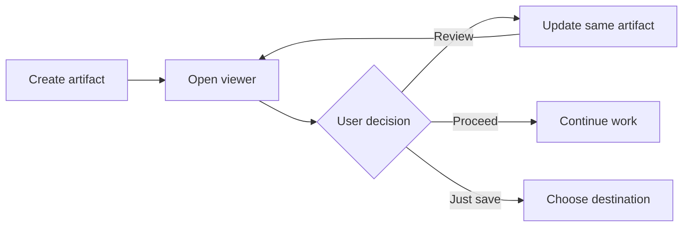

# Markdown Viewer – Full Feature Plan Suite

Tài liệu này chứa **nhiều plan mẫu** và một bộ kiểm thử Markdown đầy đủ cho Artifact Review của Agent Plus. Nội dung cần hiển thị đúng ở theme sáng, tối và high contrast; các đoạn có thể review phải cho phép chọn text và thêm comment.

> [!NOTE]
> Cú pháp alert kiểu GitHub ở trên không phải tính năng riêng của viewer. Nó được giữ trong blockquote để kiểm tra cách renderer xử lý nội dung GFM chưa được mở rộng.

## Cách test

- [ ] Đổi lần lượt giữa light, dark và high-contrast theme.
- [ ] Chọn text trong heading, paragraph, list item, quote, code block và table cell.
- [ ] Lưu ít nhất hai comment rồi mở **Comments (N)** để nhảy tới highlight.
- [ ] Thử **Copy** trên code block và **Copy Markdown** trên toolbar.
- [ ] Thử **Show source / Show diagram** trên Mermaid.
- [ ] Xác nhận comment chưa lưu làm vô hiệu hóa các nút lifecycle.
- [ ] Cuối cùng chọn **Review**, **Proceed** hoặc **Just save**.

---

## Plan 1 — Cải thiện tài liệu onboarding

### Mục tiêu

Giúp người dùng mới hoàn tất quy trình artifact đầu tiên trong dưới **5 phút**, với hướng dẫn ngắn, liên kết an toàn tới [VS Code](https://code.visualstudio.com/) và địa chỉ hỗ trợ [review@example.com](mailto:review@example.com).

### Phạm vi

1. Rà soát README hiện tại.
2. Thêm prompt mẫu:
   - Prompt tạo implementation plan.
   - Prompt tạo artifact tài liệu.
3. Bổ sung checklist xác minh:
   - [x] Artifact dùng schema v3.
   - [ ] Hook đã được trust.
   - [ ] MCP trả quyết định về đúng thread.

### Ưu tiên

| Hạng mục | Mức độ | Chủ sở hữu | Trạng thái |
| :--- | :---: | ---: | --- |
| Getting started | **P0** | Docs | Đang đề xuất |
| Prompt mẫu | P1 | DX | Chưa bắt đầu |
| Screenshot | ~~P1~~ P2 | Design | Tùy chọn |

### Tiêu chí hoàn thành

- Người dùng hiểu khác biệt giữa `Review`, `Proceed` và `Just save`.
- Mọi lệnh đều copy được và không chứa đường dẫn phụ thuộc máy cá nhân.
- Link HTTP(S) và `mailto:` mở qua extension host.

---

## Plan 2 — Kiểm thử lifecycle review

### Mục tiêu

Xác minh mỗi request chỉ sử dụng một artifact ID xuyên suốt các vòng review.

> Một review hợp lệ phải ràng buộc artifact ID, review round, origin thread và SHA-256 của Markdown.
>
> > Quote lồng nhau dùng để kiểm tra thụt lề và màu nền.

### Luồng dự kiến



### Tình huống kiểm thử

| ID | Given | When | Then |
| --- | --- | --- | --- |
| L-01 | Không có comment | Chọn Proceed | Trả về `approve` |
| L-02 | Có comment đã lưu | Chọn Review | Trả về `revise` và update token |
| L-03 | Có draft chưa lưu | Chọn action | Action bị vô hiệu hóa |
| L-04 | Hash không khớp | Submit review | Viewer từ chối trạng thái cũ |

### Rủi ro

- **Race condition:** watcher có thể thấy file chưa hoàn chỉnh.
- **Stale review:** submission cũ có thể không còn thuộc round hiện tại.
- **Windows lock:** editor có thể giữ file khi update.

---

## Plan 3 — Release smoke test

### Mục tiêu

Kiểm tra nhanh gói VSIX trước khi phát hành mà không thay đổi dữ liệu người dùng.

### Trình tự

3. Build extension và enhancement bundles.
4. Chạy unit tests.
5. Cài VSIX vào Extension Development Host.
6. Mở artifact suite này.
7. Kiểm tra renderer, selection, comments và lifecycle.

### Quyết định phát hành

- **Go:** toàn bộ test bắt buộc đạt, không có lỗi console.
- **Conditional go:** chỉ lỗi cosmetic mức P2.
- **No-go:** lỗi hash, sai thread, mất comment hoặc executable content chạy được.

---

## Markdown feature lab

Phần này kiểm tra *italic*, **bold**, ***bold italic***, ~~strikethrough~~, `inline code`, ký tự escape \*không italic\*, và một URL tự động: <https://example.com/artifact-review>.

Dòng này kết thúc bằng hai dấu cách để tạo hard break.  
Dòng này phải bắt đầu ngay bên dưới nhưng vẫn thuộc cùng đoạn hiển thị.

### Heading levels

#### Heading level 4

##### Heading level 5

###### Heading level 6

### Unordered, ordered và nested lists

- Parent A
  - Child A.1
    - Grandchild A.1.a
  - Child A.2 có **inline formatting**
- Parent B

1. First ordered item
2. Second ordered item
   1. Nested ordered item
   2. Nested item có `code`

### Task list

- [x] Completed task
- [ ] Open task
  - [x] Completed nested task
  - [ ] Open nested task

### Blockquotes

> Đây là quote có **bold**, *italic* và [safe link](https://example.com).
>
> - Quote chứa list item.
> - Quote chứa `inline code`.

### Table alignment và escaping

| Left | Center | Right | Escaped pipe |
| :--- | :---: | ---: | --- |
| alpha | **beta** | 123 | A \| B |
| long text để test wrapping | `inline` | 9,876 | C \| D |

### Safe links và media policy

- [HTTPS link hợp lệ](https://example.com/docs)
- [Email link hợp lệ](mailto:review@example.com)
- [Anchor link được phép](#markdown-feature-lab)
- [JavaScript link phải bị vô hiệu hóa](javascript:alert%281%29)
- [File link phải bị vô hiệu hóa](file:///C:/secret.txt)

Ảnh từ xa bên dưới phải hiện placeholder, không được tải qua mạng:


Raw HTML bên dưới phải bị bỏ qua hoàn toàn; nút không được xuất hiện và không được chạy:

<button onclick="alert('unsafe')">Raw HTML must not render</button>

### Syntax highlighting

#### TypeScript

```typescript
type Decision = "revise" | "approve" | "save";
const nextRound = (round: number): number => round + 1;
```

#### JavaScript

```javascript
export function isSafe(value) {
  return value.startsWith("https://");
}
```

#### TSX

```tsx
export const Badge = ({ label }: { label: string }) => (
  <span className="badge">{label}</span>
);
```

#### JSX

```jsx
export const Status = ({ ok }) => <strong>{ok ? "Ready" : "Blocked"}</strong>;
```

#### Python

```python
def next_round(current: int) -> int:
    return current + 1
```

#### PowerShell

```powershell
$artifactPath = Join-Path $PWD ".codex-artifacts"
Test-Path $artifactPath
```

#### Bash

```bash
artifact_dir=".codex-artifacts/artifacts/example"
test -d "$artifact_dir"
```

#### JSON

```json
{
  "schemaVersion": 3,
  "reviewRound": 1,
  "origin": {}
}
```

#### YAML

```yaml
review:
  round: 1
  decision: pending
```

#### CSS

```css
.review-block:hover {
  outline: 1px solid var(--vscode-focusBorder);
}
```

#### HTML source

```html
<section aria-label="Safe source example">
  <p>This is highlighted source, not executable HTML.</p>
</section>
```

#### SQL

```sql
SELECT artifact_id, review_round
FROM reviews
WHERE decision = 'approve';
```

#### Diff

```diff
- "reviewRound": 1
+ "reviewRound": 2
```

#### Markdown source

```markdown
## Nested Markdown sample

- **Bold item**
- [Safe link](https://example.com)
```

#### Plain text fallback

```text
This block verifies the non-highlighted fallback and Copy button.
Select part of this line to attach a code comment.
```

### Mermaid error fallback

Diagram cố ý sai cú pháp dưới đây phải hiển thị error và source thay vì làm hỏng viewer:

```mermaid
flowchart LR
  A[Broken diagram --> B
```

---

## Comment-selection matrix

| Block type | Text nên chọn | Kết quả mong đợi |
| --- | --- | --- |
| Heading | “Comment-selection matrix” | Highlight gắn vào heading |
| Paragraph | “nhiều plan mẫu” | Giữ nguyên inline formatting |
| List item | “Completed task” | Comment chỉ gắn item đó |
| Quote | “review hợp lệ” | Quote vẫn giữ style |
| Code | “nextRound” | Hiện source reviewable |
| Table cell | “L-02” | Chỉ cell được annotate |

## Điều kiện đạt

- CommonMark/GFM render đúng với nested lists, task lists, tables, links, quotes và inline formatting.
- Shiki chỉ tải khi có fenced code và vẫn có fallback đọc được.
- Mermaid hợp lệ render thành diagram; Mermaid lỗi quay về source kèm thông báo.
- Raw HTML không render, remote image không tải, protocol nguy hiểm không mở được.
- Text selection và comment hoạt động trên sáu loại block được hỗ trợ.
- Theme sáng, tối và high contrast không làm mất nội dung hoặc focus indicator.
