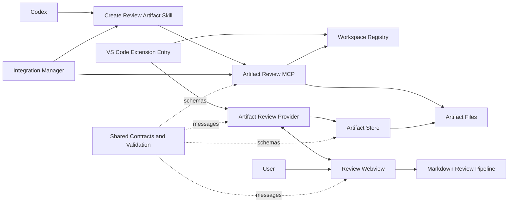

# Components and Responsibilities

This document describes the technical components that participate in the current Codex Artifacts review workflow. It explains what each component owns, how components communicate, and which responsibilities must remain outside each boundary.

It complements the existing documentation:

- [PHILOSOPHY.md](./PHILOSOPHY.md) defines the product intent and the meaning of **Review**, **Proceed**, and **Just save**.
- [ARCHITECTURE.md](./ARCHITECTURE.md) defines the high-level topology, ownership boundaries, and safety constraints.
- This file is the component-level responsibility reference: **which technical component is responsible for what**.

## Component overview



The core responsibility split is:

| Component                | Primary responsibility                        | State or resources it owns                                                   |
| ------------------------ | --------------------------------------------- | ---------------------------------------------------------------------------- |
| Codex skill              | Agent-side lifecycle and chat policy           | Exact artifact handle, complete proposed Markdown, and current tool result    |
| Artifact Review MCP      | Artifact persistence and waiter coordination  | Artifact creation, waiter registry, round grants, and round transactions      |
| Workspace Registry       | Evidence of currently open VS Code workspaces | Short-lived workspace snapshots                                              |
| Artifact file protocol   | Persistent lifecycle communication            | Manifest, Markdown, comments, and submitted decision                         |
| Extension entry          | VS Code activation and composition            | Commands, watchers, and provider registration                                |
| Artifact Review Provider | Webview/extension orchestration               | One custom-editor session and its subscriptions                              |
| Artifact Store           | Trusted artifact persistence adapter          | Validated review state, comments, and submission writes                      |
| Review Webview           | Human review interaction                      | Ephemeral UI state and typed user intent                                     |
| Markdown review pipeline | Document rendering and comment anchoring      | Parsed blocks and rendered annotations                                       |
| Shared contracts         | Cross-process protocol definition             | Schemas, types, filenames, and binding rules                                 |
| Integration manager      | Installation and verification                 | Extension-managed Codex MCP and skill configuration                          |

The governing lifetime relationship is `artifact lifetime > waiter lifetime > chat-turn lifetime`. Artifact files persist across cancellation, takeover, chat completion, and MCP restart. The MCP waiter registry is temporary process state, while the skill retains the exact artifact handle needed to inspect or reconnect that persistent state.

## 1. Codex skill

**Source**

- [`skills/create-review-artifact/SKILL.md`](../skills/create-review-artifact/SKILL.md)
- [`skills/create-review-artifact/references/artifact-contract.md`](../skills/create-review-artifact/references/artifact-contract.md)

**Responsibilities**

- Decide whether an explicit user request should create/update an artifact, inspect saved feedback, or reconnect an exact artifact.
- Resolve one unambiguous owning workspace from permitted user or IDE evidence.
- Produce one complete Markdown document.
- Call `create_artifact`, retain its exact handle, then call `wait_for_artifact_review` for the default flow.
- Interpret the returned decision.
- Apply one feedback policy to submitted `revise` and chat-inspected comments: answer questions visibly, update Markdown only for requested changes, and advance unchanged Markdown for question-only rounds.
- For chat escape, inspect the exact interrupted handle with takeover before applying that shared policy.
- For an explicit chat update on an empty round, inspect the exact handle with `intent: "explicit-chat-update"`, replace the Markdown, and advance without requiring a UI comment or Review submission.
- Reattach the same round when inspection has no feedback; ask for a path instead of guessing when the exact handle is ambiguous.
- For `approve` on `plan` or `implementation-plan`, obey the MCP `execute-approved-plan` directive and execute the complete approved plan immediately; for other kinds, continue only with the action implied by the original request.
- For `save`, ask for a destination and copy the Markdown without performing the proposed work.

**Does not own**

- Artifact IDs, review session IDs, or round numbers.
- Lifecycle-file creation or repair.
- Comment or submission persistence.
- Token creation or validation.
- Waiter ownership, cancellation, or takeover mechanics.

The skill must never create or edit `artifact.json`, `comments.json`, or `review-submission.json` directly.

## 2. Artifact Review MCP

**Source**

- [`src/integration/artifact-review-mcp-v4.ts`](../src/integration/artifact-review-mcp-v4.ts)

**Responsibilities**

- Expose the four lifecycle tools:
  - `create_artifact`
  - `wait_for_artifact_review`
  - `inspect_artifact_review`
  - `advance_and_wait_for_artifact`
- Validate tool arguments, artifact kind, title, Markdown size, workspace root, and typed workspace evidence.
- Generate the artifact ID and `reviewSessionId`.
- Create a schema-v4 artifact at review round 1.
- Return the persistent artifact handle before attaching any waiter.
- Attach one transient tool call to `review-submission.json`, or return an existing submission immediately.
- Detect a submission through filesystem watching with periodic polling as a fallback.
- Validate that the submission belongs to the same schema, artifact, session, round, Markdown hash, and comments hash.
- Reserve at most one live waiter per canonical artifact directory and let cancellation/takeover detach it without touching lifecycle files.
- Inspect validated Markdown, comments, and optional submission even when no Review submission exists.
- Grant in-memory, single-use, one-hour round tokens after submitted `revise` or a consumable chat inspection.
- Bind tokens to artifact/session/round plus artifact, comments, and submission hashes/presence.
- Transactionally preserve or replace Markdown, increment `reviewRound`, reset comments, remove the previous submission, and wait for the next decision.
- Consume the token only after a successful commit; leave a newly committed round detached if its waiter is cancelled.
- Roll back a failed round transition.

**Owns and may write**

- Initial `artifact.json`, `artifact.md`, and `comments.json`.
- New-round Markdown, manifest, and empty comments state.
- Temporary staged files, backups, and `.artifact-update.lock`.
- In-memory active waiter registry and round-token grants.

**Does not own**

- User-interface state.
- Comment authoring or the user's decision.
- Extension commands or custom-editor behavior.
- Direct implementation of an approved plan.

## 3. Workspace Registry

**Source**

- Publisher: [`src/extension/workspace-registry-publisher.ts`](../src/extension/workspace-registry-publisher.ts)
- Contract and resolver: [`src/shared/workspace-registry.ts`](../src/shared/workspace-registry.ts)

This component has two cooperating halves.

### Registry publisher

The VS Code extension publishes:

- Canonical paths for currently open workspace folders.
- Window focus state.
- Active file and its owning workspace when available.
- A unique extension-window instance ID.
- Snapshot creation and expiration timestamps.

It refreshes on workspace, active-editor, or focus changes and also sends a periodic heartbeat. It removes its snapshot when disposed.

### Registry resolver

The MCP-side resolver:

- Reads only fresh, schema-valid snapshots.
- Canonicalizes the requested workspace and rejects stale or unregistered roots.
- Scopes creation evidence to the focused VS Code window when available.
- Validates `single-workspace`, `active-file`, `explicit-user-path`, or `explicit-user-folder` evidence.
- Fails closed when ownership is ambiguous.

**Does not own**

- Artifact content or review state.
- Artifact selection based on cwd, folder order, package markers, or name similarity.
- Persistent workspace configuration.

The registry proves that a workspace is currently available and that the supplied evidence selects it; it does not decide when an artifact should be created.

## 4. Artifact file protocol

**Source**

- Filenames: [`src/shared/artifact-files.ts`](../src/shared/artifact-files.ts)
- Schemas: [`src/shared/contracts.ts`](../src/shared/contracts.ts)
- Binding validation: [`src/shared/artifact-validation.ts`](../src/shared/artifact-validation.ts)

Each artifact uses this directory:

```text
<workspace>/.codex-artifacts/artifacts/<artifactId>/
├── artifact.json
├── artifact.md
├── comments.json
├── review-submission.json   # exists after submission
└── .artifact-update.lock   # temporary during a round update
```

| File                     | Responsible writer                                         | Responsibility                                                                                     |
| ------------------------ | ---------------------------------------------------------- | -------------------------------------------------------------------------------------------------- |
| `artifact.json`          | MCP                                                        | Identify the artifact and bind kind, title, workspace root, session, timestamps, and current round |
| `artifact.md`            | MCP                                                        | Store the complete Markdown for the current round                                                  |
| `comments.json`          | Artifact Store during review; MCP when opening a new round | Store block-bound comments and bind them to the current artifact hash and round                    |
| `review-submission.json` | Artifact Store                                             | Record the immutable `revise`, `approve`, or `save` decision for one round                         |
| `.artifact-update.lock`  | MCP                                                        | Prevent readers from observing an incomplete multi-file update                                     |

The protocol is the communication medium between the independently running MCP process and VS Code extension. It is not a revision-history store.

## 5. VS Code extension entry

**Source**

- [`src/extension/extension.ts`](../src/extension/extension.ts)
- VS Code contributions in [`package.json`](../package.json)

**Responsibilities**

- Activate the extension.
- Construct the review provider and workspace-registry publisher.
- Register the `agentPlus.artifactReview` custom editor.
- Watch for newly created artifact `comments.json` files.
- Automatically open the corresponding `artifact.md` when configured.
- Register commands to:
  - Open an artifact review.
  - Install the global Codex integration.
  - Verify the global Codex integration.
- Own and dispose top-level VS Code subscriptions.

**Does not own**

- Artifact validation or comment persistence.
- Webview rendering.
- MCP waiting or round transitions.
- Review decision semantics.

This is the composition root for the extension host, not the business-logic layer.

## 6. Artifact Review Provider

**Source**

- [`src/extension/artifact-review-provider.ts`](../src/extension/artifact-review-provider.ts)

**Responsibilities**

- Resolve an `artifact.md` document as a custom text editor.
- Create one `ArtifactStore` for the artifact directory.
- Configure the webview's local resources and Content Security Policy.
- Send validated `ReviewState` snapshots to the webview.
- Parse every incoming webview message with the shared discriminated-union schema.
- Route:
  - `addComment` to the store.
  - `removeComment` to the store.
  - `submitReview` to the store.
  - Allowed external links to VS Code.
- Serialize submission attempts within the editor using the local `sending` guard.
- Watch artifact lifecycle files and refresh the webview after external changes.
- Dispose message handlers and filesystem watchers when the editor closes.

**Does not own**

- Filesystem validation rules; it delegates them to the store and shared validators.
- UI rendering or selection interpretation.
- Review-round advancement.
- Arbitrary URL opening; only `http`, `https`, and `mailto` are accepted.

The provider is the orchestration bridge between an untrusted webview and trusted extension services.

## 7. Artifact Store

**Source**

- [`src/extension/artifact-store.ts`](../src/extension/artifact-store.ts)

**Responsibilities**

- Wait briefly for an MCP round-update transaction to complete before reading.
- Load Markdown and manifest data.
- Verify that the artifact directory matches the manifest's declared workspace and ID.
- Calculate the current Markdown hash.
- Parse and bind `comments.json` to schema, artifact ID, round, and Markdown hash.
- Parse and bind a submission to the artifact, session/thread, round, Markdown hash, and comments hash.
- Parse Markdown into selectable review blocks.
- Expose one complete `ReviewState` to the provider.
- Validate that a comment still references an existing block and exact text range.
- Add and remove comments only while the round is writable and unsubmitted.
- Require at least one comment for `revise`.
- Allow `approve` and `save` with or without comments.
- Create a submission exclusively so duplicate submissions cannot overwrite one another.
- Use temporary files and rename/copy fallbacks for robust comment writes on Windows.

**Owns and may write**

- `comments.json` while a round is open.
- `review-submission.json` when the user submits the round.

**Does not own**

- `artifact.md` or `artifact.json` updates.
- Review-round increments, waiter ownership, or round tokens.
- Selection capture or rendering.
- Continued Codex behavior after a decision.

Schema-v3 artifacts are loaded for read-only viewing. Schema v4 is the only writable lifecycle.

## 8. Review Webview

**Source**

- Entry: [`src/webview/main.tsx`](../src/webview/main.tsx)
- Application: [`src/webview/ReviewApp.tsx`](../src/webview/ReviewApp.tsx)
- Action policy: [`src/webview/review-actions.ts`](../src/webview/review-actions.ts)
- VS Code messaging adapter: [`src/webview/vscode-api.ts`](../src/webview/vscode-api.ts)

**Responsibilities**

- Request initial state from the provider.
- Render the artifact title, kind, round, Markdown, comments, and lifecycle notices.
- Capture a text selection within one reviewable block.
- Normalize the selection to the block's visible-text offsets.
- Create comment drafts and send typed add/remove messages.
- Open comment details and navigate from the comments drawer to highlighted text.
- Submit `revise`, `approve`, or `save` intent.
- Disable actions while submitting, after submission, for read-only artifacts, or while a comment draft is unsaved.
- Reset transient selection/comment UI when the review round changes.
- Copy Markdown to the clipboard without changing lifecycle state.

**Owns**

- Ephemeral React state: current draft, comment body, drawer/popover state, sending status, active comment, and copy feedback.

**Does not own**

- Filesystem state.
- Final validation of comments or decisions.
- Submission uniqueness or round transitions.
- MCP communication.

The webview expresses user intent; the trusted extension host decides whether that intent is valid and persistent.

## 9. Markdown review pipeline

**Source**

- Parser: [`src/shared/markdown-blocks.ts`](../src/shared/markdown-blocks.ts)
- Renderer: [`src/webview/MarkdownRenderer.tsx`](../src/webview/MarkdownRenderer.tsx)
- Annotation mapping: [`src/webview/review-annotations.tsx`](../src/webview/review-annotations.tsx)
- Code rendering: [`src/webview/CodeBlock.tsx`](../src/webview/CodeBlock.tsx)
- Mermaid rendering: [`src/webview/MermaidBlock.tsx`](../src/webview/MermaidBlock.tsx)
- Enhancement loader: [`src/webview/enhancement-loader.ts`](../src/webview/enhancement-loader.ts)
- URL policy: [`src/webview/url-policy.ts`](../src/webview/url-policy.ts)

**Responsibilities**

- Parse CommonMark/GFM into stable selectable blocks:
  - Headings.
  - Paragraphs.
  - List items.
  - Quotes.
  - Fenced code.
  - Table cells.
- Preserve source positions while deriving the visible text used for comment offsets.
- Match rendered nodes back to parsed blocks.
- Rebuild inline React children with comment highlight ranges.
- Render overlapping annotations and associate them with comment IDs.
- Render code with optional lazy-loaded Shiki highlighting.
- Render Mermaid diagrams through a separately built enhancement bundle.
- Reject raw HTML, executable/local/malformed links, and remote image loading.
- Route safe external links through the provider instead of opening them directly.

**Does not own**

- Comment validity after the document changes.
- Comment persistence.
- Artifact lifecycle decisions.

The parser, selection capture, renderer, and store must agree on the same visible-text model. Changes to one part require checking all other parts.

## 10. Shared contracts and validation

**Source**

- [`src/shared/contracts.ts`](../src/shared/contracts.ts)
- [`src/shared/artifact-validation.ts`](../src/shared/artifact-validation.ts)
- [`src/shared/artifact-files.ts`](../src/shared/artifact-files.ts)

**Responsibilities**

- Define schema-v4 and readable legacy schema-v3 manifests.
- Define comments, review decisions, submissions, Markdown blocks, review state, and webview messages.
- Validate all untrusted JSON and webview input.
- Bind comments and submissions to the correct artifact lifecycle.
- Verify canonical artifact directory placement.
- Define canonical lifecycle filenames.

This layer is the protocol source of truth. A contract change must be propagated to every producer and consumer rather than locally patched in one process.

**Does not own**

- I/O scheduling.
- UI behavior.
- MCP waiting.
- VS Code activation.

## 11. Integration manager

**Source**

- Installer: [`src/extension/workspace-integration-v4.ts`](../src/extension/workspace-integration-v4.ts)
- MCP configuration: [`src/extension/mcp-config.ts`](../src/extension/mcp-config.ts)
- Status classification: [`src/extension/global-integration-status.ts`](../src/extension/global-integration-status.ts)
- Legacy-hook cleanup: [`src/extension/hook-config.ts`](../src/extension/hook-config.ts)

**Responsibilities**

- Copy the built MCP script into the Codex data directory.
- Copy the bundled skill into the global agent-skills directory.
- Add or update only the extension-managed `codex_artifacts` block in `config.toml`.
- Verify whether installed assets and configuration match the extension version.
- Report ready, missing, outdated, restart-required, or configuration-conflict states.
- Remove only recognized legacy Codex Artifacts hooks, scripts, and skill directories.
- Preserve unrelated user configuration.

**Does not own**

- The live review session.
- Artifact files.
- General Codex configuration outside its marked block.
- Automatic restart or hot-loading into an existing chat.

## 12. Current interaction flow

### Default submission flow

1. The skill calls `create_artifact` with complete Markdown and typed workspace evidence, then retains the returned `artifactDirectory` and round.
2. The MCP validates the workspace, creates the three initial schema-v4 files, and returns immediately.
3. The skill calls `wait_for_artifact_review` with the exact handle. The MCP reserves waiter ownership.
4. The extension opens the custom editor; provider, store, webview, and Markdown pipeline render and persist review comments as before.
5. The user submits Review (`revise`), Proceed (`approve`), or Just save (`save`); the store creates `review-submission.json` exactly once.
6. The waiting MCP validates and returns the submission. Submitted Review includes a round token.
7. For Review, the skill classifies feedback exactly as it does for chat escape: answer questions visibly, supply replacement Markdown only when changes are requested, then call `advance_and_wait_for_artifact`. Question-only Review omits Markdown.
8. Proceed and Just save end the current round without automatically advancing. For either plan kind, Proceed also returns `execute-approved-plan`, so the skill executes the approved code/file/workspace/command actions immediately in the same turn. The artifact remains persistent and reconnectable.

### Chat escape flow

1. The user saves comments and sends an instruction such as “read the review” while the waiter is active.
2. The prior tool wait is cancelled. The skill calls `inspect_artifact_review` with the exact retained handle and `takeover: true`.
3. The MCP aborts and drains any old waiter, validates persistent state, and returns comments plus a state-bound round token even if no submission exists.
4. The skill applies the same classification and response policy used by Review submissions; only the feedback transport/token source differs.
5. The skill calls `advance_and_wait_for_artifact`; omitting Markdown preserves its bytes/SHA for a question-only round.
6. The MCP advances, resets handled comments/submission, and waits on the new round. If the new wait is cancelled, the committed round remains valid but detached.
7. If inspection finds no feedback, the skill reattaches `wait_for_artifact_review` to the same round instead of advancing.

### Explicit chat update flow

1. The user explicitly requests a concrete edit to an exact artifact in chat while its current round has no saved comments or submission.
2. The skill calls `inspect_artifact_review` with the exact handle, `takeover: true`, the current `expectedReviewRound`, and `intent: "explicit-chat-update"`.
3. The MCP validates the expected round before detaching a waiter, revalidates after takeover, confirms the round is still empty, and returns a state-bound `chat-update` token.
4. The skill supplies complete replacement Markdown to `advance_and_wait_for_artifact`.
5. The MCP rejects missing or unchanged Markdown, otherwise commits the next round transactionally and attaches a new waiter.
6. A pure reconnect never uses this intent and remains on the same round.

### Reconnect rules

- Reconnect uses an exact artifact handle from the conversation or a path supplied by the user. No component selects the newest workspace artifact.
- MCP restart loses waiter/token memory, not artifact state. Inspection can issue a fresh token.
- Explicit reconnect after Proceed/Just save inspects and advances without Markdown; it does not repeat the previous approved or saved action.

## 13. Responsibility matrix

| Operation                      |             Skill |                 MCP |            Registry |               Extension entry |  Provider |              Store |      Webview |
| ------------------------------ | ----------------: | ------------------: | ------------------: | ----------------------------: | --------: | -----------------: | -----------: |
| Decide to create an artifact   |             Owner |                     |                     |                               |           |                    |              |
| Prove workspace ownership      | Supplies evidence |           Validates | Supplies live facts |               Publishes facts |           |                    |              |
| Generate artifact/session ID   |                   |               Owner |                     |                               |           |                    |              |
| Create initial lifecycle files |                   |               Owner |                     |                               |           |                    |              |
| Auto-open review editor        |                   |                     |                     |                         Owner |           |                    |              |
| Render Markdown                |                   |                     |                     |                               |   Bridges |                    |        Owner |
| Capture text selection         |                   |                     |                     |                               |           |                    |        Owner |
| Validate comment range         |                   |                     |                     |                               |    Routes |              Owner |  Preliminary |
| Write comments                 |                   | Resets on new round |                     |                               |    Routes |              Owner | Sends intent |
| Record decision                |                   |     Reads/validates |                     |                               |    Routes |              Owner | Sends intent |
| Create round token             |                   |               Owner |                     |                               |           |                    |              |
| Attach/detach waiter           | Requests lifecycle|               Owner |                     |                               |           |                    |              |
| Inspect saved feedback         | Classifies/answers| Validates and grants |                     |                               |           |        Persists it | Captures it  |
| Advance review round           | Optional Markdown |               Owner |                     |                               | Refreshes | Waits while locked |    Resets UI |
| Continue after approval        | Executes directive| Decision + nextAction|                    |                               |           |                    |              |
| Install MCP and skill          |                   |     Installed asset |                     | Owner via integration manager |           |                    |              |

## 14. Active and legacy components

The active implementation is:

- `ArtifactReviewProvider`, not `PlanReviewProvider`.
- `ReviewApp.tsx`, imported by `src/webview/main.tsx`, not the retained `src/webview/App.tsx`.
- `artifact-review-mcp-v4.ts`, built into `codex-artifacts-review-mcp.mjs`.

Retained legacy sources include:

- `src/extension/plan-review-provider.ts`
- `src/integration/review-wait-mcp.ts`
- `src/integration/stamp-origin.ts`
- `src/webview/App.tsx`

Schema-v3 artifacts remain readable but are read-only. Legacy source is compatibility or migration context and must not be treated as the current execution path.

## 15. Verification ownership

Tests document the expected responsibility boundaries:

| Area                                                                                   | Tests                                                                                           |
| -------------------------------------------------------------------------------------- | ----------------------------------------------------------------------------------------------- |
| Artifact loading, comments, submissions, and schema-v3 read-only behavior              | `test/artifact-store.test.ts`                                                                   |
| MCP creation, waiting, takeover, inspection, reconnect, token use, rollback, and safety | `test/review-wait-mcp.test.ts`                                                                 |
| Workspace evidence and registry freshness/focus behavior                               | `test/workspace-registry.test.ts`                                                               |
| Review button state and decision constraints                                           | `test/review-actions.test.ts`                                                                   |
| Markdown blocks and rendered annotation behavior                                       | `test/markdown-blocks.test.ts`, `test/markdown-renderer.test.tsx`                               |
| Safe links and protocols                                                               | `test/url-policy.test.ts`                                                                       |
| Managed MCP and legacy-hook configuration                                              | `test/mcp-config.test.ts`, `test/hook-config.test.ts`, `test/global-integration-status.test.ts` |
| Installed skill contract                                                               | `test/skill-contract.test.ts`                                                                   |

For responsibility or protocol changes, update the shared contract first, trace every producer and consumer, and run:

```powershell
npm run check
npm test
npm run build
```

## Summary

The review system deliberately separates responsibilities:

- The **skill** controls agent behavior.
- The **MCP** controls lifecycle transitions.
- The **registry** proves workspace availability and ownership evidence.
- The **extension entry** composes VS Code services.
- The **provider** bridges the webview and trusted host.
- The **store** validates and persists human review state.
- The **webview** captures human intent.
- The **Markdown pipeline** renders and anchors that intent.
- The **shared layer** defines the protocol.
- The **integration manager** installs and verifies the system.

No component should absorb another component's authority merely for convenience. This separation keeps persistent artifact state, transient waiter ownership, chat responses, and human decisions correctly bound across process and filesystem boundaries.
