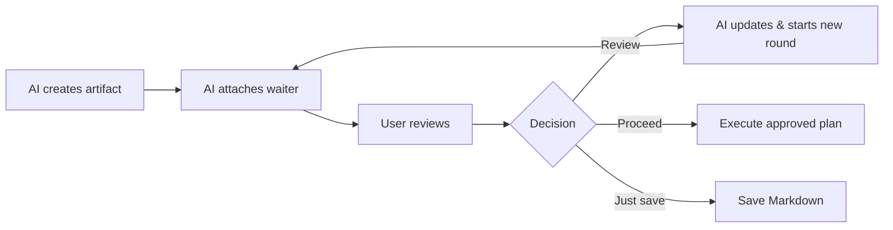

# Product Philosophy

## Artifacts are durable data; waiters are ephemeral connections

The core lifecycle rule is:

```text
artifact lifetime > waiter lifetime > chat-turn lifetime
```

An artifact represents a request awaiting human review and persists in the user's global AI Artifacts collection until the user explicitly removes it. Its manifest retains the target workspace as metadata and ownership context, but lifecycle storage does not live in that workspace. A waiter is merely a temporary connection between an active MCP request and an artifact review round. Individual chat turns are shorter still.

Therefore, cancellations, takeovers, concluding a chat turn, or restarting the MCP server must never delete or terminate an artifact. They only clear in-memory waiters or active round tokens. The AI can inspect the exact known artifact handle, obtain a fresh token from validated persistent state, and reconnect later.

## Two ways to interact with the same artifact

The default flow provides an intuitive, in-editor review experience:



The chat escape flow allows the user to save comments and say "read the review" without pressing the Review button. The previous waiter is safely cancelled; the AI inspects the exact artifact handle, reads the comments, and:

- Answers questions directly in chat.
- Revises the artifact if comments request changes.
- Both answers and edits if feedback is mixed.
- Clarifies in chat without consuming the round if feedback is ambiguous.

After processing, the AI starts the next round and attaches a new waiter. If feedback consisted solely of questions, the round advances while preserving the exact bytes and SHA of `artifact.md`. If no comments or submissions were saved, the AI reattaches to the current round without advancing, unless the user explicitly requested an artifact edit directly in chat (`intent: "explicit-chat-update"`), in which case the AI updates the Markdown and advances to the next round.

## Meaning of review decisions

1. **Review:** Submits a `revise` decision. The AI processes batch comments using the same policy as the chat escape flow: answers questions directly in chat, updates `artifact.md` only when edits are requested, resets state, and begins the next round. Question-only feedback preserves Markdown bytes and SHA. No revision history or conversational responses are inserted into the artifact document itself.
2. **Proceed:** Concludes the current review round. For `plan` and `implementation-plan`, this authorizes immediate execution of the entire approved plan within the same turn; the MCP server returns an `execute-approved-plan` runtime directive, and the AI must not halt at confirmation, explain what it will do, or ask for execution authorization again. It does not automatically open another review round.
3. **Just save:** Concludes the current round, saves the Markdown as requested, and does not execute proposed work. It does not automatically open another review round.
4. **Copy Markdown:** Copies content locally to the clipboard without submitting a decision or mutating lifecycle state.

Proceed and Just save conclude the round without destroying the artifact. The user may explicitly request a reconnect later. Reconnect opens a fresh round; it does not re-execute the previous Proceed or Just save action.

## Exact handles, no speculative artifact guessing

The AI must use the exact `artifactDirectory` returned when creating the artifact or retained from an interrupted waiter in the same conversation. It must never select the "newest artifact", scan the workspace to guess, or infer an artifact from the current working directory. If the context does not contain a single unique handle, the AI must ask the user for the artifact path.

This safety invariant takes precedence over convenience: binding to the wrong artifact could attach comments, document content, and execution authorization to the wrong conversation.

## Product intent

AI Artifacts provides a dedicated review layer for AI-generated Markdown. It enables users to read, annotate, and drive the feedback loop without turning the extension into a task manager or a second chat interface. Conversational interaction belongs in AI chat; the webview focuses purely on document review and annotations.

The agent skill triggers only when the user explicitly requests creating or updating an artifact, reading saved feedback, or reconnecting an existing lifecycle. The document type alone is never an auto-trigger condition.

## Implementation status 1.0.0

Version 1.0.0 uses artifact schema v5, connection schema v1, and MCP server 8.0.0. Every lifecycle is stored beneath the per-user `~/.ai-artifacts/artifacts/` collection. `artifact.json` and its `location.workspaceRoot` remain the source of truth for artifact identity and workspace ownership; optional `artifact-connection.json` records only the current UI-routing request. Schemas v3/v4 and workspace-local artifact directories are outside the live protocol and are not migrated. This hard cutoff avoids ambiguous mixed-version writes: extension upgrades must be followed by integration reinstall and AI-client restart.

Workspace creation requires either tagged-file evidence or a validated candidate selection token from `resolve_artifact_workspace`. Workspace folder resolution occurs before the skill inspects the repository or drafts artifact content. The resolver normalizes separators and returns candidates grouped by fresh VS Code window. Focus is a ranking hint, not identity, authorization, or a requirement for opening the target. Multiple windows alone are not ambiguous: the skill chooses a unique strongest candidate when the evidence supports one and asks the user only when the strongest targets remain tied. A selection token binds the exact window and workspace tuple; for tagged-file creation it selects the window while the tagged file remains the ownership evidence. After creation, all lifecycle operations use the exact global artifact handle and do not request workspace evidence again.

Create and explicit reconnect atomically commit schema-v1 connection state containing a window instance ID, monotonically increasing connection revision, unique open-request ID, source, and timestamp. The extension window whose stable instance ID matches the request may open the editor even when unfocused; every other window ignores it. Wait and advance preserve routing state and cannot silently rebind an artifact. Reconnect may select another live window but never changes lifecycle identity, Markdown, comments, submission, review round, or a prior Proceed/Just save action.

The official skill requires exactly five tools, creates `kind: "implementation-plan"`, verifies tool availability once per chat lifecycle, and manages exact handle-to-round mappings. Reconnect, saved-comment inspection, and explicit chat updates follow an explicit decision table with fail-closed safety. Lifecycle errors supply structured recovery metadata so agents preserve handles and avoid duplicate commits. Round tokens remain in-memory, single-use, and state-bound with a one-hour expiration.

Artifact Markdown, comments, and decisions may contain sensitive project information. Local-only transport does not make the files non-sensitive: POSIX runtime paths are restricted to owner-only directory/file modes, users remain responsible for their account and Windows filesystem ACLs, and uninstall deliberately retains user review data in `~/.ai-artifacts/artifacts/` to prevent data loss.
