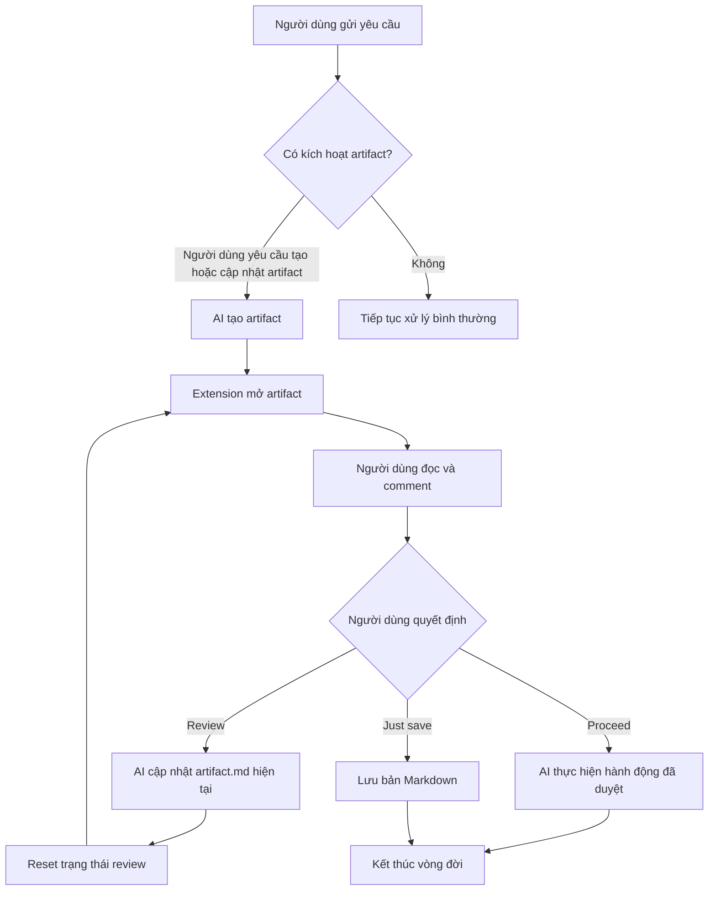

# Triết lý Codex Artifacts

## Vòng đời của một artifact

Codex Artifacts là lớp review cho nội dung do AI tạo ra. AI quyết định khi nào cần artifact trong phạm vi được cho phép; người dùng đọc, comment và chọn hành động tiếp theo.

Một artifact đại diện cho một yêu cầu cần review, không đại diện cho từng phiên bản nội dung. Nhiều lần Review chỉ tạo nhiều vòng review trên cùng artifact:

1. **Review:** AI dùng comment để cập nhật `artifact.md` hiện tại, reset trạng thái và bắt đầu vòng review mới. Không giữ bản cũ.
2. **Proceed:** chấp thuận artifact và cho phép AI thực hiện hành động tiếp theo.
3. **Just save:** lưu Markdown vào vị trí người dùng chọn mà không tiếp tục công việc.
4. **Copy Markdown:** chỉ sao chép nội dung, không gửi dữ liệu cho AI và không thay đổi vòng đời artifact.

## Mục tiêu

Codex Artifacts biến Markdown do AI tạo ra thành một artifact dễ đọc, dễ comment và có thể gửi phản hồi về đúng cuộc hội thoại Codex đã tạo nó.

Ứng dụng là công cụ review tài liệu, không thay thế Codex chat và không phải task manager.

## Phạm vi tạo artifact hiện tại

Skill hiện chỉ tạo artifact khi người dùng **yêu cầu rõ ràng việc tạo hoặc cập nhật một artifact**. Yêu cầu tạo plan, implementation plan hoặc các loại tài liệu khác không tự động kích hoạt artifact nếu người dùng không nói rõ rằng nội dung đó cần được tạo dưới dạng artifact.

## Các trường hợp mở rộng đã ghi nhận

Các trường hợp có thể mở rộng gồm architecture proposal, technical design, feature specification, API contract, data migration, refactoring proposal, test strategy, investigation report, security review và documentation draft.

Đây mới là ý tưởng đã ghi nhận, chưa phải điều kiện auto-trigger. Mỗi loại chỉ nên được bật sau khi xác định rõ khi nào cần review và Proceed có ý nghĩa gì.

## Trạng thái triển khai 0.6.1

Lifecycle vẫn giữ nguyên triết lý: Review cập nhật cùng `artifact.md`, reset trạng thái round và không lưu revision history. MCP sở hữu cả thao tác tạo lẫn cập nhật artifact, vì vậy phản hồi quay lại đúng tool call đang chờ mà không cần hook hoặc gắn `threadId`. Extension chỉ công bố các workspace đang thực sự mở, hiển thị tài liệu và ghi nhận quyết định của người dùng.

Trong multi-root workspace, root phải đến từ bằng chứng người dùng/IDE có kiểu rõ ràng; project marker không được dùng để tự chọn root. Mục `Review responses` chỉ phản hồi batch comment ngay trước đó và được thay mới ở round kế tiếp, không trở thành lịch sử tích lũy.

Viewer tiếp tục trình bày artifact như tài liệu CommonMark/GFM dễ đọc, cho phép comment ngay cạnh vùng chọn, ẩn drawer và theo theme VS Code. Ứng dụng vẫn là lớp review tài liệu, không trở thành task manager hay một chat UI khác.

Skill không tự động kích hoạt theo loại tài liệu. Implementation plan và các loại mở rộng chỉ đi qua lifecycle này khi người dùng yêu cầu rõ ràng việc tạo hoặc cập nhật artifact.
