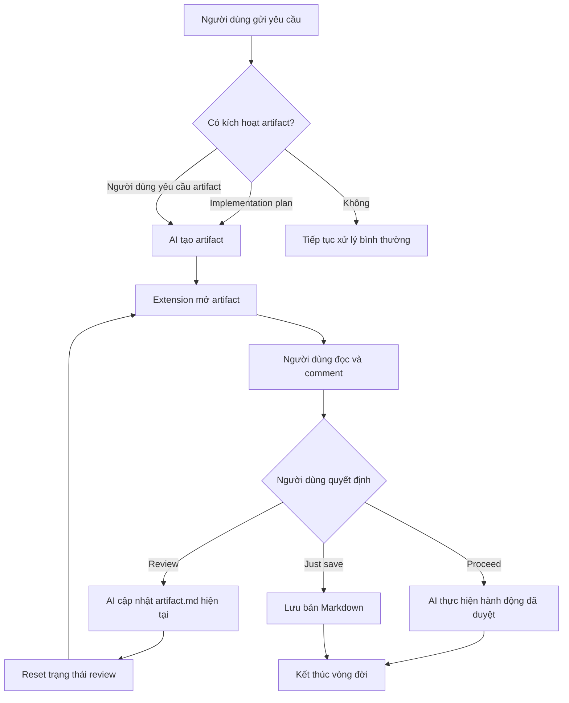

# Triết lý Codex Artifacts

## Vòng đời của một artifact

Codex Artifacts là lớp review cho nội dung do AI tạo ra. AI quyết định khi nào cần artifact trong phạm vi được cho phép; người dùng đọc, comment và chọn hành động tiếp theo.

Một artifact đại diện cho một yêu cầu cần review, không đại diện cho từng phiên bản nội dung. Nhiều lần Review chỉ tạo nhiều vòng review trên cùng artifact:

1. **Review:** AI dùng comment để cập nhật `artifact.md` hiện tại, reset trạng thái và bắt đầu vòng review mới. Không giữ bản cũ.
2. **Proceed:** chấp thuận artifact và cho phép AI thực hiện hành động tiếp theo.
3. **Just save:** lưu Markdown vào vị trí người dùng chọn mà không tiếp tục công việc.
4. **Copy Markdown:** chỉ sao chép nội dung, không gửi dữ liệu cho AI và không thay đổi vòng đời artifact.

## Mục tiêu

Codex Artifacts biến Markdown do AI tạo ra thành một artifact dễ đọc, dễ comment và có thể gửi phản hồi về đúng cuộc hội thoại Codex đã tạo nó.

Ứng dụng là công cụ review tài liệu, không thay thế Codex chat và không phải task manager.

## Phạm vi tạo artifact hiện tại

Skill hiện chỉ tạo artifact khi AI cần một **implementation plan** để người dùng review, hoặc khi người dùng **yêu cầu tạo artifact** rõ ràng. Các loại khác chưa được tự động kích hoạt để tránh tạo artifact ngoài mong đợi.

## Các trường hợp mở rộng đã ghi nhận

Các trường hợp có thể mở rộng gồm architecture proposal, technical design, feature specification, API contract, data migration, refactoring proposal, test strategy, investigation report, security review và documentation draft.

Đây mới là ý tưởng đã ghi nhận, chưa phải điều kiện auto-trigger. Mỗi loại chỉ nên được bật sau khi xác định rõ khi nào cần review và Proceed có ý nghĩa gì.

## Trạng thái triển khai 0.4.0

Lifecycle mới đã được triển khai theo triết lý trên: artifact tổng quát dùng `artifact.md`, Review cập nhật cùng artifact qua nhiều round, comment/submission được reset và không tạo revision history hoặc `.trash` mới. Skill chỉ auto-trigger implementation plan hoặc explicit artifact request; các loại mở rộng vẫn là định hướng, chưa tự động kích hoạt.
