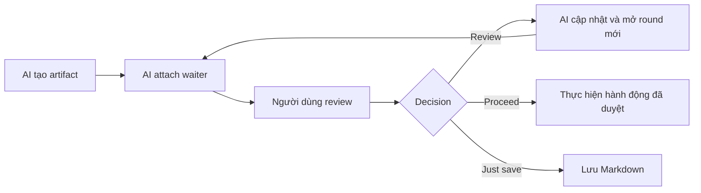

# Triết lý Codex Artifacts

## Artifact là dữ liệu bền vững, waiter chỉ là kết nối

Nguyên tắc vòng đời cốt lõi là:

```text
artifact lifetime > waiter lifetime > chat-turn lifetime
```

Artifact đại diện cho một yêu cầu cần review và tồn tại trong workspace cho đến khi người dùng chủ động xử lý nó. Waiter chỉ là kết nối tạm thời giữa một MCP request và một review round. Chat turn còn ngắn hơn nữa.

Vì vậy, cancellation, takeover, kết thúc chat turn hoặc MCP restart không được xóa hay kết thúc artifact. Chúng chỉ làm mất waiter hoặc token đang nằm trong memory. AI có thể inspect đúng artifact đã biết, lấy token mới từ trạng thái đã validate và reconnect về sau.

## Hai cách đối thoại cùng một artifact

Luồng mặc định vẫn giữ trải nghiệm quen thuộc:



Luồng chat escape cho phép người dùng lưu comment rồi nhắn “hãy xem review” mà không cần bấm Review. Waiter cũ được hủy an toàn; AI inspect đúng artifact handle, đọc comment và:

- Trả lời câu hỏi trực tiếp trong chat.
- Sửa artifact nếu comment yêu cầu thay đổi.
- Vừa trả lời vừa sửa nếu feedback là hỗn hợp.
- Hỏi lại và chưa consume round nếu feedback chưa rõ.

Sau khi xử lý xong, AI mở round mới và tự chờ lại. Nếu chỉ có câu hỏi, round vẫn tăng nhưng bytes và SHA của `artifact.md` được giữ nguyên. Nếu không có comment hoặc submission đã lưu, AI attach lại waiter cho cùng round và không tăng round, trừ khi người dùng yêu cầu sửa trực tiếp qua chat (explicit chat update với `intent: "explicit-chat-update"`), khi đó AI cập nhật Markdown mới và mở round tiếp theo.

## Ý nghĩa của các quyết định

1. **Review:** gửi submission `revise`. AI xử lý batch comment bằng cùng policy với chat escape: trả lời câu hỏi trực tiếp trong chat, chỉ cập nhật `artifact.md` khi có yêu cầu sửa, reset trạng thái và bắt đầu round mới. Question-only giữ nguyên Markdown/SHA. Không giữ revision history hoặc chèn câu trả lời hội thoại vào artifact.
2. **Proceed:** kết thúc round hiện tại. Với `plan` và `implementation-plan`, đây là quyền thực thi toàn bộ plan đã duyệt ngay trong cùng turn; MCP trả runtime directive `execute-approved-plan`, và AI không được dừng ở bước xác nhận, mô tả việc sẽ làm hoặc hỏi lại quyền triển khai. Không tự mở round mới.
3. **Just save:** kết thúc round hiện tại, lưu Markdown theo yêu cầu và không thực hiện công việc được đề xuất. Không tự mở round mới.
4. **Copy Markdown:** chỉ sao chép nội dung, không gửi decision và không thay đổi lifecycle.

Proceed và Just save kết thúc round, không “kill” artifact. Người dùng có thể yêu cầu reconnect rõ ràng về sau. Reconnect chỉ mở round mới; nó không được thực thi lại hành động Proceed/Just save trước đó.

## Exact handle, không suy đoán artifact

AI phải dùng chính xác `artifactDirectory` được trả về khi tạo artifact hoặc được giữ từ waiter vừa bị ngắt trong cùng conversation. Không được chọn “artifact mới nhất”, quét workspace để đoán, hoặc suy luận từ cwd. Nếu context không còn một handle duy nhất, AI phải hỏi người dùng artifact path.

Quy tắc này quan trọng hơn sự tiện lợi: kết nối nhầm artifact có thể khiến comment, nội dung và quyền thực hiện hành động bị gắn sai cuộc đối thoại.

## Mục tiêu sản phẩm

Codex Artifacts là lớp review cho Markdown do AI tạo ra. Nó giúp người dùng đọc, comment và điều khiển vòng phản hồi mà không biến ứng dụng thành task manager hoặc một chat UI thứ hai. Câu trả lời hội thoại vẫn thuộc Codex chat; webview tập trung vào tài liệu và annotation.

Skill chỉ kích hoạt khi người dùng yêu cầu rõ ràng việc tạo/cập nhật artifact, đọc feedback đã lưu, hoặc reconnect lifecycle đã biết. Loại tài liệu tự nó không phải điều kiện auto-trigger.

## Trạng thái triển khai 0.8.0

Phiên bản 0.8.0 dùng MCP server 5.1.0, bổ sung hỗ trợ explicit chat update qua `inspect_artifact_review` với `intent: "explicit-chat-update"` để cập nhật và advance một round trống trực tiếp từ chat mà không cần tạo comment hoặc bấm nút Review. Việc tách artifact persistence khỏi waiter ownership cho phép chat escape và reconnect mà không thay schema-v4, webview, provider, Artifact Store, renderer hoặc workspace registry.

Round token vẫn là capability in-memory, single-use và hết hạn sau một giờ, nhưng được bind vào toàn bộ trạng thái đã inspect: artifact, session, round, artifact hash, comments hash và submission presence/hash. Token chỉ bị consume sau commit thành công. Schema-v3 tiếp tục chỉ đọc.
