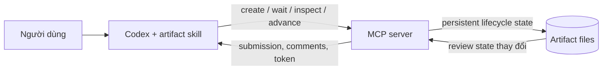

# Kế hoạch tối ưu workflow artifact: Codex skill và MCP server

## 1. Phạm vi

Plan này chỉ giữ lại hai đối tượng cần tối ưu:

1. **Codex + artifact skill** — cách Codex đọc hướng dẫn, xác định workspace, chuẩn bị nội dung, giữ lifecycle handle và xử lý feedback.
2. **MCP server** — cách server tạo artifact, chờ review, inspect/takeover, cấp token và advance round.

Extension store, webview, renderer, workspace publisher và integration UI không nằm trong scope hiện tại. Chúng chỉ được nhắc đến khi là boundary bắt buộc của một workflow thuộc hai đối tượng trên.

## 2. Luồng kiến trúc được giữ lại



| Đối tượng              | Trách nhiệm cần giữ                                                                                                                                           | Vấn đề cần tối ưu                                                                                                                     |
| ---------------------- | ------------------------------------------------------------------------------------------------------------------------------------------------------------- | ------------------------------------------------------------------------------------------------------------------------------------- |
| Codex + artifact skill | Nhận biết yêu cầu artifact, xác minh workspace, tạo Markdown hoàn chỉnh, giữ exact handle, phân loại feedback và chọn đúng lifecycle flow                     | Đọc hướng dẫn/context dài; nhiều bước trước tool call đầu tiên; sinh lại full document; dễ mất thời gian khi reconnect hoặc chọn flow |
| MCP server             | Validate workspace/state, tìm registered workspace candidates, tạo persistent artifact, sở hữu waiter/token, inspect/takeover và commit round transactionally | Chưa có workspace discovery API cho AI; lỗi token/state chưa có recovery metadata đủ rõ; nhiều I/O khi advance document               |

## SKILL summary

Phần này tóm tắt toàn bộ rules của `create-review-artifact` hiện tại bằng tiếng Việt. Source skill trong repo và bản đang được cài đặt khớp nhau tại thời điểm phân tích.

### S.1. Khi nào skill được kích hoạt

- Chỉ kích hoạt khi người dùng **yêu cầu rõ ràng** một trong các việc:
  - tạo artifact;
  - cập nhật artifact;
  - đọc comment/review đã lưu;
  - reconnect lifecycle của một artifact đã biết.
- Việc người dùng chỉ yêu cầu “viết plan”, “viết spec” hoặc một loại tài liệu không tự động có nghĩa là phải tạo artifact.
- Một yêu cầu độc lập chỉ sở hữu một artifact ID và một artifact directory.

### S.2. Artifact kind hiện tại và hướng mặc định mới

Rule hiện tại của skill yêu cầu AI tự phân loại:

- Dùng `implementation-plan` nếu artifact trực tiếp hướng dẫn thay đổi code, file, workspace hoặc command.
- Dùng `plan` cho plan có thể thực thi nhưng không trực tiếp hướng dẫn các thay đổi trên.
- Các loại khác dùng lowercase slug ngắn.
- `kind` ảnh hưởng tới Proceed: `plan` và `implementation-plan` nhận `execute-approved-plan`.

Decision 1 tại A.1 **không xóa field `kind`**. Target mới chỉ xóa bước suy luận: skill luôn truyền hằng `kind: "implementation-plan"` cho mọi artifact. Schema v4, manifest, result và UI tiếp tục giữ `kind` để tương thích.

### S.3. Điều kiện tool

Rule hiện tại yêu cầu MCP có bốn lifecycle tools:

1. `create_artifact`
2. `wait_for_artifact_review`
3. `inspect_artifact_review`
4. `advance_and_wait_for_artifact`

Target tại Decision 4 bổ sung tool read-only thứ năm:

5. `resolve_artifact_workspace`

Nếu thiếu bất kỳ tool bắt buộc nào, Codex phải yêu cầu người dùng chạy **Codex Artifacts: Install Global Codex Integration**, restart Codex và mở chat mới. Skill không tự giả lập lifecycle bằng cách ghi file. Decision 5 làm rõ availability check chỉ diễn ra một lần khi bắt đầu artifact lifecycle trong chat hiện tại, không lặp ở mỗi review round.

### S.4. Workspace evidence gate hiện tại (Decision 4 sẽ thay thế)

Skill phải tìm một workspace root đã được xác minh, theo thứ tự và dừng ở lựa chọn đầu tiên vừa hợp lệ vừa không mơ hồ:

1. Path, file link, `@mention` hoặc attachment được người dùng cung cấp rõ trong message.
2. Active/open file do IDE context cung cấp với path cụ thể.
3. Repository/folder được người dùng gọi tên rõ; Codex resolve path và xem ít nhất một marker, document hoặc source liên quan.
4. Nếu vẫn không có đúng một root, hỏi người dùng workspace nào sở hữu artifact.

Các nguồn sau chỉ là orientation hint, không phải ownership evidence:

- cwd của Codex/session;
- `environment_context`;
- thứ tự workspace folder;
- repo đầu tiên nhìn thấy;
- search result đầu tiên;
- folder name hoặc project marker đứng một mình.

Skill phải yêu cầu absolute directory tồn tại và có bằng chứng công việc thuộc về đó. Trước khi root rõ ràng, không được inspect repo không liên quan, tạo lifecycle files hoặc gọi artifact tools.

### S.5. Mapping evidence hiện tại sang MCP input

| Nguồn đã xác minh                                   | `workspaceEvidence.kind` | Dữ liệu bắt buộc                                         |
| --------------------------------------------------- | ------------------------ | -------------------------------------------------------- |
| Path/link/attachment người dùng đưa                 | `explicit-user-path`     | Absolute existing path và nguyên văn user text liên quan |
| Active file từ IDE                                  | `active-file`            | Concrete file path                                       |
| Người dùng gọi tên đúng một folder                  | `explicit-user-folder`   | Nguyên văn user text                                     |
| IDE context chứng minh chỉ có một registered folder | `single-workspace`       | Không tự dùng chỉ vì cwd có một repo                     |

Skill không được bịa hoặc diễn đạt lại evidence. Nếu MCP trả `AMBIGUOUS_WORKSPACE` hoặc `WORKSPACE_EVIDENCE_MISMATCH`, Codex phải hỏi người dùng; không retry bằng một root tự suy luận khác.

Decision 4 sẽ thay bốn evidence types hiện tại bằng đúng hai loại: `tagged-file` và `user-selected-workspace`. Keyword tên repo chỉ là input discovery cho `resolve_artifact_workspace`, không phải creation evidence.

### S.6. Create và default review flow

1. Viết một Markdown document hoàn chỉnh, không gửi patch hoặc placeholder.
2. Gọi `create_artifact` với `workspaceRoot`, typed evidence, title, `kind` và Markdown. Theo target mới, skill luôn truyền `kind: "implementation-plan"` thay vì yêu cầu AI phân loại.
3. Không tạo/sửa trực tiếp lifecycle files.
4. Giữ nguyên exact `artifactDirectory` và `reviewRound` MCP trả về.
5. Gọi `wait_for_artifact_review` ngay trên exact handle/round đó.
6. Sau khi create thành công, không gọi `resolve_artifact_workspace` lại cho artifact này; workspace owner đã nằm trong artifact context.
7. Các round sau dùng đúng handle đã giữ, không lặp tool-availability check nếu không có lỗi tool/connection, MCP restart hoặc chat mới.
8. Sau mỗi round được advance, tiếp tục xử lý decision và giữ nguyên artifact directory.

### S.7. Xử lý decision từ review

| Decision                                                  | Rule của skill                                                                                                                                       |
| --------------------------------------------------------- | ---------------------------------------------------------------------------------------------------------------------------------------------------- |
| Review / `revise`                                         | Đọc tất cả comments, phân loại feedback và dùng round token để advance                                                                               |
| Proceed / `approve` với `plan` hoặc `implementation-plan` | Thực thi toàn bộ plan đã duyệt ngay trong cùng turn theo `execute-approved-plan`; không chỉ xác nhận, không hỏi xin phép lần nữa, không mở round mới |
| Proceed với kind khác                                     | Chỉ thực hiện action đã được hàm ý bởi yêu cầu ban đầu; Proceed không tự mở rộng authority                                                           |
| Just save / `save`                                        | Hỏi hoặc dùng destination trong workspace, copy Markdown rồi kết thúc; không execute và không tự mở round mới                                        |
| Copy Markdown                                             | Chỉ là UI action; không thay lifecycle                                                                                                               |

Theo target tại A.1, mọi artifact do skill tạo đều mang `kind: "implementation-plan"`, nên chúng luôn đi vào nhánh Proceed hiện có và nhận `execute-approved-plan`. Không cần đổi MCP thành universal routing cho các client khác.

### S.8. Unified feedback handling

Skill gom tất cả comments của một round và phân loại:

| Loại feedback       | Hành động bắt buộc                                                                                  |
| ------------------- | --------------------------------------------------------------------------------------------------- |
| Question-only       | Trả lời mọi câu hỏi trong chat trước, sau đó advance **không gửi Markdown** để giữ nguyên bytes/SHA |
| Change-only         | Tạo complete replacement Markdown rồi advance                                                       |
| Mixed               | Trả lời câu hỏi trong chat trước, tạo complete replacement Markdown chứa thay đổi rồi advance       |
| Needs clarification | Hỏi lại trong chat, chưa consume token và chưa advance                                              |

Câu trả lời hội thoại không được chèn vào mục `Review responses` trong artifact. Nếu revision chạm một tài liệu có section đó do AI tạo trước đây, skill phải bỏ section đó.

### S.9. Chat escape, chat update và reconnect

| Tình huống                                                   | Tool flow                                                                                                                               |
| ------------------------------------------------------------ | --------------------------------------------------------------------------------------------------------------------------------------- |
| Pure reconnect, chỉ muốn chờ tiếp                            | `wait_for_artifact_review` trên exact handle và cùng round; không inspect, không advance                                                |
| Người dùng đã lưu comment rồi nhắn “đọc review”              | `inspect_artifact_review(takeover: true)`; nếu có feedback thì xử lý theo unified policy                                                |
| Inspect không có comment/submission                          | Báo chưa có feedback rồi wait lại cùng round; không advance                                                                             |
| Người dùng yêu cầu sửa trực tiếp trong chat trên round trống | Inspect với `takeover: true`, exact round và `intent: explicit-chat-update`; dùng chat-update token để advance với Markdown có SHA khác |
| Reconnect sau Proceed/Just save                              | Inspect exact artifact, lấy token mới, advance không Markdown và wait; không lặp lại action đã Proceed/save                             |
| Ý định mơ hồ như “xem lại artifact”                          | Hỏi người dùng muốn reconnect, đọc feedback đã lưu hay sửa trực tiếp; chưa gọi wait/inspect/advance và không tự takeover                |
| Advance báo token/round/state không khớp                     | Theo structured recovery của Case G; mặc định inspect lại cùng exact handle và không replay mù                                          |
| Token đang được request khác dùng                            | Không gửi thêm advance; chờ request đang chạy hoàn tất rồi inspect nếu kết quả không rõ                                                 |

Takeover chỉ hủy và drain waiter cũ. Nó không xóa artifact, không kết thúc round và không sửa lifecycle files. Nếu chưa xác định được duy nhất ý định lifecycle hoặc exact artifact handle, skill phải hỏi lại trước; an toàn hơn việc hủy nhầm waiter.

### S.10. Handle, lifetime và ownership rules

- Luôn dùng exact `artifactDirectory` được create trả về hoặc được giữ từ waiter vừa bị ngắt.
- Nếu chat giữ nhiều artifact, chọn đúng một handle bằng mapping `request/workspace → artifactDirectory → reviewRound` trước mọi wait, inspect, advance hoặc reconnect.
- Không quét workspace để chọn “artifact mới nhất” và không suy luận handle từ cwd.
- Nếu context không còn một handle duy nhất, hỏi người dùng artifact path.
- `resolve_artifact_workspace` chỉ thuộc pre-create Case A; không dùng để tìm lại artifact hoặc workspace sau create.
- MCP vẫn load context của exact artifact và xác minh `manifest.location.workspaceRoot` trong mỗi lifecycle call dựa trên `loadArtifactContext`. Thành công thì tool tiếp tục ngay; thất bại thì trả lỗi trước mutation/attach waiter.
- Lifetime model: `artifact > waiter > chat turn`.
- Cancellation, hết chat turn hoặc MCP restart chỉ làm mất waiter/token in-memory; không xóa artifact.
- Mỗi artifact chỉ có một live waiter tại một thời điểm, trừ takeover có chủ ý.
- Advance thay cùng `artifact.md` khi có Markdown mới, tăng round, reset comments/submission và không giữ revision history.
- Chỉ MCP được tạo artifact, advance round, reset comments, consume token và ghi lifecycle metadata.
- Schema v4 là writable; schema v3 chỉ đọc.

### S.11. Round token rules trong contract

- Token nằm trong memory, dùng một lần và hết hạn sau một giờ.
- Token bind với artifact, session, round, artifact SHA, comments SHA và trạng thái/hash submission.
- State thay đổi giữa inspect/wait và advance sẽ làm token bị từ chối.
- Token chỉ bị consume sau khi transaction commit thành công.
- Sau MCP restart phải inspect exact artifact để lấy token mới.
- Chat-update token bắt buộc có replacement Markdown không rỗng và SHA phải khác current document.
- Target của Case G giữ nguyên token model nhưng bổ sung error code và recovery metadata.
- Khi không chắc commit đã xảy ra hay chưa, skill phải inspect cùng exact handle trước; không replay token, Markdown hoặc action cũ.
- Chỉ được reuse token khi MCP xác nhận transaction đã rollback và token chưa bị consume.

### S.12. Tóm tắt thay đổi của skill sau toàn bộ decisions

| Decision                         | Rule cần có trong skill                                                                                      | Case chịu ảnh hưởng | Trạng thái                                           |
| -------------------------------- | ------------------------------------------------------------------------------------------------------------ | ------------------- | ---------------------------------------------------- |
| 1 — Default kind                 | Luôn truyền `kind: "implementation-plan"`; không suy luận kind                                               | A, H                | Implement                                            |
| 2 — Giữ Proceed routing          | Tin và xử lý nhánh `execute-approved-plan` hiện có                                                           | H                   | Không đổi MCP routing                                |
| 3 — Giải thích NextAction        | Execute plan đã approve ngay cùng turn; không hỏi lại, không mở round mới                                    | H                   | Implement trong skill; H không có optimization riêng |
| 4 — Hai workspace cases          | Tagged file hoặc user selection từ resolver; MCP vẫn verify                                                  | A                   | Implement                                            |
| 5 — Tool availability            | Yêu cầu năm tools và chỉ check một lần mỗi chat; recheck khi unavailable/restart/chat mới                    | A–H                 | Implement                                            |
| 6 — Multi-handle                 | Giữ mapping request/workspace → exact handle/round; mơ hồ thì hỏi, không chọn theo recency                   | A–H                 | Implement                                            |
| D.1 — Chat escape decision table | Phân biệt reconnect, inspect feedback và explicit chat update; intent/handle chưa rõ thì hỏi, không takeover | D, F, G             | Implement P2                                         |
| F — Pure reconnect               | Wait exact handle/same round, không inspect/resolve/advance                                                  | F                   | Không cần improve                                    |
| G — Structured recovery          | Dùng error code/recovery metadata; same exact handle; không replay mù                                        | G                   | Implement P2                                         |
| H — Proceed                      | Thừa hưởng Decision 1–3; chỉ giữ acceptance coverage                                                         | H                   | Không cần improve                                    |
| Document payload                 | Case B/E tiếp tục full replacement; structured edits để Later                                                | B, E                | Later                                                |
| Question-only                    | Trả lời chat rồi advance không Markdown                                                                      | C                   | Không cần improve                                    |

#### Rule set cuối cùng sau create

1. Chọn đúng một exact artifact handle trước mọi lifecycle call.
2. Không gọi `resolve_artifact_workspace` lại sau create.
3. Không lặp tool-availability check nếu chưa có tool failure, MCP restart hoặc chat mới.
4. Reconnect thuần túy dùng `wait_for_artifact_review`; Case F không thêm optimization.
5. Đọc feedback/chat update tuân theo decision table Case D; chưa rõ thì hỏi trước.
6. Token/state error tuân theo recovery table Case G; không replay khi commit state chưa rõ.
7. Approve tuân theo `execute-approved-plan` từ Decision 1–3; Case H không thêm lifecycle behavior.
8. MCP tiếp tục xác minh workspace và exact state bên trong từng tool call.

## 3. Workflow cases liên quan trực tiếp

### Case A — Tạo artifact mới

#### A.1. Quyết định thay đổi của Chú

Đây là các quyết định target của Case A. Phần A.2 tiếp tục mô tả hệ thống **hiện tại** để làm baseline; các mục A.3 trở đi mô tả hệ thống sau thay đổi.

##### Decision 1 — Giữ artifact kind, mặc định `implementation-plan` tại skill

- Không xóa artifact `kind` khỏi protocol.
- AI không còn phải suy luận giữa `plan`, `implementation-plan` hoặc slug khác.
- Skill luôn gọi `create_artifact` với hằng `kind: "implementation-plan"`.
- `create_artifact` vẫn nhận field `kind` bắt buộc như hiện tại.
- Manifest, artifact handle, wait/inspect result và webview state vẫn giữ artifact `kind`.
- `artifactKindSchema`, validation lowercase slug và UI label hiện tại được giữ nguyên.

“Default” ở đây nằm tại **skill orchestration**: AI làm theo một giá trị cố định, không tự phân loại nội dung. MCP chưa cần đổi `kind` thành optional hay tự inject default. Vì vậy:

- mọi artifact tạo qua official skill có `kind: "implementation-plan"`;
- client khác vẫn có thể truyền kind khác theo contract hiện tại;
- không cần schema mới hoặc migration artifact cũ.

Đổi lại, tên `implementation-plan` có thể không phản ánh đúng nội dung của artifact phân tích. Trong target này, `kind` được xem là field tương thích kỹ thuật để giữ lifecycle/Proceed behavior ổn định, không còn là metadata phân loại chính xác.

##### Decision 2 — Dùng nguyên Proceed routing hiện tại

Khi submission có decision `approve` trên artifact do skill tạo:

```json
{
  "decision": "approve",
  "nextAction": {
    "type": "execute-approved-plan",
    "instruction": "Execute the approved artifact immediately in this same turn..."
  }
}
```

- MCP hiện đã trả `nextAction.type = "execute-approved-plan"` cho `kind: "implementation-plan"`.
- Vì skill luôn tạo kind này, không cần sửa `approvedPlanAction(kind, decision)` thành universal action.
- MCP không tự execute; MCP chỉ phát directive trong tool result.
- Proceed không tự advance round và không tự attach waiter mới.
- Nếu artifact chỉ chứa phân tích mà không có action để thực hiện, AI hoàn tất mà không tạo side effect ngoài nội dung đã được duyệt.
- Nếu artifact có action code/file/command, Proceed là authorization thực thi các action nằm trong scope đó, trừ blocker hoặc authority bên ngoài.

##### Decision 3 — Skill vẫn giải thích NextAction cho AI

Skill phải giữ rule rõ ràng:

- Khi nhận `approve` cùng `nextAction.type = "execute-approved-plan"`, thực thi ngay nội dung đã duyệt trong cùng turn.
- Không chỉ trả lời “đã approve”.
- Không mô tả công việc như việc sẽ làm sau.
- Không hỏi xác nhận triển khai lần nữa.
- Không tự mở review round mới.
- Chỉ dừng khi có blocker thật hoặc cần authority ngoài scope đã duyệt.

Đây vẫn là application-level contract, không phải field chuẩn có semantics mặc định trong MCP. Tool description và contract phải lặp lại rule để AI/client tương thích có thể hiểu.

##### Decision 4 — Workspace flow chỉ còn hai cases, MCP tiếp tục xác minh

Không tối ưu hoặc loại bỏ workspace registry verification trong MCP. Registry lookup, canonical path checking, freshness, registered-root validation và filesystem safety vẫn được giữ vì chi phí nhỏ và là hard boundary hữu ích.

Skill chỉ còn hai đường hợp lệ để lấy `workspaceRoot`:

**Case 1 — Có tag file**

```text
User tag file
  → AI lấy exact file path
  → AI xác định một workspaceRoot chứa file
  → create_artifact(workspaceRoot, tagged-file evidence, ...)
  → MCP xác minh file/root bằng registry và filesystem rules hiện tại
  → tạo artifact
```

- Tag file là creation evidence trực tiếp.
- AI không dùng cwd, workspace order, active file không được tag hoặc project marker để thay thế.
- Nếu tagged file không quy về một root duy nhất, AI phải hỏi; không tự chọn.
- MCP vẫn xác minh root tồn tại, canonical, registered và chứa file trước mutation.

**Case 2 — Không có tag file**

```text
User gọi tên repo
  → AI gửi nguyên văn keyword cho resolve_artifact_workspace
  → MCP lọc registered workspace roots theo name/path
  → MCP trả candidates
  → AI hỏi user chọn
  → user chọn một candidate
  → AI gọi create_artifact bằng selected path + selection evidence
  → MCP xác minh lại current registry/path
  → tạo artifact
```

- Keyword chỉ dùng để discovery; nó không phải ownership evidence và không được gửi thẳng làm `workspaceRoot`.
- `resolve_artifact_workspace` là read-only, không tạo lifecycle files.
- Resolver phải dùng cùng fresh registry scope mà create sẽ xác minh, để hạn chế trả candidate chắc chắn bị create từ chối.
- User selection biến một candidate thành creation evidence.
- Nếu không có candidate, AI yêu cầu user tag file hoặc cung cấp keyword rõ hơn.
- Nếu candidate/token stale khi create, MCP từ chối và AI chạy resolver lại.

Create contract chỉ còn hai evidence types:

```ts
type WorkspaceEvidence =
  | {
      kind: "tagged-file";
      filePath: string;
    }
  | {
      kind: "user-selected-workspace";
      selectionToken: string;
      userText: string;
    };
```

Bốn evidence types hiện tại — `single-workspace`, `active-file`, `explicit-user-path`, `explicit-user-folder` — bị loại khỏi writable create input. Đây là breaking tool-contract change nhưng không đổi persisted artifact schema vì workspace evidence không được lưu trong manifest.

##### Decision 5 — Tool availability có năm tools và chỉ kiểm tra một lần mỗi chat

Giữ nguyên cấu trúc rule hiện tại, bổ sung resolver vào danh sách:

> Require the `codex_artifacts` MCP server to expose `resolve_artifact_workspace`, `create_artifact`, `wait_for_artifact_review`, `inspect_artifact_review`, and `advance_and_wait_for_artifact`. If unavailable, ask the user to run **Codex Artifacts: Install Global Codex Integration**, restart Codex, and start a new chat.

Chỉ bổ sung phần làm rõ sau vào chính rule này:

> Perform this availability check only once when starting the artifact lifecycle in the current chat. Do not repeat it in later review rounds unless an artifact tool becomes unavailable, the MCP connection is restarted, or a new chat begins.

Ý nghĩa triển khai:

- Target yêu cầu đủ năm tools; resolver là bắt buộc cho case không có tag file.
- AI dùng tool catalog đã được runtime cung cấp; không gọi thêm capabilities tool.
- Không thêm cờ trạng thái persistent.
- Review round sau dùng tiếp lifecycle flow, không lặp availability check.
- Chỉ kiểm tra lại khi có tool/connection failure thực tế, MCP restart hoặc chat mới.

##### Decision 6 — Quản lý nhiều artifact handle trong cùng chat

Giữ nguyên invariant hiện tại: một yêu cầu độc lập sở hữu một artifact directory và artifact ID. Bổ sung rule:

> When multiple artifacts exist in one chat, associate each exact `artifactDirectory` and `reviewRound` with its request and workspace. Use only a uniquely matching handle; if ambiguous, ask the user and never select by recency.

Ý nghĩa triển khai:

- Một chat có thể giữ nhiều artifact thuộc các request hoặc repo khác nhau.
- Mapping `request/workspace → artifactDirectory → reviewRound` nằm trong conversation context của AI; không tạo server-side “current artifact”.
- Trước wait, inspect, advance hoặc reconnect, AI phải xác định đúng một handle.
- Nếu lời nhắc có thể trỏ tới nhiều artifact, AI hỏi người dùng thay vì chọn artifact mới nhất.
- Trường hợp chỉ có một artifact không phát sinh bước suy luận bổ sung đáng kể.
- Một yêu cầu trải qua nhiều repo phải chọn một repo làm owner hoặc tách thành nhiều artifact; không ghép mơ hồ nhiều workspace root vào một lifecycle.

##### Ảnh hưởng contract và compatibility

| Vị trí                     | Hiện tại                                                            | Sau thay đổi                                                         |
| -------------------------- | ------------------------------------------------------------------- | -------------------------------------------------------------------- |
| Skill trước create         | AI chọn artifact kind theo nội dung                                 | Không suy luận; luôn dùng `implementation-plan`                      |
| Tool availability          | Bốn lifecycle tools                                                 | Năm tools, thêm `resolve_artifact_workspace`; check một lần mỗi chat |
| Workspace resolution       | Nhiều fallback từ path, active file, named repo và single workspace | Đúng hai cases: tagged file hoặc user selection từ resolver          |
| Workspace evidence         | Bốn evidence types                                                  | Chỉ `tagged-file` và `user-selected-workspace`                       |
| Create tool input          | Bắt buộc absolute root và typed evidence                            | Vẫn bắt buộc; evidence union thay đổi                                |
| MCP registry verification  | Xác minh registered/focused workspace                               | Giữ lại; không phải mục tiêu tối ưu                                  |
| Manifest schema v4         | Bắt buộc `kind` và lưu workspace root                               | Không đổi                                                            |
| Proceed routing            | Plan kinds có `execute-approved-plan`                               | Không đổi; artifact từ skill luôn dùng `implementation-plan`         |
| Artifact handle management | Giữ exact handle cho một request                                    | Giữ mapping riêng khi chat có nhiều artifact                         |

##### Lợi ích của các quyết định

1. Không cần schema mới hoặc migration artifact v3/v4.
2. AI không suy luận artifact kind; chỉ truyền hằng `implementation-plan`.
3. Workspace flow giảm còn hai nhánh dễ dự đoán.
4. Khi không có tag file, AI không tự dò filesystem; MCP trả đúng registered candidates.
5. MCP vẫn giữ hard verification trước mutation.
6. Nhiều artifact trong cùng chat không bị chọn theo recency.

##### Thành phần bị ảnh hưởng trực tiếp

- `skills/create-review-artifact/SKILL.md`: default kind, five-tool availability, two-case workspace flow và multi-handle rule.
- `skills/create-review-artifact/references/artifact-contract.md`: resolver contract, hai evidence types, selection/retry rules và Proceed semantics.
- `src/integration/artifact-review-mcp-v4.ts`: đăng ký/handle `resolve_artifact_workspace`, create schema mới và selection grant validation.
- `src/shared/workspace-registry.ts`: candidate filtering theo name/path và reuse current verification scope.
- Shared workspace-evidence contracts.
- Skill, workspace-registry và MCP tests/fixtures.
- Integration source chịu trách nhiệm đóng gói/cài skill và MCP mới.
- README, architecture, philosophy và changelog khi triển khai behavior mới.

Không cần thay artifact manifest schema, Artifact Store hoặc webview cho các quyết định này.

#### A.2. Luồng hiện tại

##### A.2.1. Skill đang làm gì trước khi gọi MCP

| Thứ tự | Rule hiện tại của skill                        | Hành động Codex phải thực hiện                                                                                            |
| -----: | ---------------------------------------------- | ------------------------------------------------------------------------------------------------------------------------- |
|      1 | Trigger policy                                 | Xác nhận người dùng đã yêu cầu rõ việc tạo artifact; nếu chỉ yêu cầu một document thông thường thì không tự bật lifecycle |
|      2 | Artifact kind inference — sẽ được đơn giản hóa | Hiện tại AI chọn `implementation-plan`, `plan` hoặc lowercase slug; target mới luôn dùng `implementation-plan`            |
|      3 | Tool availability                              | Kiểm tra đủ bốn MCP tools; nếu thiếu thì dừng và yêu cầu install/restart/new chat                                         |
|      4 | Workspace evidence gate                        | Thử lần lượt explicit path/link/attachment → active file → repo/folder được gọi tên → hỏi người dùng                      |
|      5 | Reject weak evidence                           | Không dùng cwd, `environment_context`, workspace order, project marker hoặc search result làm ownership evidence          |
|      6 | Verify root                                    | Đảm bảo root là absolute existing directory và yêu cầu thực sự thuộc root đó                                              |
|      7 | Type evidence                                  | Map nguồn sang `explicit-user-path`, `active-file`, `explicit-user-folder` hoặc `single-workspace` với dữ liệu nguyên văn |
|      8 | Complete document                              | Đọc context cần thiết và tạo toàn bộ Markdown trước tool call đầu tiên                                                    |
|      9 | Create request                                 | Hiện tại gửi kind đã chọn; target mới gửi cố định `kind: "implementation-plan"` cùng các input còn lại                    |

Phần có thể khiến Codex mất nhiều thời gian nhất là rule 4–8: skill vừa phải chứng minh workspace ownership vừa hoàn thiện nội dung trước khi MCP tạo bất kỳ artifact nào.

##### A.2.2. `create_artifact` đang làm gì trong MCP

Luồng thực tế trong `parseCreateArguments`, `resolveWorkspaceRootForArtifactCreation`, `safeArtifactCollectionRoot`, `createArtifact` và `loadArtifactContext`:

1. **Parse input**
   - `workspaceRoot` phải là absolute path.
   - `workspaceEvidence` phải match một trong bốn schema.
   - Title phải dài 1–200 ký tự.
   - Kind phải là lowercase slug hợp lệ; validation này được giữ nguyên và target skill luôn cung cấp `implementation-plan`.
   - Markdown phải không rỗng và không vượt giới hạn byte.

2. **Canonicalize requested root**
   - `resolveRegisteredWorkspaceRoot` gọi `realpath` trên requested root.
   - Đọc toàn bộ fresh registry snapshots.
   - Chỉ chấp nhận root có path và real path khớp một folder đã register.
   - Nếu không khớp, trả `WORKSPACE_NOT_REGISTERED`.

3. **Chọn tập workspace theo focus**
   - MCP đọc fresh snapshots thêm một lần trong `resolveWorkspaceRootForArtifactCreation`.
   - Nếu có focused snapshot, chỉ dùng các snapshot đang focus; nếu không thì dùng toàn bộ fresh snapshots.
   - Gom các registered folders duy nhất.
   - Requested root phải xuất hiện trong tập này, nếu không trả `WORKSPACE_EVIDENCE_MISMATCH`.

4. **Validate theo từng evidence kind**
   - `single-workspace`: tập folder liên quan phải có đúng một root; nhiều hơn trả `AMBIGUOUS_WORKSPACE`.
   - `active-file`: snapshot phải đang focus, active file path phải khớp và file phải thuộc requested root.
   - `explicit-user-path`: evidence path phải absolute, tồn tại, `realpath` nằm trong root; basename của path phải xuất hiện trong exact `userText`.
   - `explicit-user-folder`: user text phải nhắc đúng tên của đúng một registered folder và folder đó phải là requested root.

5. **Chuẩn bị artifact collection**
   - Tạo hoặc xác nhận `.codex-artifacts` và `.codex-artifacts/artifacts`.
   - Mỗi directory component phải là directory thật, không phải symbolic link/junction.
   - Gọi `realpath` cho workspace và collection root.
   - Xác minh collection root vẫn nằm trong workspace.

6. **Cấp identity**
   - Sinh artifact ID từ title + ngày + UUID rút gọn.
   - Thử tối đa năm lần nếu ID directory bị trùng.
   - Sinh `reviewSessionId` và timestamp.

7. **Tạo schema-v4 state**
   - Manifest bắt đầu ở review round 1 và ghi canonical workspace root.
   - Comments document bắt đầu rỗng và bind với SHA-256 của Markdown.

8. **Ghi lifecycle files**
   - Tạo artifact directory.
   - Ghi tuần tự `artifact.json`, `artifact.md`, `comments.json` với chế độ create-exclusive `wx`.
   - Nếu một bước lỗi, MCP recursive-remove đúng directory vừa cấp; rollback lỗi sẽ trả aggregate error.

9. **Load và validate lại state vừa ghi**
   - `loadArtifactContext` đọc manifest, Markdown và comments song song.
   - Parse manifest và xác minh artifact directory binding.
   - Gọi `resolveRegisteredWorkspaceRoot` lần nữa, tức lại đọc registry và kiểm tra canonical workspace.
   - Tính lại artifact SHA và validate comments binding.
   - Sau đó handler mới trả persistent handle cho Codex.

##### A.2.3. Skill đang làm gì sau create

1. Retain exact `artifactDirectory` và `reviewRound`; không tự tìm artifact khác.
2. Gọi `wait_for_artifact_review` ngay trên handle/round đó.
3. Waiter chờ Review, Proceed hoặc Just save; cancellation chỉ detach waiter.
4. Extension watcher mở editor là side effect ở boundary khác, không phải rule do skill hoặc create handler trực tiếp thực hiện.

##### A.2.4. Các bước đang trùng hoặc tạo dependency

| Điểm               | Hành động hiện tại                                                         | Quyết định target                                                    |
| ------------------ | -------------------------------------------------------------------------- | -------------------------------------------------------------------- |
| Workspace decision | Skill resolve evidence, MCP lại resolve registered/focused workspace       | Đơn giản hóa skill thành hai cases; MCP verification được giữ        |
| Registry reads     | Create resolution và `loadArtifactContext` đều đọc registry                | Không tối ưu trong scope này                                         |
| Canonicalization   | Requested root, explicit evidence và collection root có thể gọi `realpath` | Giữ vì safety                                                        |
| Persist rồi reload | MCP vừa ghi ba file xong lại đọc/parse/hash để tạo response                | Có thể nghiên cứu riêng; không thuộc Decision 4                      |
| Create rồi wait    | Codex phải thực hiện hai tool calls                                        | Giữ để trả persistent handle trước long-lived waiter                 |
| Focus dependency   | Evidence hiện tại phụ thuộc focused/registered workspace                   | Resolver phải dùng cùng candidate scope với create để tránh mismatch |

#### A.3. Luồng đề xuất

```text
Explicit artifact request
  → kiểm tra năm tools một lần cho chat
  → skill luôn dùng kind = implementation-plan
  → có tagged file?
      ├─ Có
      │   → lấy filePath
      │   → xác định một workspaceRoot
      │   → evidence = tagged-file
      │
      └─ Không
          → lấy nguyên văn workspace keyword
          → resolve_artifact_workspace(query)
          → MCP trả registered candidates
          → hỏi user chọn
          → evidence = user-selected-workspace
  → tạo complete Markdown sau khi có exact root
  → create_artifact(root, evidence, kind, markdown)
  → MCP revalidate registry/path/evidence
  → tạo artifact và trả exact handle
  → retain handle mapping
  → wait_for_artifact_review
```

| Ownership step                   | Hiện tại                                               | Đề xuất                                             |
| -------------------------------- | ------------------------------------------------------ | --------------------------------------------------- |
| Nguồn path trực tiếp             | Path/link/active file/named folder theo nhiều fallback | Chỉ tagged file                                     |
| Không có path                    | Skill tự resolve repo/folder rồi kiểm tra marker       | Gọi `resolve_artifact_workspace` bằng exact keyword |
| Candidate selection              | Skill/MCP suy luận qua evidence hiện tại               | User chọn một kết quả MCP trả về                    |
| Evidence                         | Bốn variants                                           | Hai variants                                        |
| Registry/focus/path verification | MCP                                                    | MCP tiếp tục giữ                                    |
| Lifecycle creation               | MCP                                                    | Không đổi                                           |

#### A.4. Contract strict phía skill

1. **Có tagged file**
   - Lấy concrete `filePath` từ tag do user cung cấp.
   - Xác định đúng một workspace root chứa file; không dùng cwd hay workspace order.
   - Nếu nhiều tagged files cùng quy về một root, có thể dùng root đó.
   - Nếu chúng quy về nhiều roots hoặc nested ownership không rõ, hỏi user; không tự chọn.
   - Gọi create với `workspaceEvidence.kind = "tagged-file"`.

2. **Không có tagged file**
   - Không tự dùng cwd, active file, project marker, search result hoặc folder order làm root.
   - Trích exact keyword/repo name từ user message.
   - Gọi `resolve_artifact_workspace` trước khi tạo Markdown hoàn chỉnh hoặc gọi create.
   - Hiển thị candidates và yêu cầu user chọn.
   - Dùng exact candidate path và selection token để gọi create với `workspaceEvidence.kind = "user-selected-workspace"`.
   - Không có candidate thì yêu cầu tag file hoặc keyword rõ hơn.

3. **Sau khi có root**
   - Tạo complete Markdown.
   - Luôn truyền `kind: "implementation-plan"`.
   - Nếu create báo selected root/token stale hoặc verification mismatch, chạy resolver lại hoặc hỏi user; không retry root khác.

4. **Sau create**
   - Retain chính xác `artifactDirectory`, root và round.
   - Nếu chat có nhiều artifact, giữ mapping theo request/workspace.
   - Wait/inspect/advance dùng exact handle; không resolve workspace lại trong skill.

#### A.5. Contract đề xuất phía MCP

Bổ sung read-only tool:

```ts
resolve_artifact_workspace({
  query: string; // exact keyword supplied by the user
}): {
  status: "selection-required" | "not-found";
  candidates: Array<{
    candidateId: string;
    name: string;
    path: string;
    match: "exact-path" | "exact-name" | "similar-name";
    selectionToken: string;
  }>;
}
```

Resolver phải:

- từ chối query rỗng hoặc quá rộng;
- đọc fresh workspace registry;
- dùng cùng focused/relevant snapshot scope với create verification;
- ưu tiên exact path, exact basename rồi similar name/path;
- chỉ dùng fuzzy result để liệt kê, không tự chọn;
- giới hạn và sắp xếp candidate ổn định;
- không tạo hoặc sửa lifecycle files;
- bind selection token với exact candidate, registry context và TTL.

Create input giữ `workspaceRoot`, title, kind và Markdown nhưng đổi evidence union:

```ts
{
  workspaceRoot: string;
  workspaceEvidence:
    | {
        kind: "tagged-file";
        filePath: string;
      }
    | {
        kind: "user-selected-workspace";
        selectionToken: string;
        userText: string;
      };
  title: string;
  kind: string; // official skill always sends "implementation-plan"
  markdown: string;
}
```

Khi create, MCP vẫn phải:

- đọc registry và xác minh workspace root đang registered trong scope hợp lệ;
- canonicalize `workspaceRoot` và evidence paths;
- với `tagged-file`, xác minh file tồn tại và nằm trong root;
- với `user-selected-workspace`, xác minh token thuộc exact selected root, chưa hết hạn và candidate vẫn hợp lệ;
- giữ focused-window/freshness rules hiện tại trừ khi có quyết định riêng sau này;
- chặn filesystem root, path traversal, linked-path escape và unsafe artifact directory;
- fail trước mutation khi evidence/path không hợp lệ;
- tiếp tục sở hữu schema, lifecycle files và transaction.

Selection token là state tạm thời. MCP restart hoặc token expiry yêu cầu gọi resolver lại. Persisted artifact schema không đổi.

#### A.6. Ảnh hưởng dự kiến

| Mặt đánh giá           | Tác động                                                                                    |
| ---------------------- | ------------------------------------------------------------------------------------------- |
| Skill reasoning        | Giảm: chỉ chọn giữa có/không có tagged file                                                 |
| Tagged-file happy path | Không thêm tool call; MCP verify như hiện tại                                               |
| Không có tagged file   | Thêm một resolver call và một lượt user selection trước create                              |
| MCP latency            | Registry verification được giữ; không nhắm tối ưu raw registry I/O                          |
| Safety                 | Giữ hard verification trong MCP; keyword/candidate chưa được phép tạo cho tới khi user chọn |
| Multi-root/nested repo | Không tự chọn; user quyết định candidate/root                                               |
| Tool surface           | Tăng từ bốn lên năm tools                                                                   |
| Evidence contract      | Giảm từ bốn types xuống hai types; đây là breaking tool-contract change                     |
| Artifact compatibility | Không đổi schema v4 và không cần migrate artifact cũ                                        |
| Client khác            | Phải hỗ trợ resolver/selection flow hoặc cung cấp tagged-file evidence hợp lệ               |

Lợi ích chính là giảm suy luận workspace ở skill mà không hạ safety boundary của MCP. Chi phí chỉ xuất hiện ở case không có tagged file, nơi một lượt selection là hành vi có chủ ý.

#### A.7. Showcase dành riêng cho Case A

1. **Tagged file, một workspace**
   - AI lấy file path, xác định root và gọi create trực tiếp.
   - MCP verify registry/file containment rồi tạo artifact.

2. **Nhiều tagged files cùng root**
   - Skill quy chúng về một root và dùng tagged-file evidence hợp lệ.

3. **Tagged files hoặc nested roots mơ hồ**
   - Skill hỏi user, không chọn theo cwd hoặc recency.

4. **Không tag, exact repo keyword**
   - Resolver trả candidate theo exact name/path.
   - AI vẫn yêu cầu user chọn theo contract đã chốt.

5. **Không tag, nhiều tên tương tự**
   - MCP trả danh sách ổn định gồm name/path.
   - User chọn và create dùng selection token tương ứng.

6. **Không tìm thấy**
   - Resolver trả `not-found`; AI yêu cầu tag file hoặc keyword rõ hơn.

7. **Candidate stale**
   - Workspace đóng hoặc token hết hạn trước create.
   - MCP từ chối trước mutation; AI resolve lại.

8. **Path không an toàn**
   - Dù có evidence, MCP vẫn từ chối missing root, traversal, linked-path escape hoặc file nằm ngoài root.

9. **Nhiều artifact trong một chat**
   - Sau create, AI giữ mapping exact handle theo request/workspace và hỏi nếu lời nhắc mơ hồ.

### Invariant chung cho Case B–H sau khi artifact đã được tạo

Các quyết định ở A.1 tạo một boundary chung cho mọi lifecycle flow phía sau:

1. Codex chọn **đúng một exact `artifactDirectory` và `reviewRound`** từ mapping trong conversation context trước khi gọi wait, inspect hoặc advance. Nếu nhiều handle cùng phù hợp, hỏi Chú; không chọn theo recency.
2. `resolve_artifact_workspace` chỉ dùng trước create trong Case A khi không có tagged file. Sau create, không gọi resolver lại để tìm workspace hay artifact.
3. Tool availability đã được kiểm tra lúc bắt đầu lifecycle trong chat. Không kiểm tra lại ở Case B–H, trừ khi tool thật sự unavailable, MCP connection restart hoặc bắt đầu chat mới.
4. MCP vẫn gọi `loadArtifactContext` cho exact handle và xác minh workspace root lưu trong manifest ở mỗi wait/inspect/advance. Đây là validation nội bộ trong chính tool call: nếu thành công, flow tiếp tục ngay; nếu thất bại, MCP trả lỗi và không attach waiter/không mutation.
5. Decision 1–3 về `kind: "implementation-plan"` và `execute-approved-plan` chỉ thay nhánh Proceed ở Case H; chúng không đổi semantics của revise, question-only, chat update, reconnect hay stale-token recovery.

### Case B — Review yêu cầu sửa tài liệu

```text
Review submission trên exact handle
  → MCP load artifact context + verify manifest workspace
  → MCP trả comments + round token
  → Codex phân loại feedback
  → Codex tạo complete replacement Markdown
  → advance_and_wait_for_artifact(exact handle)
  → MCP verify lại context/token + commit round mới + wait
```

**Ảnh hưởng từ toàn bộ decisions:**

- Nếu chat có nhiều artifact, Codex phải chọn duy nhất một handle trước khi xử lý submission.
- Không gọi workspace resolver và không lặp tool-availability check trong round này.
- Workspace verification của MCP vẫn được giữ trong cả lượt nhận feedback và lượt advance.
- Default `implementation-plan` chưa kích hoạt execute; Case B vẫn là decision `revise`.

**Quyết định:** phase hiện tại tiếp tục gửi complete replacement Markdown cho change-only hoặc mixed revision. Ý tưởng giảm payload nằm ở **Later** và full Markdown vẫn là fallback.

### Case C — Review chỉ có câu hỏi, Markdown không đổi

```text
Question-only feedback trên exact handle
  → MCP load artifact context + verify manifest workspace
  → Codex trả lời trong chat
  → advance không gửi markdown
  → MCP verify token + tăng round + reset review state
```

**Ảnh hưởng từ toàn bộ decisions:**

- Exact-handle, no-resolver và no-repeat-tool-check invariants vẫn áp dụng.
- MCP vẫn xác minh workspace; không bỏ validation để tạo fast path.
- `kind` mặc định và Proceed routing không tham gia vì decision của round là `revise`, không phải `approve`.

**Quyết định:** không cần improve Case C. Giữ nguyên token, round advancement và transactional review-state reset; không thêm unchanged-Markdown fast path hoặc contract mới.

### Case D — Đọc comment bằng chat escape

```text
Codex xác định đúng ý định + một exact handle
  → inspect_artifact_review(exact handle, takeover)
  → MCP load context + verify manifest workspace
  → MCP detach/drain waiter cũ
  → MCP load và validate lại current round/state
  → MCP đọc feedback và cấp exact-state token
  → Codex xử lý theo unified feedback policy
```

#### D.1. Quyết định của Chú

**Làm decision table trong skill ở phase hiện tại.** Đây là thay đổi P2, rủi ro thấp và không đổi MCP protocol.

| User intent / trạng thái                                      | Hành động của skill                                                                                                     |
| ------------------------------------------------------------- | ----------------------------------------------------------------------------------------------------------------------- |
| “Kết nối lại”, “chờ tiếp”, không yêu cầu đọc hay sửa          | `wait_for_artifact_review(exact handle, same round)`; không inspect, không advance                                      |
| Người dùng nói đã lưu comment hoặc yêu cầu đọc review/comment | `inspect_artifact_review(exact handle, takeover: true)`                                                                 |
| Người dùng yêu cầu sửa trực tiếp artifact qua chat            | `inspect_artifact_review(exact handle, takeover: true, expectedReviewRound, intent: "explicit-chat-update")`            |
| Inspect không có comment/submission                           | Báo chưa có feedback rồi wait lại cùng round; không advance                                                             |
| Inspect có feedback                                           | Xử lý bằng unified feedback policy; chỉ advance khi feedback đã rõ                                                      |
| Có nhiều artifact handle phù hợp                              | Hỏi Chú chọn exact artifact; không chọn theo recency                                                                    |
| Ý định mơ hồ, ví dụ “xem lại artifact đi”                     | Hỏi Chú muốn **reconnect**, **đọc feedback đã lưu** hay **sửa trực tiếp**; chưa gọi lifecycle tool và không tự takeover |

**Rule an toàn bắt buộc:** chỉ takeover khi cả hai điều kiện đều rõ: đúng một exact artifact handle và ý định là đọc feedback hoặc cập nhật trực tiếp. Nếu thiếu một trong hai, hỏi lại trước.

#### D.2. Kết quả kiểm tra atomic takeover/race protection hiện tại

Phần bảo vệ correctness mức P1 **đã có**, không cần thiết kế lại trong phase này:

- Active waiter được reserve trong registry trước I/O; waiter thứ hai trên cùng artifact bị từ chối.
- Detach gọi abort rồi chờ `waiter.settled`, nên inspect không tiếp tục khi waiter cũ chưa release ownership.
- `inspect_artifact_review` load và kiểm tra `expectedReviewRound` trước takeover.
- Sau takeover, MCP load artifact context lại và kiểm tra round lần nữa.
- Final inspection bind token vào artifact/session/round, Markdown SHA, comments SHA và submission state.
- `advance_and_wait_for_artifact` revalidate exact state, từ chối active waiter và fail trước mutation nếu token/state không còn khớp.
- Existing tests bao phủ wrong-round không được hủy waiter hợp lệ, takeover comment, empty-round reattach, state-bound token và concurrent token consumption.

Vì vậy, đề xuất “thêm atomic detach + state generation” trước đây được **loại khỏi implementation scope hiện tại**. Generation/lock mới chỉ đáng cân nhắc nếu muốn ngăn một interleaving rất hẹp: waiter mới attach ngay sau khi waiter cũ settle nhưng trước khi inspect trả kết quả. Trạng thái hiện tại vẫn fail closed và không corrupt artifact; hậu quả chủ yếu là advance gặp `ARTIFACT_ALREADY_WAITING` và phải retry. Đây là hardening P2, không phải thiếu correctness P1.

#### D.3. Stability và tác động tốc độ

- Decision table ổn định cao vì branch dựa trên ý định rõ và trạng thái tool; fallback mơ hồ luôn hỏi thay vì đoán.
- Happy path gần như không nhanh hơn về I/O; skill chỉ chọn đúng tool ngay lần đầu.
- Tình huống dễ gọi nhầm cải thiện vừa: tránh một wait/inspect sai, timeout hoặc lượt người dùng phải nhắc lại.
- Không thêm capabilities call, resolver call hoặc state-generation protocol.
- Focused lifecycle suite đã được chạy: lần đầu 22/23 do test reconnect trả kết quả không ổn định; test đó pass khi chạy riêng và full rerun đạt 23/23. Vì chưa xác nhận root cause, implementation plan phải ổn định fixture bằng cách chờ waiter registration rõ ràng và bổ sung test cạnh tranh tại boundary detach–reattach.

#### D.4. Thành phần cần thay đổi

- `skills/create-review-artifact/SKILL.md`: thêm decision table và ambiguous-intent safety rule.
- `skills/create-review-artifact/references/artifact-contract.md`: ghi rõ takeover chỉ dùng khi intent và exact handle đã rõ.
- `test/skill-contract.test.ts`: assert đủ ba nhánh reconnect / inspect / explicit-chat-update và fallback hỏi lại.
- `test/review-wait-mcp.test.ts`: ổn định waiter-ready synchronization; bổ sung regression cho wrong-round không detach và detach–reattach interleaving.
- Không thay MCP protocol, artifact schema hoặc persistent lifecycle files cho Decision D.1.

### Case E — Cập nhật trực tiếp từ chat trên round trống

```text
User yêu cầu sửa một artifact đã biết
  → Codex chọn exact handle/round
  → inspect(intent=explicit-chat-update, exact round, takeover)
  → MCP load context + verify manifest workspace
  → MCP xác nhận round trống và cấp chat-update token
  → Codex tạo complete replacement Markdown
  → advance_and_wait_for_artifact(exact handle)
```

**Ảnh hưởng từ toàn bộ decisions:**

- Nếu có nhiều handle, phải hỏi/chọn trước takeover.
- Không gọi resolver và không lặp tool-availability check.
- MCP giữ workspace verification ở inspect và advance.
- `kind` mặc định không làm chat update trở thành Proceed; vẫn cần chat-update token và Markdown có SHA khác.

**Quyết định:** giữ flow hiện tại trong phase này. Tối ưu payload khi thay document được gom vào **Later** cùng Case B.

### Case F — Reconnect cùng round

```text
Waiter bị cancel, chưa có feedback
  → Codex chọn exact handle + same round
  → wait_for_artifact_review(exact handle, same round)
  → MCP load context + verify manifest workspace
  → attach waiter hoặc trả submission đã có ngay
```

**Ảnh hưởng từ toàn bộ decisions:**

- Decision 5: không lặp tool-availability check nếu chưa có tool failure, MCP restart hoặc chat mới.
- Decision 6: có một exact handle duy nhất thì reconnect trực tiếp; nhiều handle mơ hồ thì hỏi Chú trước.
- Decision 4: không dùng workspace resolver sau create.
- Decision D.1: chỉ coi là pure reconnect khi user không yêu cầu đọc feedback, sửa nội dung hoặc advance.
- Decision 1–3 về kind/Proceed không thay reconnect flow.
- MCP vẫn verify workspace và expected round trong chính wait call; submission đã tồn tại sẽ được trả ngay.

**Quyết định:** **Case F không cần improve.** Luồng hiện tại đã là đường ngắn nhất: một `wait_for_artifact_review` trên exact handle và same round. Multi-handle cùng ambiguous-intent rules là invariant chung của skill, không phải optimization riêng cho Case F.

**Validation giữ lại:** test cancellation không đổi lifecycle files, reattach cùng round, existing submission trả ngay, duplicate waiter bị từ chối và multiple-handle ambiguity được hỏi trước. Không đổi MCP protocol, schema hoặc waiter architecture cho Case F.

### Case G — Token stale, replay hoặc state đổi

```text
advance(exact handle, token) bị từ chối trước mutation
  → MCP trả error code + recovery metadata
  → Codex giữ nguyên exact handle
  → chọn recovery theo bảng
  → inspect exact handle khi current commit/state chưa chắc chắn
  → lấy current state/token mới
  → xử lý lại trên Markdown/feedback hiện tại
```

#### G.1. Quyết định của Chú

**Improve Case G theo đề xuất structured recovery.** Đây là P2 về reliability và error-path latency; giữ nguyên fail-closed token model hiện tại.

Không thay đổi:

- token in-memory, single-use và TTL một giờ;
- binding với artifact/session/round/Markdown/comments/submission;
- concurrent claim chỉ cho một request;
- consume token chỉ sau commit thành công;
- rollback thành công giữ round và token;
- exact handle và workspace verification.

#### G.2. Recovery decision table cho skill

| Error code / trạng thái                               | Hành động bắt buộc                                                                           |
| ----------------------------------------------------- | -------------------------------------------------------------------------------------------- |
| `ROUND_TOKEN_INVALID_OR_EXPIRED`                      | Inspect cùng exact handle để lấy state/token mới; không reuse token                          |
| `ROUND_TOKEN_IN_USE`                                  | Không gửi request thứ hai; chờ request đang chạy, rồi inspect nếu kết quả không rõ           |
| `ROUND_TOKEN_ALREADY_CONSUMED`                        | Inspect current round; không replay action hoặc Markdown cũ                                  |
| `ROUND_MISMATCH`                                      | Inspect cùng exact handle; không tự đoán expected round                                      |
| `ROUND_STATE_CHANGED`                                 | Inspect lại, đọc Markdown/comments/submission mới và tạo lại revision trên current state     |
| `ARTIFACT_ALREADY_WAITING`                            | Dùng Decision D.1: reconnect thì tiếp tục wait; đọc feedback/update thì inspect với takeover |
| `ADVANCE_ROLLED_BACK` và MCP xác nhận token còn valid | Có thể retry cùng token/payload                                                              |
| `WORKSPACE_NOT_REGISTERED`                            | Yêu cầu Chú mở/khôi phục đúng workspace; không gọi resolver vì artifact đã tồn tại           |
| Không rõ commit đã xảy ra trước cancellation hay chưa | Inspect exact handle trước; tuyệt đối không replay mù                                        |

**Rule an toàn:** mọi lỗi không chứng minh rõ “chưa commit và token vẫn dùng được” đều đi qua inspect exact handle trước retry.

#### G.3. Contract đề xuất phía MCP

Giữ error message dạng text để tương thích, đồng thời bổ sung machine-readable metadata:

```ts
type ArtifactRecoveryError = {
  code:
    | "ROUND_TOKEN_INVALID_OR_EXPIRED"
    | "ROUND_TOKEN_IN_USE"
    | "ROUND_TOKEN_ALREADY_CONSUMED"
    | "ROUND_MISMATCH"
    | "ROUND_STATE_CHANGED"
    | "ARTIFACT_ALREADY_WAITING"
    | "ADVANCE_ROLLED_BACK"
    | "WORKSPACE_NOT_REGISTERED";
  retryable: boolean;
  expectedNextTool?: "inspect_artifact_review" | "wait_for_artifact_review" | "advance_and_wait_for_artifact";
  reuseRoundToken: boolean;
  useSameArtifactHandle: true;
};
```

Rules:

- Error code phải phản ánh nguyên nhân thực, không bắt AI parse message.
- `expectedNextTool` là recovery hint của ứng dụng, không phải semantics chuẩn của MCP.
- Với state/round/token không chắc chắn, hint luôn trỏ tới inspect cùng exact handle.
- Chỉ `ADVANCE_ROLLED_BACK` được đặt `reuseRoundToken: true`, và chỉ sau khi rollback hoàn tất.
- Cancellation sau commit phải chỉ ra state không chắc chắn hoặc current round, không hướng dẫn replay.
- Không trả resolver như next tool cho lifecycle sau create.

#### G.4. Tác động và độ ổn định

- Happy path không nhanh hơn và không thêm tool call.
- Error path giảm retry sai và giảm nguy cơ AI dùng lại revision/action cũ.
- Đây không phải P1 vì current exact-state validation đã ngăn stale write.
- Contract additive có rủi ro thấp nếu giữ nguyên text error hiện tại.
- Độ ổn định phụ thuộc việc mapping mọi throw site sang code duy nhất và test cả commit-before-cancel/rollback paths.

#### G.5. Thành phần cần thay đổi

- `src/integration/artifact-review-mcp-v4.ts`: typed recovery error/result mapping cho wait, inspect và advance.
- Shared tool-result/error contracts nếu project dùng schema chung cho structured content.
- `skills/create-review-artifact/SKILL.md`: recovery decision table và no-blind-replay rule.
- `skills/create-review-artifact/references/artifact-contract.md`: error semantics, token reuse và same-handle recovery.
- MCP/skill tests: expired, in-use, consumed, wrong round, state changed, active waiter, rollback, cancellation-after-commit và MCP restart.

### Case H — Proceed / approve

```text
Review decision = approve trên exact handle
  → MCP load context + verify manifest workspace
  → artifact kind = implementation-plan
  → MCP trả nextAction.type = execute-approved-plan
  → Codex thực thi toàn bộ plan đã duyệt ngay trong cùng turn
  → không hỏi xác nhận lại
  → không advance và không attach waiter mới
```

**Ảnh hưởng từ toàn bộ decisions:**

- Decision 1 làm mọi artifact mới từ official skill mang `kind: "implementation-plan"`.
- Decision 2 giữ nguyên `approvedPlanAction(kind, decision)`; MCP không tự execute.
- Decision 3 yêu cầu skill thực thi `execute-approved-plan` trong cùng turn, không acknowledgement-only và không re-confirm.
- Decision 5/6 vẫn áp dụng trước lúc nhận decision: không lặp availability check và phải dùng exact handle duy nhất.
- Decision 4/resolver không tham gia sau create.
- Case G chỉ tham gia nếu recovery state không rõ; reconnect sau Proceed không được lặp action đã execute.

**Quyết định:** **Case H không cần improve riêng.** Behavior hoàn toàn thừa hưởng Decision 1–3 và invariant chung. Case H chỉ là acceptance case, không phải một implementation workstream mới.

**Validation giữ lại:** approve trên `implementation-plan` trả `execute-approved-plan`, AI thực thi đúng một lần trong cùng turn, không hỏi lại, không advance/wait thêm, không vượt scope và reconnect không re-execute. Không thêm execution-state protocol hoặc execution receipt trong scope hiện tại.

## 4. Đối tượng 1 — Codex + artifact skill

### 4.1. Thay đổi đề xuất

1. **Mặc định artifact kind**
   - Bỏ yêu cầu AI phân loại.
   - Luôn truyền `kind: "implementation-plan"`.

2. **Tool availability**
   - Yêu cầu năm tools, thêm `resolve_artifact_workspace`.
   - Chỉ check một lần khi bắt đầu lifecycle trong chat; không lặp mỗi round.
   - Chỉ check lại khi tool unavailable, MCP restart hoặc chat mới.

3. **Workspace decision chỉ có hai cases trước create**
   - Tagged file → lấy path, xác định root và dùng `tagged-file` evidence.
   - Không tagged file → gửi exact keyword cho resolver, hỏi user chọn và dùng `user-selected-workspace` evidence.
   - Sau create, không gọi resolver lại; lifecycle dùng workspace đã lưu trong artifact context.

4. **Reject weak evidence**
   - Keyword, cwd, active file không được tag, project marker, workspace order và search result không phải creation evidence.
   - Keyword chỉ được gửi tới resolver để discovery.

5. **Handle nhiều artifact**
   - Giữ mapping `request/workspace → artifactDirectory → reviewRound`.
   - Trước mọi wait/inspect/advance/reconnect, chọn đúng một handle.
   - Nếu không chọn được duy nhất một handle, hỏi user; không chọn theo recency.

6. **Proceed qua nhánh hiện có**
   - Artifact do skill tạo dùng `implementation-plan`, nên MCP hiện tại trả `execute-approved-plan`.
   - Skill execute directive trong cùng turn, không hỏi xác nhận lại, không advance/wait thêm.

7. **Invariant cho lifecycle sau create**
   - Không resolve workspace lại và không lặp availability check ở Case B–H.
   - MCP tự load exact artifact context và xác minh manifest workspace trong từng tool call.
   - Validation thành công không tạo thêm round-trip cho AI; failure trả lỗi trước mutation/attach waiter.

8. **Continuation decision table — quyết định triển khai**
   - Pure reconnect → wait cùng round; Case F không có optimization riêng.
   - Saved feedback → inspect/takeover.
   - Chat update trên round trống → inspect với `explicit-chat-update`.
   - Question-only → trả lời chat rồi advance không Markdown.
   - Change request → advance với complete replacement Markdown.
   - Proceed/approve → obey `execute-approved-plan` trong cùng turn; Case H không có optimization riêng.
   - Token/round/state error → dùng structured recovery Case G; mặc định inspect cùng exact handle và không replay mù.
   - Intent hoặc handle chưa rõ → hỏi user; chưa gọi lifecycle tool và không tự takeover.

9. **Structured recovery cho Case G**
   - Phân loại error bằng code, không parse text tự do.
   - Giữ same exact handle; không gọi resolver sau create.
   - Chỉ reuse token khi MCP xác nhận rollback và token còn valid.

10. **Document revision**

- Phase hiện tại giữ complete replacement Markdown như contract đang có.
- Ý tưởng structured edits cho revision nhỏ được chuyển sang mục **Later**.

### 4.2. Files dự kiến liên quan

- `skills/create-review-artifact/SKILL.md`
- `skills/create-review-artifact/references/artifact-contract.md`
- Skill fixtures/tests cho five-tool availability, two-case workspace flow, multi-handle, review và reconnect
- Integration source đóng gói/cài bản skill mới; không sửa trực tiếp global installed assets

## 5. Đối tượng 2 — MCP server

### 5.1. Thay đổi đề xuất

1. **Không đổi artifact kind protocol hoặc Proceed routing**
   - Giữ `kind` trong create input, manifest, handle và review result.
   - MCP nhận `implementation-plan` từ official skill và dùng nhánh Proceed hiện tại.
   - Với approve, trả `nextAction.type = "execute-approved-plan"`; MCP không tự execute.

2. **Thêm `resolve_artifact_workspace`**
   - Tool read-only nhận exact keyword.
   - Lọc fresh registered workspace roots theo name/path.
   - Trả candidate ID, name, canonical path, match type và selection token.
   - Không tự chọn, không tạo artifact và không dùng trong lifecycle sau create.

3. **Giữ workspace verification trong create**
   - Không tối ưu hoặc loại registry reads trong scope Decision 4.
   - Revalidate selected/tagged root trước mutation.
   - Resolver và create dùng cùng registry/focus scope.

4. **Giữ workspace verification trong toàn bộ lifecycle**
   - Wait, inspect và advance đều load exact artifact context và xác minh `manifest.location.workspaceRoot`.
   - Verification nằm trong tool call hiện tại, không yêu cầu AI gọi thêm tool.
   - Nếu verify thất bại, fail trước attach waiter hoặc mutation; nếu thành công, tiếp tục flow ngay.

5. **Chỉ hai evidence types tại create**
   - `tagged-file`: verify file tồn tại và nằm trong root.
   - `user-selected-workspace`: verify selection token và selected root.
   - Loại bốn evidence variants cũ khỏi writable create contract.
   - Các lifecycle call sau create không yêu cầu gửi lại evidence.

6. **Selection grants**
   - Token bind candidate/root, registry context và TTL.
   - Token stale/replay/restart phải fail closed và yêu cầu resolve lại trước create.

7. **Giữ filesystem safety**
   - Canonicalize target/evidence.
   - Chặn filesystem root, traversal, symlink/junction escape và unsafe artifact directory.

8. **Case B, C và E**
   - Case B/E giữ complete replacement Markdown trong phase hiện tại; hướng structured edits nằm ở **Later**.
   - Case C không cần improve và không thêm unchanged-Markdown fast path.

9. **Case D takeover guard hiện tại**
   - Giữ waiter registry, abort + await settled, pre-takeover round validation và post-takeover reload/revalidation.
   - Không thêm state-generation protocol trong phase hiện tại; correctness P1 đã được bảo vệ.
   - Chỉ giữ hardening P2 ở test synchronization và detach–reattach interleaving.

10. **Structured recovery cho Case G — quyết định triển khai**

- Thêm machine-readable `code`, `retryable`, `expectedNextTool`, `reuseRoundToken` và `useSameArtifactHandle`; giữ text message để tương thích.
- Phân biệt invalid/expired, in-use, consumed, wrong round, state changed, active waiter, rollback và workspace unavailable.
- Recovery luôn dùng same exact handle và không yêu cầu resolver.
- Chỉ rollback đã xác nhận mới cho phép reuse token; state không chắc chắn phải inspect trước.

11. **Case F và H**

- Không thay MCP behavior cho pure reconnect hoặc Proceed.
- Case F/H chỉ giữ regression/acceptance coverage; không phải workstream tối ưu riêng.

### 5.2. Files dự kiến liên quan

- `src/integration/artifact-review-mcp-v4.ts`: tool registration/handler, resolver grant, create validation và structured recovery errors
- `src/shared/workspace-registry.ts`: candidate matching và registry scope
- Shared workspace-evidence cùng tool-result/error contracts
- MCP/workspace tests cho exact/similar/not-found, selection, stale state, recovery mapping, focus, containment và rollback
- Không cần sửa shared artifact-kind schema, Artifact Store hoặc webview header

## 6. Thứ tự triển khai hiện tại

1. Cập nhật skill: default `kind: "implementation-plan"`, five-tool availability check một lần và multi-handle mapping.
2. Chốt `resolve_artifact_workspace` input/result, candidate matching order và selection-token lifetime.
3. Thay workspace evidence union bằng đúng `tagged-file` và `user-selected-workspace`.
4. Cập nhật skill thành two-case workspace flow; resolver chạy trước khi tạo complete Markdown ở case không tag và không được dùng sau create.
5. Implement resolver bằng fresh registry scope hiện tại; giữ create workspace verification và filesystem safety.
6. Đồng bộ invariant hậu create: wait/inspect/advance dùng exact handle, MCP verify workspace từ manifest, skill không lặp availability check.
7. Cập nhật Case D trong skill/contract: decision table, exact-handle guard và rule an toàn “chưa rõ thì hỏi, không tự takeover”.
8. Implement Case G structured recovery:
   - chuẩn hóa error codes và additive recovery metadata;
   - thêm skill recovery table cùng no-blind-replay rule;
   - chỉ cho reuse token sau rollback đã xác nhận;
   - không dùng resolver trong recovery.
9. Cập nhật MCP instructions, artifact contract, installer payload và clients/tests phụ thuộc tool list/error contract.
10. Ổn định lifecycle test fixture bằng waiter-ready synchronization; thêm coverage cho:
    - ambiguous intent và multiple handles;
    - wrong-round không detach và detach–reattach interleaving;
    - token expired/in-use/consumed, state changed, rollback và cancellation-after-commit.
11. Giữ Case F và H làm acceptance coverage:
    - F: pure reconnect là một wait trên exact handle/same round;
    - H: Decision 1–3 tạo `execute-approved-plan`, execute đúng một lần và không re-confirm.
    - Không tạo implementation item riêng cho F/H.
12. Chạy full validation cho workspace discovery/evidence, lifecycle B–H, filesystem safety và compatibility.
13. Cập nhật README, architecture, philosophy và changelog cho behavior/tool-contract change.

### Kết luận scope hiện tại

| Case | Quyết định                                                |
| ---- | --------------------------------------------------------- |
| A    | Implement Decision 1–6                                    |
| B    | Giữ full replacement; optimization để Later               |
| C    | Không cần improve                                         |
| D    | Implement decision table P2; P1 takeover guard hiện đã đủ |
| E    | Giữ flow hiện tại; document payload để Later              |
| F    | Không cần improve                                         |
| G    | Implement structured recovery P2                          |
| H    | Không cần improve; thừa hưởng Decision 1–3                |

Tối ưu document payload chỉ nằm ở **Later**. Không thêm state-generation protocol, unchanged-Markdown fast path hoặc execution receipt trong scope hiện tại.

## 7. Implementation plan

### 7.1. Mục tiêu và phạm vi thực thi

Implementation này chỉ thực hiện những decision đã được Chú chốt:

| Nhóm           | Thực hiện                                                                                            |
| -------------- | ---------------------------------------------------------------------------------------------------- |
| Case A         | Decision 1–6: default kind, resolver, two-case evidence, one-time availability check và multi-handle |
| Case D         | Decision table P2 và rule an toàn khi intent/handle chưa rõ                                          |
| Case G         | Structured recovery P2 và no-blind-replay                                                            |
| Case F/H       | Không optimize; chỉ giữ regression/acceptance coverage                                               |
| Case B/E       | Không làm structured edits trong phase này; để Later                                                 |
| Case C         | Không thay đổi                                                                                       |
| MCP safety     | Giữ workspace verification, exact-state token, transaction, rollback và waiter ownership             |
| Persisted data | Không đổi artifact schema v4 và không migrate artifact hiện có                                       |

Không thêm state-generation protocol, unchanged-Markdown fast path, execution receipt, server-side “current artifact” hoặc webview behavior.

### 7.2. Dependency order

```text
Shared workspace/error contracts
  → MCP resolver + create evidence validation
  → MCP structured recovery
  → Skill orchestration rules
  → Installer/tool approvals + packaged integration
  → Focused tests
  → Full validation
  → Docs/version/changelog
```

Contract và producer/consumer phải được cập nhật trong cùng release. Không ship skill yêu cầu tool thứ năm khi packaged MCP hoặc managed tool approvals chưa có resolver.

### 7.3. Phase 0 — Baseline và bảo vệ worktree

**Mục tiêu:** xác nhận trạng thái trước khi sửa và không ghi đè thay đổi hiện có.

1. Đọc lại `AGENTS.md`, `docs/INSTRUCTION.md`, `docs/PHILOSOPHY.md`, `docs/ARCHITECTURE.md`, skill contract, changelog và TODO.
2. Kiểm tra `git status --short`; giữ nguyên mọi thay đổi không thuộc implementation.
3. Chạy baseline:
   - `npm.cmd run check`
   - focused lifecycle/workspace/skill tests
   - `npm.cmd run build`
4. Ghi nhận test flaky hiện có. Với waiter tests, không dựa vào delay tùy ý; bổ sung synchronization helper trước khi dùng failure làm bằng chứng runtime.
5. Không sửa generated `dist/`, VSIX hoặc global installed assets trực tiếp.

**Exit criteria:** baseline có kết quả rõ; các file user-owned/unrelated được nhận diện và không bị chạm.

### 7.4. Phase 1 — Shared workspace contract

**Files chính:**

- `src/shared/workspace-registry.ts`
- `src/shared/contracts.ts` nếu cần export tool result dùng chung
- `test/workspace-registry.test.ts`

**Thay đổi:**

1. Thay writable `WorkspaceEvidence` union bằng:
   - `{ kind: "tagged-file"; filePath: string }`
   - `{ kind: "user-selected-workspace"; selectionToken: string; userText: string }`
2. Loại `single-workspace`, `active-file`, `explicit-user-path` và `explicit-user-folder` khỏi create input mới.
3. Định nghĩa resolver candidate:
   - stable `candidateId`;
   - display name;
   - canonical absolute path;
   - match type `exact-path | exact-name | similar-name`;
   - opaque `selectionToken`.
4. Giữ registry schema/publisher hiện tại nếu resolver chỉ đọc snapshot hiện có.
5. Không lưu evidence hoặc selection token vào artifact manifest.

**Tests:**

- tagged file đúng/sai root;
- exact path, exact name và similar name ordering;
- empty/too-broad query;
- multi-root và nested-root ambiguity;
- stale/unregistered candidate;
- canonical containment và linked-path rejection.

**Exit criteria:** contract compile được, matching deterministic và không có filesystem mutation từ resolver.

### 7.5. Phase 2 — MCP workspace resolver và create validation

**Files chính:**

- `src/integration/artifact-review-mcp-v4.ts`
- `src/shared/workspace-registry.ts`
- `test/review-wait-mcp.test.ts`
- `test/workspace-registry.test.ts`

**Thay đổi:**

1. Đăng ký tool thứ năm `resolve_artifact_workspace`.
2. Parse exact keyword, từ chối input rỗng/quá rộng và đọc fresh registry scope.
3. Match candidates theo thứ tự:
   1. exact canonical path;
   2. exact basename/name;
   3. similar name/path.
4. Trả danh sách giới hạn, stable ordering; không tự chọn candidate.
5. Tạo selection grant in-memory có TTL, bind candidate/root và registry context.
6. Khi `create_artifact` nhận:
   - `tagged-file`: verify file tồn tại, canonical và nằm trong selected root;
   - `user-selected-workspace`: verify token chưa hết hạn/replay và bind đúng exact root.
7. Re-read registry và revalidate root trước mutation; resolver success không bypass create verification.
8. Giữ nguyên artifact ID generation, schema v4 files, rollback và filesystem safety.
9. Sau create, wait/inspect/advance tiếp tục lấy workspace từ manifest; không nhận lại evidence và không gọi resolver.

**Error behavior:**

- no candidate → `WORKSPACE_NOT_FOUND`;
- multiple candidates vẫn trả selection list, không trả chosen root;
- stale selection → `WORKSPACE_SELECTION_EXPIRED`;
- root/token mismatch → `WORKSPACE_EVIDENCE_MISMATCH`;
- unsafe/unregistered → fail trước artifact directory mutation.

**Exit criteria:** cả tagged-file và selected-workspace happy paths tạo được artifact; mọi stale/ambiguous/unsafe case fail closed trước mutation.

### 7.6. Phase 3 — Case G structured recovery

**Files chính:**

- `src/integration/artifact-review-mcp-v4.ts`
- shared error contract nếu cần
- `test/review-wait-mcp.test.ts`

**Thay đổi:**

1. Thay các throw site liên quan lifecycle bằng typed internal errors có một canonical code.
2. Mở rộng `toolError` để giữ text message hiện tại và thêm recovery metadata:
   - `code`;
   - `retryable`;
   - `expectedNextTool`;
   - `reuseRoundToken`;
   - `useSameArtifactHandle: true`.
3. Map riêng:
   - invalid/expired;
   - in-use;
   - consumed;
   - wrong round;
   - state changed;
   - active waiter;
   - confirmed rollback;
   - workspace unavailable.
4. Với unknown/cancellation-after-commit, không khai báo token có thể reuse; hướng recovery về inspect exact handle.
5. Chỉ confirmed rollback được `reuseRoundToken: true`.
6. Không trả `resolve_artifact_workspace` làm recovery tool sau create.
7. Giữ `isError: true` và human-readable text để client cũ không bị mất thông tin.

**Tests:**

- từng throw site trả đúng một code;
- metadata không mâu thuẫn với commit/token state;
- concurrent claim chỉ một request commit;
- state changed không mutation;
- rollback giữ token;
- cancellation trước và sau commit;
- MCP restart yêu cầu inspect lấy token mới.

**Exit criteria:** AI không cần parse câu chữ để chọn recovery; không có đường nào hướng dẫn replay khi commit state chưa rõ.

### 7.7. Phase 4 — Skill orchestration

**Files chính:**

- `skills/create-review-artifact/SKILL.md`
- `skills/create-review-artifact/references/artifact-contract.md`
- `skills/create-review-artifact/agents/openai.yaml`
- `test/skill-contract.test.ts`

**Thay đổi:**

1. Giữ nguyên trigger policy “explicit artifact request”.
2. Thay kind classification bằng hằng `kind: "implementation-plan"`.
3. Sửa availability rule theo cách cộng thêm, không xóa nội dung fallback:
   - yêu cầu đủ năm tools;
   - check một lần khi bắt đầu lifecycle trong chat;
   - chỉ recheck khi unavailable, MCP restart hoặc chat mới.
4. Workspace flow chỉ còn:
   - có tagged file → derive exact root → create bằng `tagged-file`;
   - không tagged file → resolver → hỏi user chọn → create bằng `user-selected-workspace`.
5. Giữ mapping `request/workspace → artifactDirectory → reviewRound`; ambiguity thì hỏi, không chọn theo recency.
6. Sau create:
   - không gọi resolver lại;
   - lifecycle dùng exact handle;
   - MCP tự verify workspace trong tool call.
7. Thêm Case D decision table và rule:
   - reconnect → wait;
   - saved feedback → inspect/takeover;
   - chat update → inspect với intent;
   - chưa rõ intent hoặc handle → hỏi trước, không tự takeover.
8. Thêm Case G recovery table:
   - đọc structured code;
   - same exact handle;
   - state không chắc → inspect;
   - không blind replay;
   - chỉ reuse token sau confirmed rollback.
9. Giữ Case F/H như behavior hiện tại:
   - F không có optimization riêng;
   - H thừa hưởng Decision 1–3 và không có workstream riêng.
10. Giữ full replacement cho Case B/E và question-only flow của Case C.

**Exit criteria:** skill có đường quyết định duy nhất cho create và lifecycle; không có rule nào dùng weak workspace evidence, latest artifact hoặc parser dựa trên free-form error text.

### 7.8. Phase 5 — Installer, tool exposure và compatibility

**Files chính:**

- `src/extension/mcp-config.ts`
- `src/extension/workspace-integration-v4.ts`
- `src/integration/review-wait-mcp.ts`
- `test/mcp-config.test.ts`
- `test/global-integration-status.test.ts`

**Thay đổi:**

1. Thêm `resolve_artifact_workspace` vào managed MCP tool approvals.
2. Bảo đảm packaged integration cài đồng thời:
   - MCP server mới;
   - skill mới;
   - contract mới;
   - managed config mới.
3. Verify upgrade không xóa skill, hook hoặc MCP config không do extension quản lý.
4. Old chat chỉ thấy bốn tools phải đi vào fallback hiện có: reinstall integration, restart Codex và mở chat mới.
5. Artifact schema-v4 cũ vẫn inspect/wait/advance được vì persisted schema không đổi.
6. Client gọi create bằng evidence variants cũ nhận breaking-contract error rõ ràng.
7. Bump version đồng bộ khi implement:
   - extension/package dự kiến `0.9.0`;
   - MCP server dự kiến `6.0.0` vì create tool contract breaking;
   - cập nhật cả `package.json` và `package-lock.json`.

**Exit criteria:** một lần chạy install/upgrade tạo ra tool catalog và skill cùng version; không có trạng thái skill mới + MCP cũ bị báo là healthy.

### 7.9. Phase 6 — Validation matrix

| Area               | Bắt buộc pass                                                                                   |
| ------------------ | ----------------------------------------------------------------------------------------------- |
| Tool catalog       | Đúng năm tools; resolver có schema/description đúng                                             |
| Case A tagged file | Root/file containment đúng; unsafe path fail trước mutation                                     |
| Case A resolver    | exact/similar/not-found, selection, expiry, replay, focus scope                                 |
| Multi-handle       | Mapping tách biệt; ambiguous prompt hỏi user                                                    |
| Case B/E           | Full replacement vẫn hoạt động                                                                  |
| Case C             | Question-only advance không Markdown và giữ SHA                                                 |
| Case D             | Reconnect/inspect/chat-update routing; ambiguous intent không gọi takeover                      |
| Case F             | Pure reconnect một wait, same round; chỉ acceptance coverage                                    |
| Case G             | Mọi error code và recovery hint; no-blind-replay                                                |
| Case H             | Approve trả `execute-approved-plan`; execute một lần, không re-confirm; chỉ acceptance coverage |
| Transaction        | Token binding, concurrent claim, rollback, Windows editor-lock fallback                         |
| Compatibility      | Existing schema-v4 reconnect; schema-v3 read-only                                               |
| Installer          | Config/skill/server đồng bộ; unrelated user config được giữ                                     |

**Focused commands:**

```powershell
npm.cmd run check
npx.cmd vitest run --configLoader native test/workspace-registry.test.ts
npx.cmd vitest run --configLoader native test/review-wait-mcp.test.ts
npx.cmd vitest run --configLoader native test/skill-contract.test.ts test/mcp-config.test.ts
npm.cmd run build
```

**Final gate:**

```powershell
npm.cmd run check
npm.cmd test
npm.cmd run build
```

Không chấp nhận release nếu focused test chỉ pass khi retry. Waiter tests phải có explicit readiness synchronization thay vì timing ngầm.

### 7.10. Phase 7 — Documentation và release handoff

**Docs dự kiến cần cập nhật khi Chú cho phép triển khai docs:**

- `README.md`
- `docs/ARCHITECTURE.md`
- `docs/PHILOSOPHY.md`
- `docs/COMPONENTS.md`
- `CHANGE_LOGS.md`
- skill contract files

Nội dung docs phải phản ánh:

- five-tool catalog;
- two-case workspace ownership;
- create evidence breaking change;
- exact handle và no-resolver-after-create;
- Case D decision table;
- Case G structured recovery;
- F/H không có optimization riêng;
- schema v4 không đổi;
- reinstall + restart + new-chat requirement.

Release handoff phải ghi rõ version, validation counts, known limitations và xác nhận `package-lock.json` khớp `package.json`.

### 7.11. Definition of done

Implementation chỉ hoàn thành khi:

1. Skill không còn suy luận kind hoặc workspace bằng weak evidence.
2. Resolver chỉ discovery; user selection/tagged file mới cho phép create.
3. MCP vẫn revalidate workspace trước mutation.
4. Mọi post-create flow dùng exact handle và không gọi resolver.
5. Case D ambiguous intent không tự takeover.
6. Case G trả structured recovery và skill không blind replay.
7. Case F/H không có code path tối ưu mới ngoài acceptance behavior đã chốt.
8. Không đổi schema v4, Artifact Store hoặc webview.
9. Focused và full validation pass ổn định không cần retry.
10. Installer, package version, lockfile, docs và changelog được đồng bộ trong cùng release.

## 8. Later

### L.1. Giảm complete replacement Markdown cho revision nhỏ

Mục tiêu là giảm lượng nội dung AI phải sinh và gửi khi chỉ sửa một phần nhỏ của tài liệu dài. Đây là ý tưởng sau phase hiện tại, không nằm trong implementation order ở trên.

Giữ `advance_and_wait_for_artifact` tương thích với full replacement và có thể bổ sung một input mode tùy chọn:

```ts
{
  artifactDirectory: string;
  expectedReviewRound: number;
  roundToken: string;
  edits: Array<{
    operation: "replace-exact";
    oldText: string;
    newText: string;
  }>;
}
```

Rules đề xuất:

- `markdown` và `edits` mutually exclusive.
- MCP chỉ áp dụng edits sau khi round token khớp exact artifact state.
- Mỗi `oldText` phải xuất hiện đúng một lần trong current Markdown.
- Từ chối missing match, duplicate match, overlapping edits, output rỗng hoặc vượt size limit trước mutation.
- MCP tạo final Markdown trong memory rồi dùng transaction hiện tại để commit full artifact.
- Patch conflict trả structured recovery; AI inspect lại hoặc fallback về complete replacement Markdown.
- Rewrite lớn tiếp tục dùng full `markdown`; structured edits chỉ dành cho revision nhỏ và anchor rõ.

Lợi ích dự kiến:

- Giảm output token và tool payload cho tài liệu dài.
- Giảm nguy cơ AI vô tình sửa phần không liên quan.
- Không đổi persisted artifact schema, comments binding hoặc transaction model.
- Không yêu cầu thay đổi webview hay Artifact Store.

Phần Later này chỉ chứa ý tưởng tối ưu complete replacement Markdown. Không đưa tối ưu trạng thái validation hoặc Case C fast path vào scope.

Plan chưa triển khai code; đây là quyết định kiến trúc để review.
