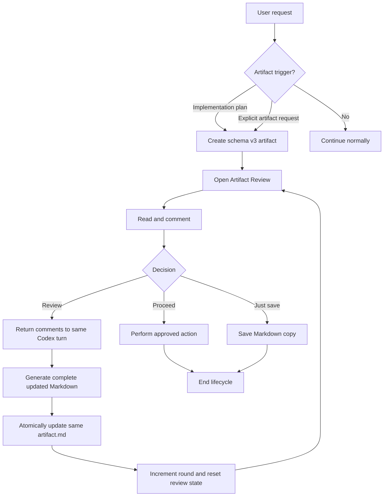

# Generic Artifact Lifecycle & In-Place Review Update

## Trạng thái triển khai

Source, automated tests, production build và VSIX `0.4.0` đã hoàn thành. Manual Extension Host smoke test với integration được cài lại vẫn cần thực hiện sau khi người dùng cài VSIX, trust hook, restart Codex và mở chat mới.

## 1. Mục tiêu

Nâng Codex Artifacts từ công cụ review plan thành lớp review Markdown tổng quát, đồng thời thay lifecycle tạo revision mới bằng cơ chế cập nhật cùng một artifact.

Sau thay đổi:

- Một yêu cầu độc lập chỉ tạo một artifact và một thư mục.
- Mỗi lần **Review** cập nhật trực tiếp `artifact.md` trong cùng thư mục, tăng review round và reset comment/submission.
- Không tạo artifact ID mới, không tạo revision history và không chuyển bản cũ vào `.trash`.
- **Proceed** thực hiện hành động đã được duyệt; **Just save** chỉ lưu Markdown; **Copy Markdown** không thay đổi lifecycle.
- Skill chỉ tự động tạo artifact cho implementation plan, hoặc tạo khi người dùng yêu cầu artifact rõ ràng.
- Các loại artifact khác được hỗ trợ ở cấp contract/UI nhưng chưa tự động trigger.

Đây là breaking redesign so với schema v2 và nên phát hành dưới phiên bản extension mới, dự kiến `0.4.0` với `schemaVersion: 3`.

## 2. Ngoài phạm vi

- Revision history, diff hoặc khả năng khôi phục các nội dung review cũ.
- Task, checklist, progress, threaded comments, resolve hoặc outdated state.
- Tự động tạo architecture, specification, API, migration, report hoặc documentation artifact.
- Tự reconnect một artifact với Codex turn đã kết thúc hoặc MCP server đã restart.
- Tự động xóa dữ liệu schema v2 hay `.trash` cũ mà không có xác nhận của người dùng.
- Hỗ trợ artifact không phải Markdown.

## 3. Quyết định thiết kế đã chốt

### 3.1 Một artifact có nhiều review round

- `artifactId` và thư mục không thay đổi trong toàn bộ lifecycle.
- Round đầu tiên là `reviewRound: 1`.
- Review thành công tăng `reviewRound` thêm một.
- Mỗi round có content hash, comments và submission riêng về mặt logic, nhưng chỉ trạng thái round hiện tại được giữ trên đĩa.
- Sau khi round mới commit thành công, nội dung, comments và submission của round cũ bị loại bỏ; không lưu lịch sử.

### 3.2 Cấu trúc file schema v3

```text
.codex-artifacts/artifacts/<artifact-id>/
  artifact.json
  artifact.md
  comments.json
  review-submission.json  # chỉ tồn tại sau khi user submit round hiện tại
```

`artifact.json` bỏ `operation` và `replacesArtifactId`; thêm ít nhất:

- `schemaVersion: 3`;
- `kind`: slug mô tả loại artifact, với `implementation-plan` là loại auto-trigger đầu tiên;
- `artifactId`, `title`, `createdAt`, `updatedAt`;
- `reviewRound`: số nguyên dương;
- `location.workspaceRoot`;
- `origin.threadId`, `origin.turnId`, `origin.codexCwd`.

`comments.json` và `review-submission.json` phải bind vào:

- `artifactId`;
- `reviewRound`;
- SHA-256 của `artifact.md`;
- SHA-256 của comments đối với submission;
- origin thread đối với submission.

Đổi tên toàn bộ trường `planSha256` thành `artifactSha256`.

### 3.3 Update do MCP điều phối

AI vẫn cập nhật chính `artifact.md`, nhưng không tự xóa hoặc sửa `comments.json` và `review-submission.json`. MCP cung cấp transaction update để tránh trạng thái nửa vời giữa nhiều file.

Target MCP tools:

1. `wait_for_artifact_review(artifactDirectory)` chờ Review, Proceed hoặc Just save.
2. Khi kết quả là Review, tool trả `artifactPath`, `commentsPath`, `reviewRound` và một update token dùng một lần.
3. AI đọc comment, tạo lại toàn bộ Markdown rồi gọi `update_artifact(artifactDirectory, expectedReviewRound, updateToken, markdown)`.
4. MCP validate token, origin, submission, round và hashes; stage toàn bộ file mới; atomically thay `artifact.md`, tăng round, reset comments và xóa submission cũ.
5. Skill gọi lại `wait_for_artifact_review` trên cùng thư mục.

Update token chỉ được tạo sau quyết định Review, chỉ dùng cho đúng artifact/round và không được ghi vào artifact files. Nếu MCP restart hoặc token không hợp lệ, fail closed và yêu cầu tạo lại review lifecycle; không tự đoán hoặc ghi đè.

### 3.4 Chính sách tương thích

- Schema v3 dùng thư mục `artifacts/` nên không xung đột với schema v2 trong `plans/`.
- Không tự migrate một review v2 đang mở vì không thể bảo toàn live turn và submission semantics một cách đáng tin cậy.
- Installer để nguyên dữ liệu v2 và `.trash` cũ. README hướng dẫn cleanup thủ công; command cleanup có xác nhận có thể làm ở task riêng.
- Skill/hook/MCP cũ ở user scope phải được thay thế khi chạy Install Global Codex Integration.
- Extension phải báo lỗi schema không hỗ trợ rõ ràng nếu người dùng cố mở artifact v2 bằng editor mới.

## 4. Luồng mục tiêu



## 5. Kế hoạch triển khai theo phase

### Phase 0 — Baseline và khóa contract

Mục đích: tránh sửa rải rác trước khi lifecycle mới được định nghĩa đầy đủ.

1. Ghi lại baseline `npm run check`, `npm test`, `npm run build` và số test hiện tại.
2. Chốt schema v3 bằng fixture JSON cho manifest, comments và submission.
3. Chốt state transition table cho `reviewing → review-submitted → reviewing(next round)` và các terminal decisions `approve/save`.
4. Chốt error behavior cho stale round, wrong origin, invalid hash, duplicate submission, expired token và transaction failure.
5. Chốt tên public:
   - `Artifact Review` thay `Plan Review`;
   - `artifact.md` thay `plan.md`;
   - `.codex-artifacts/artifacts/` thay `.codex-artifacts/plans/`;
   - `wait_for_artifact_review` thay `wait_for_plan_review`;
   - skill mới dự kiến `create-review-artifact`.
6. Chốt hard break schema v2 theo chính sách tại mục 3.4; không thêm migration ngầm trong lúc implement.

Exit criteria:

- Contract fixtures parse được bằng schema dự kiến.
- Không còn quyết định mở về identity, round ownership, reset semantics hoặc backward compatibility.

### Phase 1 — Shared contract và validation schema v3

Mục đích: tạo một nguồn contract duy nhất trước khi đổi runtime.

1. Cập nhật `src/shared/contracts.ts`:
   - tăng `ARTIFACT_SCHEMA_VERSION` lên 3;
   - generic hóa `kind`;
   - bỏ `operation` và `replacesArtifactId`;
   - thêm `updatedAt` và `reviewRound`;
   - bind comments/submission vào round và `artifactSha256`.
2. Cập nhật `src/shared/artifact-validation.ts`:
   - validate đường dẫn `artifacts/<id>`;
   - thay toàn bộ plan binding bằng artifact binding;
   - kiểm tra round, origin và hashes;
   - cung cấp validation riêng cho create, wait, submit và update transition.
3. Tạo helper path/constants chung cho `artifact.json`, `artifact.md`, `comments.json`, `review-submission.json`; không để string path lặp lại ở hook, MCP và extension.
4. Thêm schema fixtures và unit test:
   - manifest hợp lệ;
   - invalid kind/round/path;
   - comments sai artifact/round/hash;
   - submission sai thread/round/hash;
   - schema v2 bị từ chối bằng lỗi rõ ràng.

Exit criteria:

- Shared contract không còn `planSha256`, `operation`, `replace` hoặc `replacesArtifactId`.
- Contract tests bao phủ toàn bộ binding của một review round.
- TypeScript check pass trước khi chuyển runtime sang phase tiếp theo.

### Phase 2 — Transaction cập nhật cùng artifact

Mục đích: xây phần khó và rủi ro nhất trước UI/skill.

1. Tách persistence helpers dùng chung:
   - atomic write một file;
   - create-once submission;
   - stage/commit/rollback transaction nhiều file;
   - cleanup file tạm sau crash hoặc retry.
2. Định nghĩa transaction cho Review update:
   - validate round N và submission `revise`;
   - stage Markdown mới, manifest round N+1 và empty comments round N+1;
   - giữ backup tạm chỉ trong transaction;
   - commit tất cả file hoặc rollback về round N;
   - xóa submission và backup sau commit;
   - không tạo artifact/revision directory mới.
3. Mở rộng MCP server:
   - rename wait tool thành `wait_for_artifact_review`;
   - trả generic `artifactPath` và `artifactSha256`;
   - cấp update token dùng một lần khi decision là Review;
   - thêm `update_artifact` và pending-token registry;
   - invalidate token sau success, cancel, timeout hoặc failure không retryable.
4. Giữ đúng same-turn behavior: Review trả về turn đang chờ; update thành công rồi chính turn đó wait lại trên cùng artifact.
5. Loại bỏ replacement cleanup và `.trash` khỏi runtime v3.
6. Thêm integration tests:
   - ba lần Review vẫn chỉ có một directory và một `artifactId`;
   - `artifact.md` đổi, round tăng, comments reset, submission biến mất;
   - update token không reuse được;
   - stale round/wrong artifact/wrong thread bị từ chối;
   - lỗi giữa transaction rollback được nội dung và state cũ;
   - Proceed/Just save không cấp update token và không đổi artifact.

Exit criteria:

- Test nhiều review round chứng minh không sinh revision directory hoặc `.trash`.
- Không có trạng thái quan sát được nơi content round mới đi với comments/submission round cũ.
- MCP cancel/timeout không làm hỏng artifact.

### Phase 3 — Hook tạo artifact và origin binding

Mục đích: giới hạn hook ở creation/origin; update do MCP transaction sở hữu.

1. Đổi hook discovery từ `artifact.json + plan.md` sang `artifact.json + artifact.md` trong một `apply_patch` Add File operation.
2. Validate exact v3 directory và workspace root trước khi stamp origin.
3. Tạo `comments.json` cho round 1 với đúng artifact hash.
4. Bỏ toàn bộ `validReplacementDirectory`, `replace`, `replacesArtifactId` và `.trash` logic.
5. Không để hook xử lý update `artifact.md`; nếu gặp update ngoài MCP transaction, validation/store phải báo content bị thay đổi trái protocol.
6. Cập nhật hook status message từ “Linking Codex artifact” nếu cần, giữ trust model hiện tại.
7. Test hook:
   - creation hợp lệ;
   - wrong root/cross-root/path traversal;
   - thiếu một trong hai file;
   - origin đã tồn tại;
   - update patch không reset state ngoài MCP.

Exit criteria:

- Hook chỉ tạo origin và initial review state.
- Không còn code hoặc test replacement lifecycle trong hook.

### Phase 4 — Generic hóa extension core và review UI

Mục đích: chuyển giao diện và store sang contract tổng quát mà không thay đổi trải nghiệm review tốt đang có.

1. Rename `PlanReviewProvider` thành `ArtifactReviewProvider`; đổi view type và user-facing label sang `Artifact Review`.
2. Cập nhật `package.json`:
   - selector `**/.codex-artifacts/artifacts/**/artifact.md`;
   - command/title/config từ plan review sang artifact review;
   - description không còn plan-specific;
   - cân nhắc alias command/config cũ một release nếu không làm tăng đáng kể complexity.
3. Cập nhật watcher auto-open theo `comments.json` và mở sibling `artifact.md`.
4. Generic hóa `ArtifactStore`:
   - constructor nhận `artifactPath`;
   - load/validate round-aware state;
   - hiển thị lại khi `artifact.md`, manifest hoặc comments thay đổi sau update transaction;
   - terminal submission vẫn khóa round hiện tại.
5. Generic hóa webview:
   - `PLAN ARTIFACT` thành `ARTIFACT` hoặc hiển thị `kind`;
   - giữ Review, Proceed, Just save và Copy Markdown;
   - thông báo không dùng “plan/revision” khi artifact có kind khác;
   - sau update round, clear UI draft/status cũ và render content mới.
6. Sửa TODO hiện tại: chặn Review/Proceed/Just save khi có comment draft chưa lưu; yêu cầu Save comment hoặc Cancel.
7. Giữ nguyên block selection, CSP, comment anchoring và copy behavior đã ổn định.
8. Bổ sung tests cho store round reset và, nếu khả thi, component/webview message tests cho action disabling và refresh.

Exit criteria:

- Artifact v3 tự mở, review và refresh nhiều round trong cùng editor.
- UI không còn plan-specific ngoài nội dung/kind của chính artifact.
- Unsaved draft không thể bị bỏ qua khi submit.

### Phase 5 — Skill, trigger policy và global installer

Mục đích: làm AI sử dụng đúng lifecycle mới và chỉ auto-trigger trong phạm vi đã chốt.

1. Tạo skill generic `create-review-artifact` với contract v3.
2. Frontmatter trigger policy:
   - tự động dùng khi AI đang chuẩn bị implementation plan cần user review trước khi code;
   - dùng khi user yêu cầu artifact rõ ràng;
   - không tự động dùng cho architecture/spec/API/report/docs ở phiên bản này;
   - không dùng cho inline outline, status hoặc implementation đã được yêu cầu rõ mà không cần checkpoint.
3. Workflow create:
   - xác định workspace root;
   - tạo cùng lúc `artifact.json` và `artifact.md` bằng `apply_patch`;
   - verify hook-stamped origin/comments;
   - gọi `wait_for_artifact_review`.
4. Workflow Review:
   - đọc comments của round hiện tại;
   - tạo lại nội dung Markdown hoàn chỉnh;
   - gọi `update_artifact` với token/expected round;
   - verify cùng artifact ID/path và round tăng;
   - wait lại, không tạo directory mới.
5. Workflow Proceed/Just save giữ hành vi hiện tại nhưng dùng thuật ngữ generic. Proceed thực hiện hành động phù hợp với original request; nếu original request chỉ yêu cầu review artifact mà không có hành động tiếp theo, approve và kết thúc.
6. Cập nhật `references/artifact-contract.md` và `agents/openai.yaml`.
7. Cập nhật installer:
   - cài skill mới ở user scope;
   - xóa đúng legacy skill `create-plan-artifact` do extension quản lý;
   - verify hook/MCP/skill assets mới;
   - đảm bảo reinstall không xóa skill/hook không liên quan.
8. Audit skill và chạy scenario review thủ công:
   - implementation plan tự trigger;
   - explicit generic artifact request trigger;
   - architecture proposal không tự trigger;
   - Review cập nhật cùng artifact;
   - Proceed thực thi;
   - Just save hỏi destination.

Exit criteria:

- Skill không còn hướng dẫn `replace`, revision directory hoặc `plan.md`.
- Hai trigger được mô tả rõ và không mở rộng ngoài scope.
- Global verify phát hiện asset cũ/outdated và cài đúng asset mới.

### Phase 6 — Documentation, compatibility và cleanup guidance

Mục đích: tránh tài liệu tiếp tục mô tả architecture cũ.

1. Cập nhật README theo cấu trúc `artifacts/<id>/artifact.md`, skill/tool mới và review-round lifecycle.
2. Cập nhật `docs/ARCHITECTURE.md`:
   - same-turn MCP wait;
   - MCP-owned update transaction;
   - hook chỉ stamp creation;
   - không có replacement/trash lifecycle v3.
3. Giữ `docs/PHILOSOPHY.md` là nguồn cho product intent; sau implementation, chuyển các mục “chưa đạt” thành trạng thái đã hoàn thành hoặc backlog thực tế.
4. Thay tài liệu MVP cũ bằng lịch sử rõ ràng hoặc đánh dấu legacy; không để App Server resume design bị hiểu là runtime hiện tại.
5. Thêm changelog `0.4.0` với breaking changes và hướng dẫn reinstall integration/restart Codex/new chat.
6. Document schema v2 policy:
   - dữ liệu cũ được giữ nguyên;
   - không tự migrate;
   - cách archive/delete thủ công;
   - không hứa reconnect review cũ.
7. Rà `.vscodeignore`, package assets và release contents để skill/reference/integration bundles mới được đóng gói.

Exit criteria:

- Không còn tài liệu active nào mô tả Review tạo replacement artifact.
- Hướng dẫn cài, trigger, review nhiều round và xử lý legacy nhất quán với runtime.

### Phase 7 — Quality gate, smoke test và release

Mục đích: xác nhận cả contract, runtime và trải nghiệm thực tế trước khi đóng gói.

1. Chạy toàn bộ:
   - `npm run check`;
   - `npm test`;
   - `npm run build`;
   - `npm run package`.
2. Thêm/giữ regression coverage cho:
   - Markdown block parser và selection;
   - comments atomic write;
   - submission create-once theo từng round;
   - same-turn MCP decisions;
   - multi-root workspace;
   - hook trust/config merge;
   - installer idempotency và legacy skill cleanup.
3. Extension Development Host smoke test:
   - install/verify global integration;
   - restart Codex và mở chat mới;
   - yêu cầu implementation plan mà không gọi skill thủ công;
   - xác nhận artifact tự mở;
   - comment và Review ít nhất ba vòng;
   - xác nhận chỉ có một artifact directory và cùng `artifactId`;
   - xác nhận comment cũ biến mất sau round mới;
   - Proceed và kiểm tra Codex triển khai trong same turn;
   - lặp lại với explicit artifact request và Just save;
   - xác nhận Copy Markdown không thay đổi files/submission.
4. Failure smoke test:
   - submit khi draft chưa lưu;
   - MCP timeout/cancel;
   - stale token;
   - sửa `artifact.md` thủ công giữa review;
   - artifact sai workspace root;
   - integration outdated/untrusted.
5. Kiểm tra VSIX sạch, cài đè từ 0.3.0, reinstall integration và verify installed global files đúng version.

Exit criteria:

- Tất cả automated checks pass.
- Smoke test chứng minh lifecycle nhiều vòng trên cùng file và cùng artifact ID.
- Không có tracked runtime path, UI label, skill instruction hoặc MCP metadata còn phụ thuộc `plan.md`/replacement semantics, trừ tài liệu migration/changelog.

## 6. Thứ tự dependency

```text
Phase 0: Contract decisions
   ↓
Phase 1: Shared schema/validation
   ↓
Phase 2: In-place update transaction + MCP
   ↓
Phase 3: Creation hook
   ↓
Phase 4: Extension/UI
   ↓
Phase 5: Skill/installer
   ↓
Phase 6: Docs/compatibility
   ↓
Phase 7: Full verification/release
```

Phase 2 không được làm song song với Phase 1 vì transaction phụ thuộc hoàn toàn vào round/hash contract. Phase 4 và Phase 5 có thể chuẩn bị rename độc lập sau khi Phase 2 ổn định, nhưng chỉ merge khi shared contract và MCP tool names đã khóa.

## 7. Rủi ro chính và biện pháp kiểm soát

### Cross-file atomicity

Rủi ro: `artifact.md`, manifest, comments và submission lệch round nếu process chết giữa update.

Kiểm soát: transaction staging, backup tạm, rollback/recovery test và fail closed khi phát hiện marker chưa hoàn tất.

### Same-turn update authorization

Rủi ro: một tool call khác có path có thể ghi đè artifact không thuộc review vừa trả về.

Kiểm soát: update token dùng một lần, bind artifact/round/origin và chỉ cấp sau submission Review hợp lệ.

### Skill trigger quá rộng

Rủi ro: AI tạo artifact cho mọi câu trả lời dài hoặc mọi implementation request.

Kiểm soát: chỉ auto-trigger implementation plan cần checkpoint; các kind khác yêu cầu explicit user request và có scenario audit.

### Stale global integration

Rủi ro: extension mới chạy với hook/MCP/skill 0.3.0 gây lỗi khó hiểu.

Kiểm soát: asset hash/version verification, trạng thái outdated rõ ràng, reinstall command và yêu cầu restart/new chat sau upgrade.

### Breaking data compatibility

Rủi ro: người dùng hiểu nhầm artifact v2 có thể tiếp tục review.

Kiểm soát: tách directory v3, lỗi unsupported rõ ràng, không auto-migrate và document cleanup/archive.

## 8. Definition of Done tổng thể

Task hoàn thành khi:

- Implementation plan có thể auto-trigger artifact; explicit artifact request cũng trigger.
- Một artifact được Review lặp lại ít nhất ba vòng trên cùng `artifact.md`, cùng thư mục và cùng `artifactId`.
- Mỗi round mới reset comments/submission và không giữ content cũ sau commit.
- Không tạo replacement artifact hoặc `.trash` mới.
- Proceed, Just save và Copy Markdown giữ đúng semantics trong PHILOSOPHY.
- Same-turn delivery, origin binding, multi-root validation và hook trust vẫn hoạt động.
- UI, contract, MCP, skill và active docs đã generic hóa; các artifact kind tương lai chưa auto-trigger.
- Type check, test, build, package và Extension Host smoke test đều đạt.
