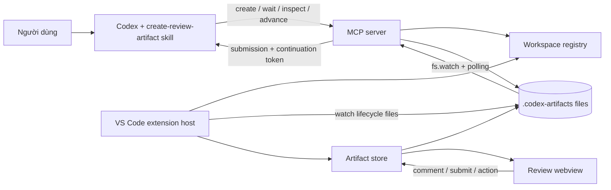
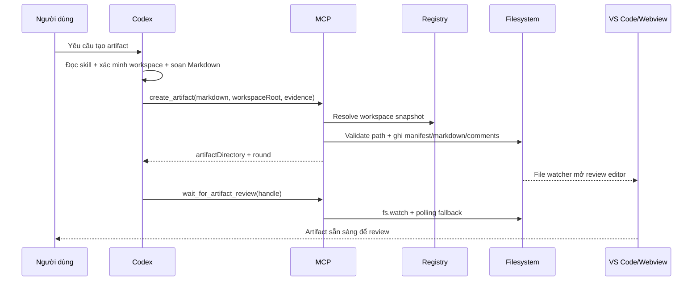

# Phân tích workflow và độ trễ của Codex Artifacts

## 1. Mục tiêu

Tài liệu này mô tả toàn bộ các luồng chính có thể xảy ra khi Codex tạo, mở, review, sửa, reconnect và hoàn tất một artifact theo kiến trúc hiện tại của `agent-plus`.

Mục tiêu là trả lời ba câu hỏi:

1. Codex và hệ thống phải đi qua những bước nào trong từng trường hợp?
2. Thành phần nào tham gia, chịu trách nhiệm gì và trao đổi dữ liệu ra sao?
3. Đoạn nào có khả năng làm trải nghiệm chậm, và nên đo hoặc cải thiện ở đâu trước?

Phạm vi phân tích dựa trên source hiện tại của repository, gồm skill phía Codex, MCP server, workspace registry, artifact store, VS Code extension và review webview. Đây là phân tích kiến trúc định tính; dự án chưa có telemetry end-to-end nên chưa thể khẳng định phần trăm thời gian của từng đoạn bằng số đo thực tế.

## 2. Kết luận ngắn

Không phải mọi thời gian nhìn thấy trên màn hình đều là “Codex chạy chậm”. Cần tách ba chiếc đồng hồ khác nhau:

| Loại thời gian | Ví dụ | Có nên tối ưu như lỗi hiệu năng? |
|---|---|---|
| Codex chuẩn bị và sinh nội dung | Đọc hướng dẫn, xác định workspace, đọc source, suy luận, viết toàn bộ Markdown | Có. Đây nhiều khả năng là phần lớn độ trễ trước khi artifact xuất hiện |
| Hệ thống artifact xử lý | Tool round-trip, đọc/ghi file, hash, parse Markdown, mở editor, render webview | Có. Phần này nhỏ hơn nhưng có nhiều I/O lặp và refresh dư thừa |
| Chờ con người review | `wait_for_artifact_review` đang giữ waiter cho đến khi người dùng bấm Review/Proceed | Không. Đây là trạng thái chờ có chủ ý, không phải computation latency |

Các ứng viên cần ưu tiên đánh giá:

1. **P0 — Đo end-to-end trước:** hiện chưa có timestamp xuyên suốt từ lúc người dùng yêu cầu đến lúc webview sẵn sàng. Không có số đo thì rất dễ tối ưu nhầm tầng.
2. **P0 — Hot path phía Codex:** skill và policy buộc Codex xác minh workspace, đọc context và tạo một tài liệu hoàn chỉnh trước lần gọi tool đầu tiên. Với artifact dài hoặc cần phân tích repository, đây có thể là phần chậm nhất.
3. **P1 — Version/session mismatch:** source repository đang ở protocol mới hơn integration được load trong phiên hiện tại. Khi MCP/skill đã cài không khớp source, người dùng có thể gặp lỗi, phải reconnect, restart hoặc mở chat mới; đây là độ trễ do retry rất lớn.
4. **P1 — I/O và validation lặp trong MCP:** một số flow load cùng artifact, comments và registry nhiều lần trong một operation, đặc biệt inspect/takeover và advance.
5. **P2 — Refresh lặp trong extension:** một transaction đổi nhiều file có thể phát ra nhiều watcher event; mỗi event có thể kéo theo đọc lại state và parse lại Markdown.
6. **P2 — Protocol có nhiều tool turn:** `create → wait`, `inspect → advance → wait` là đúng về lifecycle và an toàn, nhưng làm tăng round-trip. Chỉ nên gộp sau khi đo, vì gộp sai có thể làm mất persistent handle hoặc phá token/state guarantees.

## 3. Kiến trúc hiện tại

### 3.1. Các thành phần

| Thành phần | Trách nhiệm hiện tại | Dữ liệu chính | Khả năng gây chậm |
|---|---|---|---|
| Codex + artifact skill | Nhận biết yêu cầu artifact, xác minh workspace, soạn Markdown hoàn chỉnh, gọi đúng lifecycle tool, phân loại feedback | Prompt, repo context, Markdown, artifact handle | Suy luận/đọc context dài; sinh lại toàn bộ Markdown khi sửa; nhiều chat/tool turn |
| MCP server | Tạo artifact, attach waiter, inspect/takeover, advance round, kiểm tra schema/state/token và transaction | Manifest, SHA, round, waiter, continuation token | Registry lookup lặp; đọc/hash/parse lặp; transaction nhiều file; polling fallback |
| Workspace registry | Cho MCP biết VS Code window/workspace nào đang sống và đang focus | Snapshot heartbeat, active file, focus state | Registry stale/ambiguous gây fail và retry; heartbeat 15 giây, TTL 45 giây |
| Artifact filesystem | Persistent state và contract giữa MCP với extension | `artifact.json`, `artifact.md`, `comments.json`, `review-submission.json` | Nhiều file event, antivirus/disk latency, Windows rename/copy fallback |
| VS Code extension entry | Publish workspace snapshot; watch artifact; tự mở custom editor | Watcher event, URI | Watcher delivery có độ trễ nhỏ; event burst có thể mở/refresh dư |
| Artifact store/provider | Load/validate state, parse Markdown blocks, thêm/xóa comment, submit review, gửi state sang webview | Parsed blocks, comments, submission, UI state | Comment mutation thường load → write → load; provider watcher có thể load thêm lần nữa |
| Review webview | Render Markdown, selection/comment UX, action buttons | React state, block model | Render tài liệu lớn; lazy load Shiki/Mermaid; rerender do refresh lặp |
| Integration manager | Cài/copy/verify MCP và skill toàn cục | Version và integration files | Chỉ đáng kể khi setup/update, nhưng mismatch cần restart/new chat gây retry lớn |

### 3.2. State lưu trên filesystem

Mỗi artifact có một thư mục bền vững dưới `.codex-artifacts/artifacts/<artifact-id>/`:

| File | Vai trò |
|---|---|
| `artifact.json` | Manifest, schema, artifact identity, workspace identity, lifecycle state, round và SHA |
| `artifact.md` | Nội dung Markdown đang được review |
| `comments.json` | Comment/annotation của round hiện tại |
| `review-submission.json` | Quyết định được submit: Review, Proceed hoặc Just save |

Persistent handle tối thiểu là `artifactDirectory` và `round`. Continuation token là capability ngắn hạn gắn với state; token không thay thế handle bền vững.

## 4. Bản đồ toàn bộ workflow cases

### WF-00 — Setup hoặc integration chưa sẵn sàng

**Trigger:** lần đầu sử dụng, project vừa nâng version, hoặc session đang load MCP/skill cũ.

**Luồng:**

1. Extension kiểm tra/cài integration.
2. MCP server và skill được copy/verify vào nơi Codex sử dụng.
3. Codex/MCP có thể cần restart và chat mới để load schema/tool description mới.
4. Extension publish workspace snapshot vào registry.

**Điểm chậm/rủi ro:** restart và chat mới là chi phí lớn nhất; nếu không phát hiện mismatch sớm, Codex có thể thử flow cũ, lỗi rồi mới hướng dẫn update. Phiên dùng để tạo tài liệu này là ví dụ thực tế: source repository có `explicit-chat-update`, nhưng tool schema đang được load vẫn là bản cũ không nhận các field mới của `inspect_artifact_review`.

### WF-01 — Tạo artifact mới theo đường chuẩn

**Trigger:** người dùng nói rõ muốn tạo artifact/plan/spec để review.

**Các bước phía Codex trước tool call đầu tiên:**

1. Nhận diện đây là yêu cầu tạo artifact, không chỉ là yêu cầu trả lời trong chat.
2. Đọc và tuân thủ skill/contract.
3. Xác định đúng workspace bằng evidence cụ thể.
4. Nếu nội dung cần hiểu codebase, đọc docs/source/tests liên quan.
5. Soạn toàn bộ Markdown hoàn chỉnh.
6. Gọi `create_artifact`.
7. Giữ nguyên chính xác handle MCP trả về.
8. Gọi `wait_for_artifact_review` ngay cho cùng round.

**Điểm chậm:** bước 3–5 thường nằm trước mọi UI feedback nên người dùng chỉ thấy “Codex đang làm”. Tool create cũng có validation và I/O lặp, nhưng nhiều khả năng nhỏ hơn thời gian đọc/suy luận/sinh tài liệu.

### WF-02 — Review có comment yêu cầu sửa

**Trigger:** người dùng thêm comment rồi bấm **Review**.

**Luồng:**

1. Webview/store ghi comments và tạo submission.
2. Waiter trong MCP nhận file event hoặc polling phát hiện submission.
3. MCP validate round/state và trả feedback kèm continuation token.
4. Codex phân loại feedback:
   - chỉ câu hỏi;
   - chỉ yêu cầu thay đổi;
   - vừa hỏi vừa yêu cầu thay đổi;
   - còn mơ hồ, cần clarification.
5. Nếu có câu hỏi, Codex trả lời câu hỏi trước.
6. Nếu sửa nội dung, Codex tạo **toàn bộ Markdown thay thế**, không phải patch nhỏ.
7. Codex gọi `advance_and_wait_for_artifact` với token.
8. MCP transaction sang round mới, xóa/reset review state rồi attach waiter mới.

**Điểm chậm:** Codex phải suy luận lại và thường sinh lại toàn bộ document; MCP backup/replace nhiều file; extension nhận nhiều file event và có thể refresh nhiều lần.

### WF-03 — Review chỉ đặt câu hỏi, không yêu cầu sửa

**Trigger:** comments là câu hỏi về nội dung hiện tại.

**Luồng đúng:**

1. Codex trả lời câu hỏi trong chat.
2. Codex advance round với Markdown không đổi.
3. MCP giữ nguyên bytes/SHA của artifact nhưng reset review state và mở round mới.

**Điểm chậm có thể tránh:** kiến trúc hiện tại vẫn chạy transaction lifecycle và có thể rewrite/backup `artifact.md` dù nội dung không đổi. Có thể tối ưu transaction riêng cho “unchanged Markdown”, miễn vẫn giữ đúng round/token semantics.

### WF-04 — Feedback mơ hồ, cần hỏi lại

**Trigger:** comment không đủ để Codex biết phải sửa như thế nào.

**Luồng đúng:** Codex hỏi clarification trong chat và chưa consume token/chưa advance round. Sau khi có câu trả lời, Codex mới sửa và advance.

**Điểm chậm:** thêm một vòng hội thoại là bắt buộc để tránh sửa sai. Không nên tối ưu bằng cách tự đoán ý người dùng.

### WF-05 — Proceed

**Trigger:** người dùng bấm **Proceed**.

**Luồng:**

- Nếu artifact là plan/implementation plan: Codex thực hiện plan đã duyệt trong cùng workflow, không tự tạo round review mới chỉ để “xác nhận lại”.
- Nếu artifact là loại tài liệu khác: Codex chỉ thực hiện hành động vốn đã nằm trong yêu cầu ban đầu; Proceed không tự mở rộng quyền thực thi.

**Điểm chậm/rủi ro:** nếu session bị ngắt sau submission nhưng trước khi Codex xử lý, reconnect phải inspect submission và tránh chạy lại action cũ.

### WF-06 — Just save

**Trigger:** người dùng bấm **Just save**.

**Luồng:** Codex hỏi hoặc dùng destination đã được chỉ định, copy nội dung ra file đích rồi kết thúc. Không có round review mới trừ khi người dùng yêu cầu.

**Điểm chậm:** thường nhỏ; rủi ro chủ yếu là destination chưa rõ hoặc duplicate write.

### WF-07 — Copy Markdown

**Trigger:** người dùng copy Markdown từ UI.

**Luồng:** chỉ là hành động UI/clipboard; không thay đổi lifecycle, không tạo submission và không đánh thức waiter.

### WF-08 — Có comment nhưng người dùng chưa bấm Review, sau đó yêu cầu Codex đọc trong chat

**Trigger:** comment đã được lưu nhưng chưa có submission; người dùng nói “xem review/comment đi”.

**Luồng:**

1. Waiter hiện tại có thể cần bị takeover.
2. Codex gọi inspect cho đúng `artifactDirectory` và `round`.
3. MCP đọc current comments, validate state và cấp token khi feedback hợp lệ.
4. Codex xử lý như WF-02/WF-03/WF-04.

**Điểm chậm:** inspect/takeover hiện phải kiểm tra state trước và sau khi detach waiter để tránh race. Điều này làm tăng số lần đọc, nhưng là chi phí đổi lấy correctness.

### WF-09 — Cập nhật artifact trực tiếp từ chat khi round đang trống

**Trigger:** chưa có comment/submission ở round hiện tại; người dùng đưa yêu cầu sửa trực tiếp trong chat.

**Luồng mới của source hiện tại:**

1. Codex gọi `inspect_artifact_review` với intent `explicit-chat-update`, exact round và takeover nếu cần.
2. MCP chỉ cho phép nếu round vẫn trống.
3. MCP cấp state-bound token.
4. Codex tạo full replacement Markdown.
5. Codex advance và wait round mới.

**Vì sao phải từ chối khi đã có comment/submission:** nếu vừa có review state vừa dùng chat-update, một nguồn feedback có thể bị ghi đè hoặc bỏ qua. Khi đã có comment/submission, flow phải quay về xử lý review để bảo toàn ý kiến người dùng.

**Điểm chậm:** hardening chống race hiện có thể pre-inspect, detach waiter, reload context rồi inspect lại. Đây là hotspot I/O rõ ràng nhưng không nên bỏ validation; nên tối ưu bằng atomic snapshot/generation thay vì cắt bước kiểm tra.

### WF-10 — Waiter bị hủy nhưng round vẫn chưa có feedback

**Trigger:** tool wait bị cancel, chat bị ngắt, hoặc Codex reconnect sau đó.

**Luồng:** gọi lại `wait_for_artifact_review` cho đúng handle và đúng round. Không tạo artifact mới, không advance round.

**Điểm chậm/rủi ro:** nếu Codex làm mất exact handle sẽ phải hỏi lại path hoặc dò state; nếu có waiter khác đang active thì phải báo conflict hoặc takeover theo contract.

### WF-11 — Reconnect sau khi đã có submission

**Trigger:** submission đã tồn tại nhưng kết nối/chat trước không xử lý xong.

**Luồng:**

1. Inspect exact handle để đọc submission và lấy token mới.
2. Với Review: tiếp tục xử lý feedback.
3. Với Proceed/Just save đã được xử lý ở phiên trước: advance unchanged và wait, không lặp lại side effect.

**Điểm chậm:** inspect là bắt buộc để xác định state hiện tại. Retry không idempotent ở tầng hành động bên ngoài có thể nguy hiểm, vì vậy không nên “tự chạy lại” chỉ để nhanh.

### WF-12 — Token hết hạn, replay hoặc state đã đổi

**Trigger:** dùng token cũ, dùng lại token đã consume, hoặc files/state thay đổi từ lúc token được cấp.

**Luồng:** MCP từ chối. Codex inspect lại exact handle để lấy snapshot/token mới rồi quyết định tiếp.

**Điểm chậm:** đây là retry do optimistic concurrency. Có thể giảm bằng cách advance ngay sau khi sinh revision và giữ handle/token trong context, nhưng không nên nới lỏng state binding.

### WF-13 — Sai round, sai workspace hoặc artifact stale

**Các trường hợp:**

- Round trong request không bằng current round.
- Workspace chưa được extension register hoặc snapshot hết TTL.
- Nhiều VS Code window khiến evidence không đủ rõ.
- Symlink/path thoát khỏi workspace bị từ chối.
- Artifact schema v3 chỉ được đọc, không được mutation bằng flow v4.

**Kết quả:** MCP dừng trước mutation và trả lỗi có hướng dẫn. Đây là safety behavior; phần cần cải thiện là phát hiện sớm và thông báo rõ để tránh nhiều vòng thử lại.

### WF-14 — Transaction failure hoặc Windows file lock

**Trigger:** rename/replace lỗi, file bị lock, antivirus hoặc lỗi I/O giữa transaction.

**Luồng:** MCP dùng staging/backup/rollback; trên Windows có thể phải dùng copy fallback. Sau lỗi, lifecycle phải giữ được state nhất quán hoặc phục hồi từ backup.

**Điểm chậm:** nhiều thao tác I/O tuần tự, nhưng đây là đường hiếm và thiên về reliability. Chỉ tối ưu sau khi có số liệu cho thấy xảy ra đáng kể.

### WF-15 — Cancellation ở các thời điểm khác nhau

| Thời điểm cancel | Hành vi mong đợi |
|---|---|
| Trước commit tạo/advance | Không để lại state nửa vời; operation dừng |
| Sau commit nhưng trước khi waiter attach/return | Persistent artifact/round vẫn là nguồn sự thật; reconnect bằng exact handle |
| Trong lúc wait | Chỉ detach waiter; không xóa artifact và không tự advance |

## 5. Luồng kỹ thuật và các điểm có thể làm chậm

### 5.1. Trước `create_artifact`: latency phía Codex

Đây là vùng có khả năng tác động lớn nhất nhưng hiện khó quan sát nhất.

| Công việc | Vì sao cần | Nguy cơ latency |
|---|---|---|
| Load skill/contract | Giữ đúng lifecycle và safety | Hướng dẫn dài hoặc không progressive có thể tăng context/suy luận |
| Resolve workspace evidence | Không ghi artifact nhầm repo/window | Nếu evidence mơ hồ sẽ thêm tool/read/chat turn |
| Đọc docs/source/tests | Tạo tài liệu đúng với codebase | Có thể rất lớn với yêu cầu phân tích kiến trúc |
| Tổng hợp cấu trúc tài liệu | Artifact phải đủ hoàn chỉnh để review | Lập luận phức tạp, nhất là “toàn bộ workflow cases” |
| Sinh full Markdown | Create/advance nhận document hoàn chỉnh | Tăng gần tuyến tính theo kích thước output |

Không nên đoán rằng MCP là thủ phạm chỉ vì artifact chưa mở. Trước khi tool create được gọi, toàn bộ thời gian đều nằm ở Codex/repository analysis.

### 5.2. `create_artifact`: resolve, validate và ghi file

Flow hiện tại về cơ bản gồm:

1. Parse và validate input.
2. Resolve registered workspace từ snapshot.
3. Đọc lại fresh snapshots/validate focus-evidence.
4. `realpath` workspace và kiểm tra boundary/symlink.
5. Tạo artifact ID/directory an toàn.
6. Ghi tuần tự manifest, Markdown và comments.
7. Load lại artifact context: đọc các lifecycle file, resolve registry, hash và parse.
8. Trả persistent handle.

Các cơ hội tối ưu:

- Dùng một immutable workspace snapshot cho toàn bộ create operation thay vì resolve/đọc registry nhiều lần.
- Trả context đã validate sau commit thay vì load lại toàn bộ chỉ để tạo response.
- Cân nhắc ghi các file độc lập song song khi atomicity contract cho phép.

### 5.3. Từ file creation đến webview sẵn sàng

1. Extension watcher nhận `comments.json` creation.
2. Extension `stat` artifact rồi gọi `vscode.openWith`.
3. Provider/store đọc manifest, Markdown, comments và submission nếu có.
4. Store validate state, parse Markdown thành blocks.
5. Provider post state sang webview.
6. React render document.
7. Shiki/Mermaid chỉ lazy-load khi tài liệu cần chúng.

Shiki và Mermaid có bundle lớn nhưng đã được lazy-load, nên không phải nguyên nhân mặc định cho mọi artifact. Chúng có thể ảnh hưởng first render của tài liệu chứa code/diagram. Có thể prefetch sau first paint nếu số đo UX cho thấy có lợi.

### 5.4. `wait_for_artifact_review`

MCP kiểm tra submission hiện có, sau đó dùng `fs.watch` trên artifact directory và polling fallback mỗi 1 giây.

- Thời gian từ khi attach waiter đến khi người dùng thao tác là **human wait**, không phải hệ thống chậm.
- Sau khi người dùng submit, nếu watcher bỏ lỡ event thì polling có thể cộng thêm tối đa khoảng 1 giây.
- Một active waiter cho mỗi lifecycle giúp tránh hai Codex consumer cùng xử lý một submission.

### 5.5. Comment và submission trong extension

Đường mutation hiện có xu hướng:

1. Store `load()` toàn bộ state.
2. Ghi comments/submission.
3. Store `load()` lại để trả state mới.
4. File watcher của provider có thể lại gọi refresh/load.
5. Webview nhận state và rerender.

Với tài liệu lớn, comments-only change không nên bắt buộc parse lại Markdown nếu SHA không đổi. Event của một transaction nhiều file cũng nên được debounce/coalesce thành một refresh.

### 5.6. Inspect/takeover

Inspect cần đọc lifecycle state và bảo đảm nó không cướp waiter hoặc cấp token trên snapshot đã stale. Với explicit chat update, source hiện tại kiểm tra round trước takeover rồi load/validate lại sau takeover để tránh race.

Correctness này là cần thiết. Cách tối ưu an toàn hơn là:

- một server-side atomic operation “detach waiter + capture state generation”;
- dùng generation/revision counter để validate snapshot nhẹ;
- trả raw/parsed inspection từ một lần load thay vì đọc artifact/comments thêm lần nữa.

Không nên chỉ bỏ bước post-takeover validation.

### 5.7. Advance transaction

Flow advance hiện gồm load context, inspect state, validate token, stage file mới, tạo backup, replace targets, dọn submission/backup, load context lần nữa và attach waiter.

Các nguồn latency:

- hash/parse/read lặp giữa context và inspection;
- backup/replace nhiều file tuần tự;
- full Markdown phải được gửi lại dù thay đổi nhỏ;
- question-only round vẫn đi qua transaction gần đầy đủ;
- watcher event burst khiến extension refresh nhiều lần;
- Windows lock/copy fallback ở đường lỗi.

## 6. Ma trận bottleneck ưu tiên

| Hạng | Vùng | Tác động dự kiến | Tần suất | Mức chắc chắn | Lý do |
|---|---|---:|---:|---:|---|
| P0 | Codex đọc context + suy luận + sinh full Markdown trước create | Cao | Mọi create | Trung bình | Kiến trúc bắt buộc hoàn tất nội dung trước tool call; chưa có telemetry |
| P0 | Thiếu tracing end-to-end | Cao gián tiếp | Mọi flow | Cao | Không biết thời gian đang nằm ở Codex, MCP, extension hay render |
| P1 | Installed integration/session không khớp source | Rất cao khi xảy ra | Khi update/setup | Cao | Dẫn tới lỗi, restart/chat mới và lặp workflow |
| P1 | Full-document regeneration mỗi revision | Cao với tài liệu dài | Mọi revision có sửa | Cao | Protocol nhận replacement Markdown, không nhận semantic patch |
| P1 | MCP load/inspect/registry validation lặp | Trung bình | Create/inspect/advance | Cao | Có thể thấy trực tiếp trong call graph source |
| P1 | Tool round-trip `create → wait`, `inspect → advance → wait` | Thấp–trung bình mỗi lượt | Mọi lifecycle | Cao | Nhiều boundary crossing; tác động thực tế chưa đo |
| P2 | Provider/store refresh và parse lặp | Trung bình với doc lớn | Mọi comment/transaction | Cao | Watcher event và mutation đều có thể trigger load |
| P2 | Polling fallback 1 giây | Tối đa khoảng 1 giây sau submit nếu miss event | Không thường xuyên | Cao | Constant hiện tại |
| P2 | Webview Markdown/Shiki/Mermaid | Thấp mặc định, cao với doc đặc biệt | Tùy nội dung | Trung bình | Enhancer đã lazy-load |
| P3 | Backup/Windows fallback | Cao ở event lỗi, thấp bình thường | Hiếm | Trung bình | Reliability path, không phải hot path mặc định |

## 7. Đề xuất cải thiện theo thành phần

### 7.1. Đo lường trước khi đổi protocol

Thêm correlation ID và timestamp cho các mốc:

1. User request received.
2. Skill/workspace resolution started và completed.
3. Markdown generation completed.
4. `create_artifact` requested và returned.
5. Lifecycle files committed.
6. Extension watcher observed artifact.
7. Provider state loaded.
8. Webview first state received và first meaningful paint.
9. Review submission written.
10. MCP waiter resolved.
11. Revision generation completed.
12. Advance commit completed và next waiter attached.

Nên log duration và artifact/round/correlation ID, không log toàn bộ Markdown/comment nhạy cảm.

### 7.2. Codex skill: tạo một hot path ngắn

Giữ nguyên safety rules nhưng tách hướng dẫn thành:

- Hot path ngắn: trigger → workspace evidence → create → retain handle → wait.
- Progressive references chỉ load khi gặp reconnect, takeover, explicit chat update, schema cũ hoặc failure.
- Retain verified workspace root và exact artifact handle trong cùng workflow, tránh resolve lại bằng reasoning khi state chưa đổi.
- Nêu rõ phần research/content generation là domain work, không phải lifecycle work; chỉ đọc source cần thiết cho yêu cầu.

Trade-off: rút gọn skill quá mức có thể làm Codex bỏ qua edge cases. Cần test trigger/lifecycle trước và sau thay đổi.

### 7.3. MCP: loại bỏ đọc và validate trùng

Ứng viên cụ thể:

- `loadArtifactContext` trả luôn inspection-ready snapshot: raw Markdown, parsed comments, submission, hashes và registry identity.
- `readArtifactInspection` dùng snapshot đó, không đọc lại cùng file.
- Create giữ một workspace snapshot đã validate xuyên suốt operation.
- Create/advance trả state từ committed transaction thay vì reload toàn bộ khi có thể chứng minh state vừa ghi.
- Explicit chat update dùng atomic waiter detach + state generation để giảm pre/post full load mà vẫn chống race.
- Fast path cho advance khi Markdown SHA không đổi: chỉ đổi manifest/review files cần thiết.

### 7.4. Extension/store: coalesce và cache

- Debounce/coalesce watcher events theo artifact trong một cửa sổ ngắn.
- Mutation API trả new state cho provider để post trực tiếp; watcher refresh sau đó có thể bỏ qua nếu version/SHA đã biết.
- Cache parsed Markdown blocks theo `artifactSha256`; comments-only change tái sử dụng blocks.
- Tách artifact-content version khỏi review-state version để webview chỉ rerender phần cần thiết.
- Đo first paint trước khi tối ưu thêm Shiki/Mermaid; lazy loading hiện tại là quyết định hợp lý.

### 7.5. Integration/version handshake

- MCP tool nên expose protocol/version capability rõ ràng.
- Skill/session kiểm tra capability một lần trước artifact flow thay vì chỉ phát hiện khi field bị từ chối.
- Extension hiển thị trạng thái “source/build/installed/session” và action cụ thể: build, install, reload window, restart Codex hoặc new chat.
- Khi update làm thay đổi tool schema, changelog phải nói rõ session cũ không tự nhận schema mới.

Đây là ưu tiên cao vì mismatch không chỉ chậm vài trăm mili-giây; nó có thể làm hỏng cả workflow và buộc người dùng lặp lại.

### 7.6. Có nên gộp tool calls?

| Ý tưởng | Lợi ích | Rủi ro/giới hạn | Khuyến nghị |
|---|---|---|---|
| `create_artifact` tự attach waiter | Bớt một MCP round-trip | Nếu call chờ lâu thì persistent handle có thể không đến chat trước cancellation | Chỉ cân nhắc API composite vẫn trả handle sớm hoặc orchestration phía client |
| Gộp inspect và advance | Bớt một round-trip | Codex phải đọc feedback và sinh Markdown ở giữa; không thể gộp thuần túy trong server | Không ưu tiên |
| Cho advance nhận patch | Giảm token/bandwidth cho doc dài | Patch ambiguity, conflict, Markdown block identity và audit phức tạp | Chỉ nghiên cứu sau telemetry; full replacement đơn giản và an toàn hơn |
| `advance` không auto-wait | Response nhanh hơn | Dễ quên attach waiter, làm đứt lifecycle | Có thể là option, không đổi default |
| Fast path unchanged content | Giảm I/O cho question-only/reconnect | Phải giữ nguyên token, round và transaction guarantees | Nên làm sau khi có benchmark |

## 8. Lộ trình đánh giá đề xuất

### Giai đoạn 0 — Baseline và tracing

- Thêm timestamp/correlation xuyên Codex-facing call, MCP, extension và webview.
- Benchmark ít nhất bốn mẫu: artifact nhỏ, artifact dài, artifact có nhiều code block, artifact có Mermaid.
- Đo create cold session, create warm session, comment-only, revision, reconnect và explicit chat update.

**Exit criterion:** biết p50/p95 của từng đoạn và xác định top hai bottleneck thực tế.

### Giai đoạn 1 — Reliability làm giảm retry

- Capability/version handshake.
- Diagnostic rõ cho stale integration, stale registry, wrong round và active waiter.
- Retain/restore exact artifact handle ổn định.

**Lý do:** tránh retry thường đem lại cải thiện cảm nhận lớn hơn micro-optimization I/O.

### Giai đoạn 2 — Hot-path optimizations không đổi protocol

- Progressive skill hot path.
- Reuse workspace/context snapshot trong MCP.
- Hợp nhất artifact inspection reads.
- Debounce provider watcher và cache parsed Markdown theo SHA.
- Fast path cho unchanged Markdown nếu benchmark xác nhận lợi ích.

### Giai đoạn 3 — Protocol experiments

- Đánh giá composite create/attach waiter.
- Đánh giá patch/delta revision cho artifact rất dài.
- Đánh giá generation-based atomic inspect/takeover.

Chỉ nên làm sau khi Giai đoạn 0 chứng minh round-trip hoặc full replacement thực sự là bottleneck chính.

## 9. Invariants không được đánh đổi để lấy tốc độ

Mọi cải tiến cần giữ các điều kiện sau:

- Artifact phải nằm trong workspace đã được xác minh.
- Persistent handle phải được trả và giữ chính xác.
- Mỗi lifecycle chỉ có một active waiter trừ takeover có chủ ý.
- Continuation token phải state-bound, one-shot và có expiry.
- Advance phải atomic hoặc rollback được.
- Không làm mất comments/submission khi đổi từ review flow sang chat update.
- Không tự lặp lại side effect sau reconnect.
- Cancel waiter không được xóa artifact hoặc ngầm thay đổi round.
- Schema cũ không được mutation bằng assumptions của schema mới.

## 10. Quyết định cần Chú đánh giá

Sau khi có baseline, nên chọn một trong ba hướng đầu tư chính:

1. **Tối ưu thời gian trước khi artifact xuất hiện:** tập trung vào Codex skill, context loading và content generation.
2. **Tối ưu độ phản hồi khi review/sửa:** tập trung vào full Markdown regeneration, MCP inspect/advance và tool round-trips.
3. **Tối ưu cảm giác UI:** tập trung vào extension watcher, store cache, webview first paint và event coalescing.

Khuyến nghị hiện tại là bắt đầu bằng tracing và version handshake, sau đó mới chọn tầng có p95 lớn nhất. Dựa trên call graph nhưng chưa có telemetry, giả thuyết mạnh nhất là thời gian tạo ban đầu nằm chủ yếu ở Codex analysis/generation; còn thời gian sau comment có thể bị khuếch đại bởi full-document regeneration cộng với load/refresh lặp.

## 11. Source đã đối chiếu

- `AGENTS.md`
- `docs/INSTRUCTION.md`
- `docs/PHILOSOPHY.md`
- `docs/ARCHITECTURE.md`
- `docs/COMPONENTS.md`
- `README.md`
- `TODO.md`
- `CHANGE_LOGS.md`
- `skills/create-review-artifact/SKILL.md`
- `skills/create-review-artifact/references/codex-artifacts-contract.md`
- MCP lifecycle handlers, workspace registry, transaction/token/waiter implementation và tests
- VS Code extension entry, artifact store/provider, webview và lazy enhancement implementation
