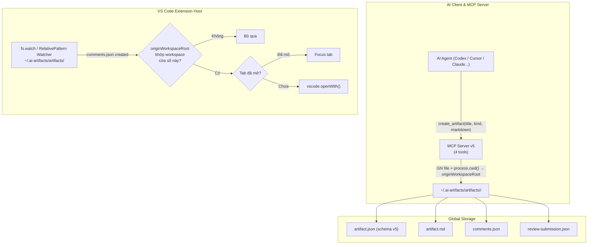

# Breaking Change: Chuyển AI Artifact Storage sang `~/.ai-artifacts/`

> **Chiến lược**: Breaking change — không migration artifacts cũ, không backward compatibility.
> **Phạm vi**: Loại bỏ hoàn toàn Workspace Registry, workspace evidence/token, lưu trữ cục bộ workspace. Giữ nguyên MCP Client Drivers, Uninstall Engine, Webview UI, Build pipeline.

---

## 1. Hiện trạng & Mục tiêu

### As-Is (v0.9.2, schema v4)
```text
<workspaceRoot>/.ai-artifacts/artifacts/<artifact-id>/
├── artifact.json     # manifest có location.workspaceRoot
├── artifact.md
├── comments.json
└── review-submission.json
```
- MCP Server expose 5 tools: `resolve_artifact_workspace` → `create_artifact` → `wait` → `inspect` → `advance_and_wait`
- AI phải qua 2 bước (resolve workspace → create) để tạo artifact
- Extension chạy `WorkspaceRegistryPublisher` ghi heartbeat mỗi 15s vào `~/.vscode/ai-artifacts/workspaces/*.json`
- Watcher dùng `vscode.workspace.createFileSystemWatcher("**/{.ai-artifacts,.codex-artifacts}/artifacts/**/comments.json")` — chỉ bắt được file trong workspace

### To-Be (v1.0.0, schema v5)
```text
~/.ai-artifacts/artifacts/<artifact-id>/
├── artifact.json     # manifest không còn location, có originWorkspaceRoot tùy chọn
├── artifact.md
├── comments.json
└── review-submission.json
```
- MCP Server expose **4 tools**: `create_artifact` → `wait` → `inspect` → `advance_and_wait`
- AI gọi thẳng `create_artifact({ title, kind, markdown })` — **1 bước duy nhất**
- Extension KHÔNG chạy WorkspaceRegistryPublisher, KHÔNG heartbeat
- Watcher dùng `fs.watch(globalArtifactsRoot(), { recursive: true })` hoặc `vscode.workspace.createFileSystemWatcher(new vscode.RelativePattern(globalUri, glob))`

---

## 2. Phân loại Code: XÓA / SỬA / GIỮ NGUYÊN

### 2.1. XÓA HOÀN TOÀN (Dead Code Elimination)

| File | Dòng | Lý do |
| :--- | ---: | :--- |
| [`src/shared/workspace-registry.ts`](file:///d:/workspace/my-projects/agent-plus/src/shared/workspace-registry.ts) | ~355 | Toàn bộ hệ thống workspace registry, snapshot schema, evidence schema, candidate resolution, heartbeat constants |
| [`src/extension/workspace-registry-publisher.ts`](file:///d:/workspace/my-projects/agent-plus/src/extension/workspace-registry-publisher.ts) | ~73 | Publisher chạy heartbeat 15s, ghi snapshot, quét workspace folders |
| [`test/workspace-registry.test.ts`](file:///d:/workspace/my-projects/agent-plus/test/workspace-registry.test.ts) | ~300+ | Test suite cho module bị xóa |

**Trong [`artifact-review-mcp-v4.ts`](file:///d:/workspace/my-projects/agent-plus/src/integration/artifact-review-mcp-v4.ts) — xóa các khối sau:**

| Khối code | Dòng (ước lượng) | Nội dung |
| :--- | :--- | :--- |
| Import workspace-registry | L28–L33 | `resolveRegisteredWorkspaceRoot`, `resolveWorkspaceCandidates`, `resolveWorkspaceRootForArtifactCreation`, `workspaceEvidenceSchema` |
| `RESOLVE_WORKSPACE_TOOL_NAME` constant | L37 | Hằng tên tool |
| `WORKSPACE_SELECTION_TTL_MS` constant | L43 | TTL 10 phút |
| `WorkspaceSelectionGrant` type | ~L100 | Type definition |
| `workspaceSelectionGrants` Map | L282 | In-memory grant store |
| `claimedWorkspaceSelectionTokens` Set | L283 | Concurrency guard |
| `pruneWorkspaceSelectionGrants()` | L285–L289 | TTL cleanup |
| `workspaceCandidateId()` | L292–L294 | Hash function |
| `resolveCreateWorkspaceRoot()` | L296–L337 | Evidence validation + token claim |
| `handleResolveWorkspaceTool()` | L939–L979 | Tool handler |
| Tool declaration trong `tools/list` | L1243–L1256 | `resolve_artifact_workspace` schema |
| Tool dispatch trong `tools/call` | L1355–L1358 | Route handler |
| Server instructions | L1233 | Toàn bộ đoạn text hướng dẫn AI về workspace resolution |

**Trong [`contracts.ts`](file:///d:/workspace/my-projects/agent-plus/src/shared/contracts.ts) — xóa legacy schemas:**

| Khối code | Dòng | Nội dung |
| :--- | :--- | :--- |
| `LEGACY_ARTIFACT_SCHEMA_VERSION` | L3 | Constant `3` |
| `legacyArtifactManifestSchema` | L25–L32 | Schema v3 manifest |
| `anyArtifactManifestSchema` | L34–L37 | Union v3 ∪ v4 |
| `legacyCommentsDocumentSchema` | L68–L70 | Schema v3 comments |
| `anyCommentsDocumentSchema` | L72–L75 | Union |
| `legacyReviewSubmissionSchema` | L93–L96 | Schema v3 submission |
| `anyReviewSubmissionSchema` | L98–L101 | Union |
| Tất cả `Legacy*` và `Any*` type exports | L104–L113 | Type aliases |

---

### 2.2. SỬA ĐỔI (Modify)

#### A. [`src/shared/contracts.ts`](file:///d:/workspace/my-projects/agent-plus/src/shared/contracts.ts)
- Nâng `ARTIFACT_SCHEMA_VERSION` từ `4` → `5`
- **Thay đổi cấu trúc manifest schema**:
  ```diff
  - location: z.object({
  -   workspaceRoot: z.string().min(1),
  - }).strict(),
  + originWorkspaceRoot: z.string().min(1).optional(),
  ```
- `ReviewState.artifact` chuyển từ `AnyArtifactManifest` → `ArtifactManifest` (chỉ v5)
- `ReviewState.comments` chuyển từ `AnyCommentsDocument` → `CommentsDocument`
- `ReviewState.submission` chuyển từ `AnyReviewSubmission` → `ReviewSubmission`

#### B. [`src/shared/artifact-files.ts`](file:///d:/workspace/my-projects/agent-plus/src/shared/artifact-files.ts)
- Xóa `LEGACY_ARTIFACTS_DIRECTORY` (`.codex-artifacts`)
- Xóa `ARTIFACTS_DIRECTORIES` array
- Thêm hàm `globalArtifactsRoot()`:
  ```ts
  import os from "node:os";
  import path from "node:path";
  export function globalArtifactsRoot(): string {
    return path.join(os.homedir(), ".ai-artifacts", "artifacts");
  }
  ```

#### C. [`src/shared/artifact-validation.ts`](file:///d:/workspace/my-projects/agent-plus/src/shared/artifact-validation.ts)
- `parseArtifactManifest()`: Chỉ parse schema v5, bỏ check `LEGACY_ARTIFACT_SCHEMA_VERSION`
- `assertArtifactDirectory()`: **Viết lại hoàn toàn** — thay vì kiểm tra `location.workspaceRoot` + `ARTIFACTS_DIRECTORIES`, kiểm tra `artifactDirectory` phải nằm trong `globalArtifactsRoot()`
- `parseBoundCommentsDocument()`: Bỏ `AnyCommentsDocument` → `CommentsDocument`
- `parseBoundReviewSubmission()`: Bỏ legacy `threadId` branch, chỉ check `reviewSessionId`

#### D. [`src/integration/artifact-review-mcp-v4.ts`](file:///d:/workspace/my-projects/agent-plus/src/integration/artifact-review-mcp-v4.ts) (ngoài phần XÓA ở trên)

**`ArtifactContext` type** — bỏ `workspaceRoot`:
```diff
  type ArtifactContext = {
    artifactDirectory: string;
    artifactId: string;
-   workspaceRoot: string;
    reviewSessionId: string;
    ...
  };
```

**`ReviewWaitResult` type** — bỏ `workspaceRoot`:
```diff
  type ReviewWaitResult = {
    ...
-   workspaceRoot: string;
    ...
  };
```

**`CreateArtifactInput` type** — bỏ `workspaceRoot`, `workspaceEvidence`:
```diff
  type CreateArtifactInput = {
-   workspaceRoot: string;
-   workspaceEvidence: WorkspaceEvidence;
    title: string;
    kind: string;
    markdown: string;
  };
```

**`parseCreateArguments()`** — đơn giản hóa, chỉ cần `{ title, kind, markdown }`

**`safeArtifactCollectionRoot()`** — thay từ `path.join(workspaceRoot, ".ai-artifacts", "artifacts")` sang `globalArtifactsRoot()`

**`persistArtifact()`** — không nhận `workspaceRoot` parameter, tự lấy `process.cwd()` gán vào `originWorkspaceRoot`

**`createArtifact()`** — bỏ `resolveCreateWorkspaceRoot()`, gọi thẳng `persistArtifact(input)`

**`loadArtifactContext()`** — bỏ `resolveRegisteredWorkspaceRoot()` check (L424–L427), chỉ validate path nằm trong `globalArtifactsRoot()`

**`artifactHandle()`** — bỏ `workspaceRoot` khỏi output

**`readValidatedSubmission()`** — bỏ `workspaceRoot` khỏi `ReviewWaitResult` (L485)

**`create_artifact` tool schema** — bỏ `workspaceRoot`, `workspaceEvidence` required props:
```diff
  inputSchema: {
    properties: {
-     workspaceRoot: { ... },
-     workspaceEvidence: { ... },
      title: { ... },
      kind: { ... },
      markdown: { ... },
    },
-   required: ["workspaceRoot", "workspaceEvidence", "title", "kind", "markdown"],
+   required: ["title", "kind", "markdown"],
  }
```

**Server Instructions** — viết lại hoàn toàn, loại bỏ mọi đề cập workspace resolution

#### E. [`src/extension/extension.ts`](file:///d:/workspace/my-projects/agent-plus/src/extension/extension.ts)
- **Xóa** import và khởi tạo `WorkspaceRegistryPublisher`
- **Thay watcher**: Từ `createFileSystemWatcher("**/{.ai-artifacts,.codex-artifacts}/artifacts/**/comments.json")` sang watcher lắng nghe `globalArtifactsRoot()`
- **Bổ sung logic lọc multi-window**: Khi watcher bắt artifact mới, đọc `originWorkspaceRoot` từ manifest, so sánh với `vscode.workspace.workspaceFolders` → chỉ auto-open nếu khớp

#### F. [`src/extension/artifact-store.ts`](file:///d:/workspace/my-projects/agent-plus/src/extension/artifact-store.ts)
- `load()`: Gọi `assertArtifactDirectory()` phiên bản mới (check global path thay vì workspace path)
- Các hàm comment/submission write: Không thay đổi logic cốt lõi, chỉ adapt theo schema v5 types

#### G. [`src/extension/artifact-review-provider.ts`](file:///d:/workspace/my-projects/agent-plus/src/extension/artifact-review-provider.ts)
- **Bổ sung concurrency guard**: `Map<string, Promise<void>>` cho dedup mở tab
- **Bổ sung tab deduplication**: Quét `vscode.window.tabGroups.all` trước khi `openWith`

#### H. Skill Contract & Docs
- [`skills/create-review-artifact/references/artifact-contract.md`](file:///d:/workspace/my-projects/agent-plus/skills/create-review-artifact/references/artifact-contract.md): Xóa `resolve_artifact_workspace`, workspace evidence, token flow. Cập nhật `create_artifact` schema mới.
- [`skills/create-review-artifact/SKILL.md`](file:///d:/workspace/my-projects/agent-plus/skills/create-review-artifact/SKILL.md): Đồng bộ luồng AI agent — gọi thẳng `create_artifact` không qua resolve.
- [`docs/INSTRUCTION.md`](file:///d:/workspace/my-projects/agent-plus/docs/INSTRUCTION.md): Cập nhật critical invariants — loại bỏ workspace-folder ownership rules.
- [`docs/ARCHITECTURE.md`](file:///d:/workspace/my-projects/agent-plus/docs/ARCHITECTURE.md): Cập nhật storage architecture.
- [`CHANGE_LOGS.md`](file:///d:/workspace/my-projects/agent-plus/CHANGE_LOGS.md): Ghi nhận breaking change v1.0.0.

#### I. Test Suite — Viết lại trọng tâm

| File | Thay đổi |
| :--- | :--- |
| [`review-wait-mcp.test.ts`](file:///d:/workspace/my-projects/agent-plus/test/review-wait-mcp.test.ts) | Chuyển mọi fixture/mock từ workspace path sang `tmpdir/.ai-artifacts/artifacts/`. Xóa test cases liên quan resolve workspace. Bỏ `workspaceRoot`/`workspaceEvidence` khỏi create input. |
| [`artifact-store.test.ts`](file:///d:/workspace/my-projects/agent-plus/test/artifact-store.test.ts) | Cập nhật manifest schema v5, assertion đường dẫn global. |
| [`skill-contract.test.ts`](file:///d:/workspace/my-projects/agent-plus/test/skill-contract.test.ts) | Kiểm tra contract khớp 4 tools (không còn 5). |
| [`workspace-registry.test.ts`](file:///d:/workspace/my-projects/agent-plus/test/workspace-registry.test.ts) | **XÓA TOÀN BỘ** |

---

### 2.3. GIỮ NGUYÊN (No Change)

| Module | File(s) | Lý do |
| :--- | :--- | :--- |
| **MCP Client Drivers** | [`src/extension/mcp-clients/`](file:///d:/workspace/my-projects/agent-plus/src/extension/mcp-clients/) (5 drivers) | Install/uninstall cấu hình MCP cho các AI client — không liên quan đến storage location |
| **Uninstall Engine** | [`src/extension/uninstall-entry.ts`](file:///d:/workspace/my-projects/agent-plus/src/extension/uninstall-entry.ts), [`src/integration/stamp-origin.ts`](file:///d:/workspace/my-projects/agent-plus/src/integration/stamp-origin.ts) | Dọn dẹp cấu hình client, không đụng artifact data |
| **Webview UI** | [`src/webview/`](file:///d:/workspace/my-projects/agent-plus/src/webview/) | React components nhận state từ extension host, không biết file path |
| **Markdown Blocks** | [`src/shared/markdown-blocks.ts`](file:///d:/workspace/my-projects/agent-plus/src/shared/markdown-blocks.ts) | Parser Markdown thuần túy, không phụ thuộc storage |
| **Review Wait Logic** | [`src/integration/review-wait-mcp.ts`](file:///d:/workspace/my-projects/agent-plus/src/integration/review-wait-mcp.ts) | Polling/watching submission file — chỉ cần absolute path |
| **MCP Config** | [`src/extension/mcp-config.ts`](file:///d:/workspace/my-projects/agent-plus/src/extension/mcp-config.ts) | Tạo JSON snippet cho install |
| **Hook Config** | [`src/extension/hook-config.ts`](file:///d:/workspace/my-projects/agent-plus/src/extension/hook-config.ts) | Codex hooks.json management |
| **Workspace Integration** | [`src/extension/workspace-integration-v4.ts`](file:///d:/workspace/my-projects/agent-plus/src/extension/workspace-integration-v4.ts) | Provisioning base runtime + client install/uninstall |
| **Plan Review Provider** | [`src/extension/plan-review-provider.ts`](file:///d:/workspace/my-projects/agent-plus/src/extension/plan-review-provider.ts) | Custom editor cho plan files |
| **Test: các file không liên quan** | `mcp-client-drivers.test.ts`, `mcp-config.test.ts`, `hook-config.test.ts`, `markdown-blocks.test.ts`, `markdown-renderer.test.tsx`, `review-actions.test.ts`, `selection-comment-popover.test.ts`, `url-policy.test.ts`, `global-integration-status.test.ts` | Không phụ thuộc workspace registry hay storage path |

---

## 3. Kiến trúc Đích



---

## 4. Các Bất biến Cốt lõi (Invariants) Phải Duy Trì

1. **`artifact lifetime > waiter lifetime > chat-turn lifetime`** — không thay đổi
2. **Fail-closed trên ghi file** — atomic write (`writeTextFileAtomic`) trên Windows vẫn bắt buộc
3. **MCP Server là process độc lập** — không giả định có `vscode` API, mọi tương tác qua file system
4. **Round token exact-state-bound** — cơ chế token 1 lần, hết hạn, gắn state vẫn nguyên vẹn
5. **Uninstall KHÔNG xóa `~/.ai-artifacts/`** — đây là dữ liệu người dùng, chỉ dọn runtime assets

---

## 5. Rủi ro & Điểm cần Chú Quyết Định

> [!IMPORTANT]
> ### Watcher ngoài Workspace — Chọn cách tiếp cận
> Có 2 lựa chọn kỹ thuật cho watcher:
> 1. **Node.js native `fs.watch()`**: Ổn định, tức thì, không phụ thuộc VS Code API. Nhưng phải tự quản lý lifecycle (start/stop/error).
> 2. **`vscode.workspace.createFileSystemWatcher(new RelativePattern(globalUri, glob))`**: Dùng API chính thống của VS Code. Nhưng cần kiểm chứng hành vi với path tuyệt đối ngoài workspace trên cả Windows/macOS/Linux.
>
> Phiên trước đã kiểm chứng `fs.watch` hoạt động tốt trên Windows. Nếu không có ý kiến khác, mặc định dùng `fs.watch`.

> [!IMPORTANT]
> ### Schema Version: v5 hay giữ v4 với cấu trúc mới?
> Khuyến nghị nâng lên **v5** vì:
> - Cấu trúc manifest thay đổi breaking (`location.workspaceRoot` → `originWorkspaceRoot`)
> - Không backward compatible theo quyết định của Chú
> - Version number rõ ràng cho debugging

> [!WARNING]
> ### Artifact cũ trong workspace
> Tất cả artifact đã tạo trong `<workspace>/.ai-artifacts/` hoặc `<workspace>/.codex-artifacts/` sẽ **không còn được nhận diện**. File vẫn tồn tại trên đĩa nhưng extension không mở, MCP không load.

---

## 6. Verification Plan

### Automated Tests
```powershell
npm.cmd run check   # TypeScript type check
npm.cmd test        # Vitest full suite
npm.cmd run build   # Production build
```

### Manual Verification
- Mở VS Code, trigger `create_artifact` qua MCP → xác nhận artifact tạo tại `~/.ai-artifacts/artifacts/`
- Mở 2 cửa sổ VS Code khác workspace → xác nhận chỉ cửa sổ đúng workspace mới auto-open tab
- Uninstall extension → xác nhận `~/.ai-artifacts/` không bị xóa
- Install/uninstall MCP cho từng client → xác nhận MCP Client Drivers hoạt động bình thường
